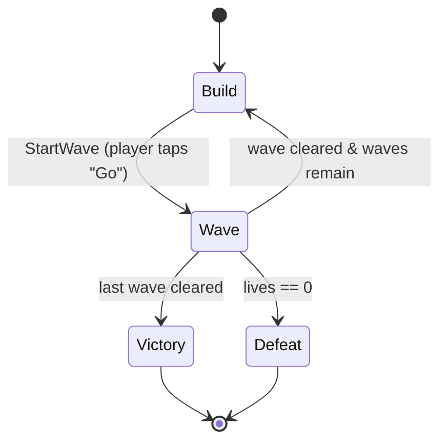

# ARCHITECTURE.md

**Project:** MobileDemo — a 2D mobile tower-defense demo
**Engine:** Unity 6.3 LTS · **Language:** C# · **Target:** Android/iOS, portrait, 60 FPS

---

## 1. Purpose & honest framing

This is a portfolio demo. Its job is to be a small, *finished*, genuinely playable
tower-defense round that demonstrates a handful of well-known patterns **in places
where they are actually the right tool** — not a gallery of patterns for their own sake.

The single most important thing a reviewer can learn from this repo is *judgment*:
where a pattern earned its place, and where a simpler option was chosen instead.
That reasoning lives in this document and in short inline comments at each decision
point, never in extra layers of code. If a pattern isn't pulling its weight, it isn't here.

### Scope, deliberately bounded
- **One** map, **one** wave sequence, **two** enemy types, **two** tower types.
- Build phase → wave phase → win/lose. That's the whole loop.
- No meta-progression, no save system, no ads/IAP, no networking, no audio mixing.
  These are called out again in §12 so their absence reads as a decision, not a gap.

---

## 2. Design constraints (the "why" behind everything else)

| Constraint | Consequence in the architecture |
|---|---|
| **Mobile** | Allocation during a wave is the enemy → **object pooling is mandatory, not decorative**. Draw calls kept low via one sprite atlas. |
| **Touch input** | All interaction is tap-to-select / tap-to-place. Input is abstracted behind one interface so the demo can be driven by mouse in-editor. |
| **Portrait, single screen** | No camera controller, no scrolling. The whole board fits `REFERENCE_RESOLUTION`. |
| **60 FPS on mid-range phones** | Per-frame work is budgeted: enemies use cached transforms; towers scan on a **tick**, not every frame (see §9). |
| **Small & finished** | Every system has a hard "good enough for the demo" line. Abstraction stops there. |

Named constants (single source of truth — see `GameConfig` ScriptableObject, §7):

```
REFERENCE_RESOLUTION      = 1080 x 1920   (portrait)
TARGET_FRAME_RATE         = 60
STARTING_CURRENCY         = 100
STARTING_LIVES            = 20
TOWER_SCAN_INTERVAL_SEC   = 0.1           (see §9 Polling)
ENEMY_POOL_PREWARM        = 64
PROJECTILE_POOL_PREWARM   = 128
```

No magic numbers in gameplay code — everything above is read from config assets.

The two pool figures are the only entries not yet backed by an asset. `ObjectPool<T>` takes
`prewarm` as a **constructor argument**, so today they are supplied by whoever constructs the pool;
they move onto `GameConfig` when §13's slice creates it, and deliberately not before — a
ScriptableObject holding one field is an asset for its own sake, and a ctor argument is what keeps
the pool testable with no asset and no scene (§14).

---

## 3. High-level layout

Three runtime assemblies, so dependency direction is enforced *by the compiler*, not by
discipline:

```
+-------------------------------------------------------------+
|  MobileDemo.UI          (HUD, build menu, win/lose panels)    |
|      depends on ->  Gameplay, Core                           |
+-------------------------------------------------------------+
|  MobileDemo.Gameplay    (towers, enemies, waves, economy,     |
|                         spawning, phases)                    |
|      depends on ->  Core                                     |
+-------------------------------------------------------------+
|  MobileDemo.Core        (EventBus, pooling, interfaces,       |
|                         ScriptableObject base types, config) |
|      depends on ->  (nothing project-specific)               |
+-------------------------------------------------------------+
```

Rule: **UI never reads gameplay state directly and Gameplay never references UI.**
They meet only through events (§8). If a `using UI;` ever appears in a Gameplay file,
the build breaks — which is the point.

Assemblies are named `MobileDemo.<Layer>`, not bare `Core` / `Gameplay` / `UI`. A bare
`UI.asmdef` produces an assembly called literally `UI` — generic enough to collide with a
package, and it tells a reader nothing about where the code came from. The prefix is the
standard Unity `<Project>.<Module>` convention and costs nothing.

A fourth assembly, **`MobileDemo.Editor`**, sits outside this stack: it is editor-only, is
excluded from player builds, and may reference the three above while none of them can
reference it. See §11 for why that separation is a hard requirement rather than tidiness.

---

## 4. Core game loop & phases — **State pattern**

The round is a small state machine. This is the pattern I'd rank *highest* for a job
signal, above Factory, because it keeps the whole game readable at a glance.



```csharp
public interface IGameState
{
    void Enter();
    void Tick(float dt);
    void Exit();
}
```

`GameStateMachine` owns the current `IGameState`, forwards `Tick`, and swaps states.
Each state is tiny and does one thing: `BuildState` enables the build UI and pauses
spawning; `WaveState` drives the active `WaveRunner`; `VictoryState`/`DefeatState`
freeze the board and raise a single event for the UI.

Enemies get their *own* micro state machine (`Spawning → Moving → Dying`) — same
interface, different scope. Reusing the shape shows the pattern generalises.

---

## 5. Systems overview

| System | Responsibility | Key patterns |
|---|---|---|
| `EventBus` | Typed one-to-many delivery for the §8 catalogue | **Observer** |
| `ObjectPool<T>` | Recycles pooled `Component`s — enemies and projectiles | **Object Pool** |
| `GameStateMachine` | Round phases | **State** |
| `WaveRunner` | Reads a `WaveDefinition`, schedules spawns over time | **Factory**, ScriptableObject |
| `EnemyFactory` | Turns an `EnemyDefinition` into a live, pooled enemy | **Factory + Object Pool** |
| `Enemy` | Path following, health, death | **State**, Observer (emits) |
| `Tower` | Target acquisition, firing | **Polling** (§9), Factory (spawns projectiles) |
| `Economy` | Currency & lives | **Observer** (emits changes) |
| `BuildController` | Place/upgrade/sell via undoable actions | **Command** |
| `InputService` | Touch → world intent | Strategy-ish (one interface, editor vs device) |
| `HudPresenter` | Listens, renders numbers | **Observer** (subscribes) |

`EventBus` and `ObjectPool<T>` head the table because they are Core infrastructure the rest lean
on, not gameplay systems in their own right — everything below them is a
`MobileDemo.Gameplay`/`MobileDemo.UI` concern. There is no `ProjectilePool` type: one generic pool
serves both clients as `ObjectPool<Enemy>` and `ObjectPool<Projectile>`, and a named subclass per
client would buy nothing.

---

## 6. Patterns — where, and *where not*

This is the table a reviewer should read first. The right-hand column is the senior part.

### Object Pool — `Core/Pooling/ObjectPool<T>`
- **Where:** enemies and projectiles. Enemies spawn in dozens per wave; a basic tower
  fires ~10×/sec. `Instantiate`/`Destroy` at that rate is the classic mobile GC-spike source.
- **Why it's justified:** it directly serves the mobile constraint. Prewarmed at construction from
  the §2 figures (`ENEMY_POOL_PREWARM`, `PROJECTILE_POOL_PREWARM`), passed as a constructor
  argument rather than read from an asset — see §2 for why that is not yet `GameConfig`'s job.
- **Where I did *not* pool:** towers themselves. A handful exist for the whole round and
  are placed by hand — pooling them would add lifecycle complexity for zero benefit.
- **Exhaustion grows the pool. This reverses an earlier decision.** §12 used to list a fixed
  budget as deliberately out of scope, on the reasoning that one known wave sequence needs no
  growth. That reasoning is still true about the *shipped* configuration and prewarm is still sized
  to hold it — but it decided the wrong question. The question is not "will a correctly tuned pool
  run dry" (it won't), it is "what should happen when someone tunes it wrong", and the honest
  answer is not a silently missing enemy. So an exhausted `Get()` creates one more instance and
  logs a warning: a mis-tuned prewarm costs one frame's `Instantiate` and one console line instead
  of a spawn that never appears. The cost of the reversal is that §10's allocation budget is now an
  invariant the numbers are *sized* to hold rather than one the code enforces, which is why §10
  says so in those words.
- **Growth is one instance per exhausted `Get`, never a doubling.** Doubling a 64-deep pool
  mid-wave would allocate 64 GameObjects in a single frame — a bigger hitch than the one pooling
  exists to avoid. The warning fires once per pool, because a burst can exhaust a pool many times
  in one frame and a flooded console is a console nobody reads; `InstanceCount > Prewarm` is the
  durable record, and `PeakActive` is the number to retune to.
- **Two callbacks (`IPoolable.OnSpawn`/`OnDespawn`), not `OnEnable`/`OnDisable`.** Those are
  spoken for: a pooled object is *disabled, not destroyed*, so `OnEnable`/`OnDisable` is the only
  correct home for EventBus subscription. Ordering is `SetActive(true)` → `OnSpawn()`, because a
  coroutine started in `OnSpawn` throws on an inactive GameObject and a tween on an inactive
  transform is meaningless; and `OnDespawn()` → `SetActive(false)` for the mirror reason. Prewarm
  does not call `OnDespawn`, so `OnSpawn` is the sole initializer.
- **`IPoolStats` — why a generic class needs a non-generic face.** `ObjectPool<Enemy>` and
  `ObjectPool<Projectile>` are unrelated closed types, so without a non-generic read surface
  nothing can hold a collection of pools. That is structural, not anticipation of the tool in §15;
  `PeakActive` already earns its place through §10.
- **Where I stopped:** no pool registry, no editor overlay, no `Clear`/`Dispose`, and no sweep for
  instances destroyed behind the pool's back. Each has a named trigger in
  [systems/object-pool.md](systems/object-pool.md) rather than speculative code here.

### Factory — `EnemyFactory`, projectile creation on `Tower`
- **Where:** `WaveRunner` asks `EnemyFactory` for "an enemy of this definition." The factory
  pulls from the pool, applies the `EnemyDefinition` data, and returns a configured instance.
- **Why it's justified:** it's the seam between *data* (which enemy) and *instance* (a live
  pooled object), and it's the one place that knows how to wire the two together.
- **Where I did *not* abstract:** no `AbstractFactory` hierarchy. One concrete factory is
  enough for two enemy types; an interface here would be architecture cosplay.

### Observer — `Core/Events/EventBus`
- **Where:** discrete, one-to-many facts: `EnemyKilled`, `EnemyLeaked`, `CurrencyChanged`,
  `LivesChanged`, `PhaseChanged`, `WaveCompleted`.
- **Why it's justified:** it's what keeps UI and Gameplay in separate assemblies (§3). The
  economy doesn't know the HUD exists; it just announces `CurrencyChanged`.
- **Where I did *not* use it:** tower→target and enemy→path following are *continuous*
  relationships, not discrete events, so they are plain references, not subscriptions.
  Firing an event every frame per enemy would be Observer used as a hammer.
- **Design choice — why a small static `EventBus` and not ScriptableObject event channels:**
  SO event channels are the trendy Unity answer and I know them, but they add an asset and an
  editor-wiring step per event for a demo where every subscriber is code. The static typed bus
  is fewer moving parts and trivially testable. Noted here so the omission is visibly a choice.
- **Shape:** `EventBus<TEvent>` is a *static generic* class, so closing it over an event type
  gives that event its own static field — a type-keyed dictionary resolved by the runtime once,
  rather than a `Dictionary<Type, List<Delegate>>` hashed on every publish. Subscribers are held
  in a multicast `Action<TEvent>`, which is immutable: a handler that unsubscribes itself mid-
  dispatch cannot corrupt the in-flight call, and getting that same guarantee from a `List` would
  cost a defensive copy per publish. Payloads are `readonly struct`s, enforced by
  `where TEvent : struct, IEvent` so no-boxing is the compiler's guarantee and not a convention.
  The real win is compile-time, though, not allocation: `Subscribe` and `Publish` agree on
  `TEvent` by construction, so a handler wired to the wrong event fails to compile instead of
  failing the day that event first fires.
- **The one non-obvious requirement — clearing statics between play sessions.** With *Enter Play
  Mode Options* set to skip domain reload, static subscribers survive into the next session and
  the second Play throws `MissingReferenceException` from code that reads as correct. A
  non-generic `EventBus.ClearAll()` runs at `SubsystemRegistration` to prevent that. It needs the
  indirection of a reset registry because a static generic class cannot be enumerated — there is
  no way to ask the runtime which closed forms exist, so each one registers itself on first use.
- **Dependency footprint:** `System`, `System.Collections.Generic`, and `UnityEngine` for the
  play-mode reset hook. No package, no asset, no container, no base class a subscriber must
  inherit. An earlier draft kept the engine touch behind `UNITY_5_3_OR_NEWER` so the files would
  also compile outside Unity; that guard is gone and the bus is Unity-only by choice, because the
  portability it bought was hypothetical. The property that actually pays daily is the one §14
  uses: the bus tests with no scene, no GameObject and no play mode.
- **Where a Factory would *not* help.** A factory is the seam between data and a configured
  instance — its job for enemies, above. Events have no asset, no pool and no lifecycle to bridge,
  and `Publish` needs `TEvent` at the call site regardless, so a factory could not remove the very
  type it would exist to hide. The instinct behind the question — *one thing that manufactures
  events, so a new event needs no new type* — is the ScriptableObject event-channel pattern, and
  it is declined two bullets up.
- **Considered and declined — one-line event declarations.** Each event costs a ~6-line
  `readonly struct`, so: can it be one line? Two routes exist and both lose. *C# 9 records* —
  `record struct` is exactly right but is C# 10, and Unity 6.3 pins `-langversion:9.0`; a `record`
  *class* is reachable with a hand-declared `IsExternalInit`, but it is a reference type, so every
  publish heap-allocates and it contradicts the `struct` constraint outright. *Phantom-tag
  generics* — `Changed<Currency>` and `Changed<Lives>` genuinely are distinct closed types with
  distinct statics, so this does trade six lines for one, but it only fits the four single-`int`
  events (`EnemyKilled` carries reward *and* position) and it makes §8 a worse catalogue to read,
  which is most of what §8 is for. Worth naming the trap next door: a `ValueTuple` payload,
  `EventBus<(int total)>`, would silently put `CurrencyChanged` and `LivesChanged` on the *same*
  bus. Distinct named types are what prevent that.

### Command — `Gameplay/Build/ICommand` + `BuildController`
- **Where:** build-phase actions only — `PlaceTowerCommand`, `UpgradeTowerCommand`,
  `SellTowerCommand`. `BuildController` pushes each onto an undo stack.
- **Why it's justified:** Command is the pattern that feels *forced* in a pure action game.
  A build phase gives it an honest home: undo/redo for free, and a clean, testable input layer
  (a command can be executed from a test with no touch input at all).
- **Where I stopped:** undo does **not** cover combat (you can't un-kill an enemy). Undo is
  scoped to the build phase, where it models a real player affordance ("misclicked, take it back")
  instead of inventing complexity to show off.
- **How it meets the bus — the one place the two patterns can disagree.** A command is not an
  event: it is an imperative with exactly one execution and a receiver the caller holds, where an
  event is a past-tense fact broadcast to nobody in particular. But commands *produce* events.
  `PlaceTowerCommand.Execute()` spends currency, so `Economy` raises `CurrencyChanged`; `Undo()`
  must therefore refund **and let that raise again**, or `HudPresenter` and `BuildController`'s
  afford check (§8) keep showing the pre-undo balance while `Economy` holds the real one. Undo
  restores state *and* re-announces it.

```csharp
public interface ICommand
{
    void Execute();
    void Undo();
}
```

### State — see §4.

### ScriptableObject-driven data — see §7. (Not GoF, but the thing pure-pattern demos miss.)

---

## 7. Data-driven config — ScriptableObjects

All tuning lives in assets, not code. This is both good Unity practice and the reason the
demo has *no magic numbers* in gameplay classes.

- `GameConfig` — the constants from §2 (currency, lives, frame rate, pool sizes).
- `EnemyDefinition` — sprite, hp, move speed, currency reward, damage-on-leak.
- `TowerDefinition` — sprite, cost, range, fire rate, projectile ref, upgrade tiers.
- `WaveDefinition` — an ordered list of `{ EnemyDefinition, count, spawnInterval }` groups.

Designers (or you, at 2am) can retune the whole game by editing assets in the Inspector —
no recompile. `EnemyFactory` and `WaveRunner` read these; they never hard-code values.

---

## 8. Event catalogue (Observer contract)

The full list of gameplay events. Keeping it short and enumerated *here* is deliberate — if
this list starts growing past ~10 entries, that's the signal the EventBus is becoming a dumping
ground and some of these should go back to direct references.

| Event | Raised by | Consumed by | Payload |
|---|---|---|---|
| `EnemyKilled` | `Enemy` | `Economy`, `WaveRunner` | reward, position |
| `EnemyLeaked` | `Enemy` | `Economy` (lives), `WaveRunner` | damage |
| `CurrencyChanged` | `Economy` | `HudPresenter`, `BuildController` (afford check) | new total |
| `LivesChanged` | `Economy` | `HudPresenter`, `GameStateMachine` (defeat check) | new total |
| `PhaseChanged` | `GameStateMachine` | `HudPresenter`, build UI | new phase enum |
| `WaveCompleted` | `WaveRunner` | `GameStateMachine` | wave index |

---

## 9. Polling vs. events — an explicit decision

Two continuous jobs deliberately use **polling on a tick**, not events:

- **Tower target acquisition.** Each tower re-scans for the nearest in-range enemy every
  `TOWER_SCAN_INTERVAL_SEC` (0.1s), not every frame and not via an "enemy moved" event.
  - *Why not every frame:* a 10 Hz scan is imperceptible for TD and cuts the work 6×.
  - *Why not event-driven:* "enemy entered range" would mean every enemy notifying every
    tower on every move — a many-to-many event storm that's strictly worse than a cheap poll.
  This is the honest case where **polling is the right answer** and events would be the naive one.
- **Enemy path following** advances along waypoints in its own `Tick`. No event per step.

Discrete, rare facts (a death, a phase change) use Observer. Continuous, per-frame-ish
relationships use polling. The dividing line — *event frequency vs. subscriber count* — is
stated so the choice looks reasoned.

---

## 10. Mobile-specific notes

- **Input:** `IInputService` exposes `TryGetTap(out Vector2 world)`. A `TouchInputService`
  on device, an editor implementation reading the mouse — so the demo is playable in-editor
  without a phone. Nothing else in the game knows which is running.
- **Rendering:** one sprite atlas → few draw calls. Sprites on a single sorting layer with
  explicit `orderInLayer`. No per-object materials.
- **Resolution:** Canvas Scaler set to *Scale With Screen Size* against `REFERENCE_RESOLUTION`,
  match = 0.5, so it survives from 18:9 to 20:9 without art breaking.
- **Allocation budget:** zero `Instantiate`/`Destroy` during a wave — an invariant the §2 prewarm
  figures are *sized* to hold, not one the code enforces. An exhausted `ObjectPool<T>.Get()` grows
  by one and logs a warning (§6), so a mis-tuned prewarm surfaces as one frame's allocation and one
  console line rather than a missing enemy. That makes **a clean console across a full wave** the
  thing that actually certifies this budget, and `PeakActive` after a run the number prewarm should
  be tuned to — which is what gives `IPoolStats` a job today, with the §15 overlay still unbuilt.
  Cache `WaitForSeconds`, avoid LINQ in per-tick paths, cache `Transform` references.

### Build & player settings

These are not incidental project settings. Each one backs a claim made elsewhere in this
document, which is why they are enumerated here and committed to version control instead of
being left to whoever opens the project next.

| Setting | Value | What it backs |
|---|---|---|
| Default orientation | **Portrait**, autorotation off | §2 "Portrait, single screen", and the Canvas Scaler note above |
| Scripting backend (Android) | **IL2CPP** | Required for the ARM64 build below; AOT also beats Mono on per-frame cost |
| Target architecture | **ARM64** | Google Play rejects 32-bit-only uploads |
| Minimum Android API | **26** (Android 8.0) | Covers the mid-range devices §2 targets |
| Incremental GC | **On** | Spreads collection across frames. It *complements* §6's pooling; it does not remove the reason for it |
| `Application.targetFrameRate` | **60** | §2's `TARGET_FRAME_RATE`. Unity exposes no project setting for this — it must be assigned in code at boot, read from `GameConfig` |

**Orientation is the one that had to be corrected.** Unity's 2D template ships with
autorotation enabled for all four orientations, which silently contradicts every layout
assumption in §2 and in the Canvas Scaler note above — left alone, the board would have
rotated into landscape on device. It is now portrait-only, deliberately; treat any future
change here as a change to §2.

**Current state:** everything above is set as listed except `Application.targetFrameRate`,
which has no bootstrap to live in yet. It arrives with §13's vertical slice.

**Colour space stays at Linear**, the URP default — a decision, not an oversight. Gamma is
marginally cheaper on mobile and this is a 2D game with no real lighting model, but the 2D
Renderer and any `Light2D` use are authored against Linear, and re-authoring art to chase a
small win is not a trade this demo needs. Revisit only if on-device profiling says otherwise.

---

## 11. Folder structure

Flat, by asset type, at the `Assets` root — with code grouped by *assembly* under `Scripts/`,
because an `.asmdef` boundary is a folder boundary:

```
Assets/
  Scripts/
    Core/           (MobileDemo.Core.asmdef)
      Events/       EventBus.cs, IEvent.cs, GameEvents.cs
      Pooling/      ObjectPool.cs, IPoolable.cs, IPoolStats.cs
      Config/       GameConfig.cs
      Interfaces/   ICommand.cs, IGameState.cs, IInputService.cs
    Gameplay/       (MobileDemo.Gameplay.asmdef)
      Phases/       GameStateMachine.cs, BuildState.cs, WaveState.cs, ...
      Enemies/      Enemy.cs, EnemyFactory.cs, EnemyDefinition.cs
      Towers/       Tower.cs, TowerDefinition.cs, Projectile.cs
      Waves/        WaveRunner.cs, WaveDefinition.cs
      Economy/      Economy.cs
      Build/        BuildController.cs, PlaceTowerCommand.cs, ...
      Input/        TouchInputService.cs, EditorInputService.cs
    UI/             (MobileDemo.UI.asmdef)
      HudPresenter.cs, BuildMenu.cs, EndScreen.cs
    Editor/         (MobileDemo.Editor.asmdef — Editor platform only)
      PathEditor.cs, PoolOverlay.cs        (both planned — §12)
  Tests/
    EditMode/       (MobileDemo.Tests.EditMode.asmdef — see §14)
  Data/             *.asset  (EnemyDefinition, TowerDefinition, WaveDefinition, GameConfig)
  Art/              sprite atlas + sprites
  Prefabs/          enemy, tower, projectile prefabs
  Scenes/           Game.unity
  Settings/         URP 2D pipeline assets — Unity's 2D template made these; left in place
```

Outside `Assets/`, the repo root holds one authored folder: **`Tools/`**, for scripts that act
on the project rather than shipping in it (`lint.ps1` — see §15). It sits outside `Assets/`
deliberately: anything under `Assets/` is an asset Unity imports, generates a `.meta` for and
considers for a build, and a lint script is none of those things.

### Why flat, and not an `Assets/_MobileDemo/` root

Most Unity style guides recommend putting everything you author inside a single
underscore-prefixed, project-named folder. That convention solves one problem well: Asset
Store packages dumping their own folder trees into the `Assets` root, plus the related job of
migrating content between projects.

This project does not have that problem. §15 excludes Asset Store content deliberately, and
PrimeTween — the one third-party dependency — installs through Package Manager into
`Packages/`, which never touches `Assets/` at all. Paying an extra nesting level on every path
to defend against an import that is ruled out by policy is cost without benefit, so the layout
stays flat. Noted here so the omission reads as "knew the convention and declined it," not
"hadn't heard of it."

**The trade-off flips if the premise does:** the first Asset Store package that lands in
`Assets/` is the signal to adopt the `_MobileDemo/` root and move these folders under it.

### Rules this layout does keep

- **`Editor/` is a reserved name, not a stylistic choice.** Unity excludes the contents of any
  folder called `Editor` from player builds. The §15 tooling (`PathEditor`, and the Pool Overlay
  that would read `IPoolStats` — both still unwritten, §12) references `UnityEditor`, so without
  this folder — and an assembly constrained to the Editor platform — the Android/iOS build fails
  to compile. The dependency is strictly one-way: editor code may reference runtime code, never
  the reverse. The assembly exists ahead of its first file precisely so that stays true by
  construction.
- **No `Resources/`.** It inflates build size unconditionally and offers no async loading.
  Every ScriptableObject is referenced directly per §7, so nothing here needs it.
- **Type folders stop at the top level.** No `Art/Textures/` or `Art/Materials/` nesting — the
  Project window's type filter already does that job, and such folders would only restate it.
- **PascalCase, no spaces, no Unicode** in folder and asset names. Unity's command-line and
  batch tooling breaks on all three.
- **Package references are per-assembly, not global.** `MobileDemo.Gameplay` references
  `Unity.InputSystem` (the §10 input services); `MobileDemo.UI` references `UnityEngine.UI` and
  `Unity.TextMeshPro` (§15). `MobileDemo.Core` references nothing but the engine — which is
  precisely what makes it the layer everything else can safely depend on.
- **`Interfaces/` is for the cross-cutting ones.** `ICommand`, `IGameState` and `IInputService`
  are contracts a whole layer implements and other layers name. An interface that exists to serve
  one type lives beside that type instead — which is why `IPoolable` and `IPoolStats` sit in
  `Pooling/` and not in `Interfaces/`. Grouping interfaces by the fact that they are interfaces
  would be filing by C# keyword rather than by responsibility.

**Status:** the tree above is the target layout. What exists today is every `.asmdef` — `Core`,
`Gameplay`, `UI`, `Editor`, `Tests/EditMode` — so the §3 dependency graph is enforced by the
compiler from the first line of code rather than retrofitted later, when untangling it would mean
moving files. Leaf folders appear as their code does: `Core/Events` and `Core/Pooling` exist;
`Core/Config`, `Core/Interfaces` and the whole `Gameplay/` and `UI/` subtrees are still only names
in this table.

Of the asset folders, only `Art/` and `Scenes/` hold content — sprites for towers and projectiles,
and Unity's `SampleScene.unity` (the `Game.unity` named above does not exist yet). `Data/` and
`Prefabs/` are empty, and §13's vertical slice is what fills them; anything still empty when the
demo ships should be deleted rather than committed as decoration. Note that git does not track
empty directories but *does* currently track their `.meta` files, so a fresh clone gets orphan
`.meta`s that Unity deletes on first open — worth a cleanup pass, and called out here so the next
reader knows the diff is expected rather than damage.

---

## 12. Deliberately out of scope

Listed so their absence is legibly a decision:
save/meta-progression, multiple maps, more than two enemy/tower types, audio, IAP/ads,
analytics, localisation, networking.

Still out of scope, and specific to §6's pooling: a pool registry or editor overlay for live counts
(`IPoolStats` exists for it; the tool does not), pool `Clear`/`Dispose` and cross-scene pool
lifetime, pooling anything other than enemies and projectiles, and a PlayMode test assembly.

**One entry has been removed from this list rather than kept.** *Object-pool auto-growth beyond
prewarm* was listed here as out of scope, with the reasoning that a fixed budget is fine for one
known wave sequence. Growth is now implemented, so the entry cannot stand; the reversal and what it
cost are recorded at the decision point in §6's Object Pool entry, not deleted.

---

## 13. First vertical slice (build this before anything else)

Prove the spine end-to-end with the *fewest* moving parts, then grow it:

1. One `EnemyDefinition`, one hard-coded path (waypoints in the scene).
2. A pooled spawner (`ObjectPool<Enemy>` + `EnemyFactory`) *gets* one enemy — `Release` is the
   opposite direction, the return to the pool.
3. The enemy follows the path, reaches the end, and raises `EnemyLeaked`.
4. A single `HudPresenter` label subscribed to the bus decrements a lives counter.

That slice exercises Pool + Factory + Observer + enemy State with **no towers, no waves,
no build UI, no commands**. When it runs clean, we add the first tower (introducing polling
and projectile pooling), then the build phase (Command), then the wave sequence and phases.
One verified slice at a time.

---

## 14. Testing (lightweight, but present)

EditMode tests where they're cheap and meaningful — exactly the seams the patterns created:
`EventBus` (deliver/unsubscribe/isolation per type, `ClearAll`), `ObjectPool` (get/release/reuse,
no leak, plus growth on exhaustion, a rejected double release, and the `SetActive`↔`OnSpawn` order
§6's reasoning depends on), each `ICommand` (execute then undo restores state), `Economy`
(spend/earn/insufficient-funds), `GameStateMachine` (legal transitions only). These pass without a
scene, because Command and the EventBus decoupled the logic from Unity objects — which is the
practical payoff of the architecture, not just theory.

The `EventBus` tests also pin two behaviours the implementation's §6 reasoning depends on and that
a future refactor could silently break: that a handler unsubscribing mid-publish still lets the
rest of that dispatch through (the multicast snapshot), and that subscribing the same handler
twice calls it twice (no hidden de-duplication). Both are asserted deliberately, so changing them
has to be a decision rather than an accident.

The `ObjectPool` tests are where EditMode's limits show, so the boundary is stated rather than
discovered. They build their prefab from a runtime `GameObject` under a throwaway root and tear it
down with `DestroyImmediate` — in EditMode, `Destroy` defers to a frame that never arrives, so
every pooled instance would leak into the next test. What that leaves unverified, by choice:
`Awake`/`OnEnable` ordering and a coroutine started from `OnSpawn` are Play-Mode behaviour, and
there is no PlayMode assembly (§12). The tests assert the pool's *own* call order instead —
observable from inside `OnSpawn`/`OnDespawn` and fully deterministic — which is the half §6
actually depends on.

These live in `Assets/Tests/EditMode` under `MobileDemo.Tests.EditMode`. It references
`MobileDemo.Core` and `MobileDemo.Gameplay` — deliberately *not* `MobileDemo.UI`, since none of
the five targets above is a UI class — plus `UnityEngine.TestRunner` / `UnityEditor.TestRunner`
and NUnit. It is restricted to the Editor platform and gated behind a `UNITY_INCLUDE_TESTS`
define constraint, so no test code can reach a player build.

`Assets/Tests/` sits at the root rather than inside `Scripts/` because that is where Unity's
Test Runner creates test assembly folders by default, and it mirrors Unity's own package
layout, where `Tests` is a sibling of `Runtime` and `Editor` rather than nested inside them.

---

## 15. Dependencies & third-party packages

Dependency policy for a portfolio demo is the inverse of a shipping game: every plugin
is a liability as much as a help, because a reviewer can't tell what was built from what
was bought. So the list is short, and the **excluded** list below is as much a signal as
the included one — it shows the same judgment as §6's "where I did *not* use it."

### First-party (Unity packages) — included
| Package | Why it's here | Ties to |
|---|---|---|
| **Input System** | Touch handling, sat behind `IInputService` (device vs editor impl) | §10 |
| **2D Sprite + Sprite Atlas** | The atlas is what *backs* the draw-call budget — not optional flavor | §10 |
| **TextMeshPro** | Crisp scalable UI text; its absence would look odd | §5 UI |
| **Test Framework (UTF)** | Runs the EditMode tests; without it §14 is just a claim | §14 |

*(2D Tilemap only if the map is grid-authored; otherwise it's dead weight.)*

### First-party built-in — a stated pooling decision
Unity ships `ObjectPool<T>` in `UnityEngine.Pool`. This project rolls its own instead, for
three reasons, only two of which are demo-specific. To **demonstrate the pattern** rather than
hide it behind a call. To expose `IPoolStats`/`PeakActive`, which the built-in doesn't surface —
`PeakActive` pays for itself before any tooling exists, as §10's allocation budget is certified by
it, and the Pool Overlay that would also read it is still §12 work. And the reason that holds
regardless of either: `UnityEngine.Pool.ObjectPool<T>` is a **plain-object** pool with `Action`
hooks — it knows nothing about prefab instantiation, parenting or GameObject activation, so
wrapping it would still leave us writing the create/activate/parent code, which is most of what
our class *is*. `UnityEngine.Pool` remains the correct production default for pooling plain
objects; rolling our own for pooled `Component`s is a deliberate choice, recorded so it reads as
"knew and chose," not "didn't know."

### Third-party — exactly one
- **PrimeTween** — for game feel (placement pop, hit-flash, UI slides). Polish is
  disproportionately what makes a demo read as *finished*. Chosen over the more popular
  **DOTween** specifically because PrimeTween is **allocation-free**, which is consistent
  with §10's allocation budget; DOTween allocates on each tween start, and tweens run
  *continuously* during a wave — squarely the per-frame path §10 does police — so it would
  quietly contradict that budget. Free, installs via Package Manager. DOTween remains the fair
  alternative if its richer sequencing is ever needed.

### Deliberately excluded
| Not used | Why |
|---|---|
| **Odin Inspector** | Would replace the hand-written custom editors (`PathEditor`) — that tooling *is* the flex here |
| **DI frameworks** (VContainer / Zenject) | Over-abstraction at this scale; reads as cargo-culting, not competence |
| **Ads / IAP / analytics** (Unity Gaming Services) | Out of scope per §12; dilutes a focused demo into a half-built product |
| **Asset-store TD kits, behaviour-tree assets** | They do exactly the work the demo exists to demonstrate |
| **Cinemachine** | No camera movement on a static portrait board — pure noise |

### Process (not a package, but assumed)
Git + a Unity `.gitignore`. Version control is a baseline requirement in the roles this demo
targets, and a clean commit history is itself portfolio evidence. Unity's own Version Control
is free, but Git is the expected standard.

### Lint — `.editorconfig` + `dotnet format`

The project lints itself through a root **`.editorconfig`**, run from **`Tools/lint.ps1`**
(read-only by default, `-Fix` to apply). It needs no package: `.editorconfig` is what Rider,
Visual Studio and VS Code already read, and `dotnet format` ships with the .NET SDK. The
script drives two passes over the `.csproj` files Unity generates — `whitespace` (syntax tree
only, so it works even when the code does not compile) and `style` (the `IDE####` rules, which
need a real compilation and therefore Unity's generated references).

The severity policy is the part worth defending: **rules that catch something wrong are
`warning`; rules that are taste are `suggestion`; nothing is `error`.** A demo whose build
stops on a stray blank line is a demo nobody playtests. `Tools/lint.ps1` still exits non-zero
on any warning, so there is a hard gate exactly where a hard gate belongs — a deliberate
check — and not in the edit-compile-play loop.

**It runs at three moments, deliberately, because no one of them is sufficient.** Live, as
squiggles: the C# extension is Roslyn-based and reads `.editorconfig` itself, so violations
surface as you type — but only in *open* files. On save: `.vscode/settings.json` turns on
`editor.formatOnSave` for `[csharp]`, which fixes the formatting rules and (via
`dotnet.formatting.organizeImportsOnFormat`) the using directives, so the mechanical half of
the lint can never fail. On demand: `Tools/lint.ps1` covers every file in every assembly and
is the only one of the three that can fail a check, which is why it is the one that matters.
The `[csharp]` block pins `editor.defaultFormatter` explicitly rather than relying on the
default, because a global default formatter set for another language would otherwise be handed
our `.cs` files on save.

The gap that leaves: naming, `this.` qualification, braces and `readonly` are code actions
rather than formatting, and the C# extension has no fix-all-on-save for them. They stay
visible as warnings and are applied by `Tools/lint.ps1 -Fix`. Note also that VS Code's core
editor does not read `.editorconfig` without the EditorConfig extension, which is not
installed here — so the `[*]` section is advisory for anything that is not C#.

Two consequences worth recording, because both were arrived at by being burned:

- **Line endings are pinned to LF in two places.** With `end_of_line` unset, `dotnet format`
  falls back to `Environment.NewLine` and writes CRLF into whichever line it fixes, leaving an
  otherwise-LF file with mixed endings — which is how the first run of this lint left
  `GameEvents.cs`. `.editorconfig` pins `end_of_line = lf` and `.gitattributes` pins
  `*.cs text eol=lf`, so checkout is deterministic regardless of a machine's `core.autocrlf`
  and the lint cannot pass here while failing on another clone.
- **The rules codify the conventions already in `Core/Events`, rather than importing a
  house style.** Explicit types over `var`, no `this.`, no `private` keyword where private is
  the default, block-scoped namespaces (also forced by Unity generating the project at
  LangVersion 9), and the naming split the `EventBus` already uses: PascalCase for readonly
  statics, camelCase with no underscore prefix for mutable private fields — underscores only
  degrade the label Unity's Inspector derives from a field name.

**What this lint deliberately does not cover: Unity-specific mistakes.** `GetComponent` in
`Update`, an empty `Update`, `?.` on a `UnityEngine.Object` (where the engine's overloaded `==`
sees a destroyed object as null but the runtime's reference check does not) — those are
`Microsoft.Unity.Analyzers`' `UNT####` rules, and catching them means committing a DLL under
`Assets/` with a `RoslynAnalyzer` label. That is a dependency, so it answers to the policy at
the top of this section and is currently declined: the analyzer is the right call the moment
there is enough `MonoBehaviour` code for those rules to have something to say, and there is
almost none yet. The two `.editorconfig` rules most likely to bite in Unity —
`dotnet_style_null_propagation` and `dotnet_style_coalesce_expression` — are held at
`suggestion` for precisely this reason, with the trap written out at the point of the setting.
Escalating them to `warning` without the analyzer present would be pressuring the reader
toward the bug.
