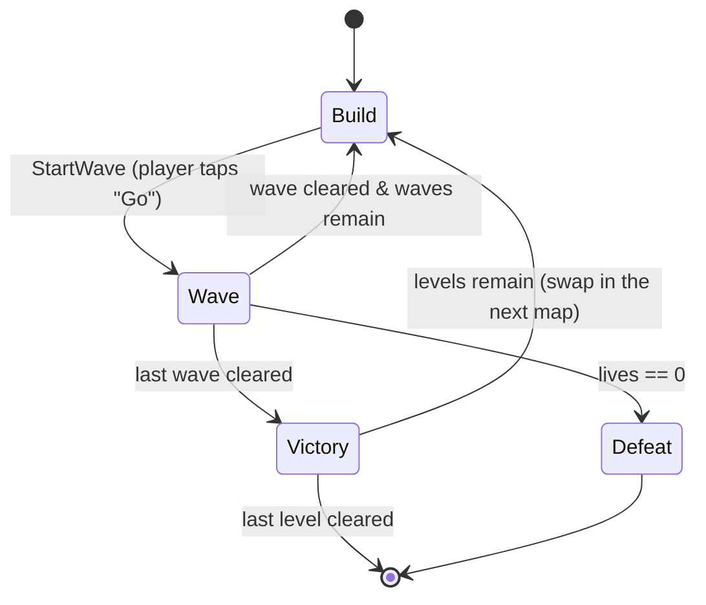

# ARCHITECTURE.md

**Project:** MobileDemo — a 2D mobile tower-defense demo
**Engine:** Unity 6.3 LTS · **Language:** C# · **Target:** Android/iOS, portrait, 60 FPS

---

## 1. Purpose & honest framing

This is a portfolio demo. Its job is to be a small, *finished*, genuinely playable
tower-defense round that demonstrates a handful of well-known patterns **in places
where they are actually the right tool** — not a gallery of patterns for their own sake.

The single most important thing a reviewer can learn from this repo is *judgment*:
where a pattern earned its place, and where a simpler option was chosen instead.
That reasoning lives in this document and in short inline comments at each decision
point, never in extra layers of code. If a pattern isn't pulling its weight, it isn't here.

### Scope, deliberately bounded
- **Three** maps played in sequence, **one** wave sequence each, **two** enemy types, **two**
  tower types.
- Build phase → wave phase → win/lose. That's the whole loop, repeated per map.
- **Lives carry over across all three maps** — one pool for the whole run, so losing on map 3
  restarts the run. That single decision is why `STARTING_LIVES` is a *run* constant and not
  per-map data (§7), and why `Defeat` is not per-map (§4).
- No meta-progression, no save system, no ads/IAP, no networking, no audio mixing.
  These are called out again in §12 so their absence reads as a decision, not a gap.

**Three maps is not a campaign system.** A map is a prefab that gets swapped, not a scene that
gets loaded — the whole feature is one component and three prefabs, with no level select, no
unlock state and nothing persisted. That distinction is what keeps it inside the bounded scope
above rather than reopening §12's meta-progression exclusion.

---

## 2. Design constraints (the "why" behind everything else)

| Constraint | Consequence in the architecture |
|---|---|
| **Mobile** | Allocation during a wave is the enemy → **object pooling is mandatory, not decorative**. Draw calls kept low via one sprite atlas. |
| **Touch input** | All interaction is tap-to-select / tap-to-place. Input is abstracted behind one interface so the demo can be driven by mouse in-editor. |
| **Portrait, single screen** | No camera controller, no scrolling. The whole board fits `REFERENCE_RESOLUTION`. |
| **60 FPS on mid-range phones** | Per-frame work is budgeted: enemies use cached transforms; towers scan on a **tick**, not every frame (see §9). |
| **Small & finished** | Every system has a hard "good enough for the demo" line. Abstraction stops there. |

Named constants (single source of truth — see `GameConfig` ScriptableObject, §7):

```
REFERENCE_RESOLUTION      = 1080 x 1920   (portrait)
TARGET_FRAME_RATE         = 60
STARTING_CURRENCY         = 100
STARTING_LIVES            = 20
TOWER_SCAN_INTERVAL_SEC   = 0.1           (see §9 Polling)
ENEMY_POOL_PREWARM        = 64
PROJECTILE_POOL_PREWARM   = 128
SELL_REFUND_FRACTION      = 0.5           (see §7 — a run rule, not per tower)
BUILD_ROAD_CLEARANCE      = 0.9           (see §6 PlacementRules)
BUILD_TOWER_SPACING       = 0.7
```

No magic numbers in gameplay code — everything above is read from config assets.

`GameConfig` now carries **nine** of the ten. §13's slice put three of them there
(`TARGET_FRAME_RATE`, `STARTING_LIVES`, `ENEMY_POOL_PREWARM`); the tower slice added the three
that had been waiting on a reader — `STARTING_CURRENCY`, `PROJECTILE_POOL_PREWARM` and
`TOWER_SCAN_INTERVAL_SEC`; the build slice added the last three with their first readers attached.
Each arrived the moment something read it, which was the whole point of keeping them off the asset
until then.

**`BUILD_ROAD_CLEARANCE` is the one of the three that is not a new number.** It is the
`RoadClearance` constant the slice-two authoring script placed the existing towers with — the same
fact the level was authored against, promoted from a `const` in a throwaway one-shot to a field the
runtime rule reads. That promotion is what stops deleting the script (§11) from losing the number,
and it means the placement rule and the authored towers cannot disagree about what "beside the
road" means.

**And the build slice's own prediction about a knob was wrong in the other direction.** §6's
Command entry expected the first spender to bring an upgrade cost with it; what it brought was a
*refund* fraction, because `UpgradeTowerCommand` was deferred (§13.2) and `SellTowerCommand` was
not. The pattern holds — a serialized knob arrives with its reader — but which knob arrives is
decided by which command ships, not by which the design named first.

**`STARTING_CURRENCY` arrived one step earlier than this section predicted, and the prediction was
the part that was wrong.** It said the field would come with "the first `ICommand` that spends".
Nothing spent at the time — `BuildController` was unwritten — but enemies *earned*: `Economy`
subscribes `EnemyKilled` and publishes `CurrencyChanged`, and the HUD has a label for it. The test
this section actually cares about is whether a serialized knob has a reader, and it did. Spending
was a sufficient trigger mistaken for a necessary one. *(The predicted spender has since arrived
anyway, in §13.2, so the field now has both kinds of reader.)*

`ENEMY_POOL_PREWARM` is a **run** constant, not a per-level one: the pool is built once at boot
and survives every level swap, so it must be sized for the *worst* of §1's three maps rather than
the current one. Three levels therefore strengthens this field's place on `GameConfig`. The
practical consequence for tuning is that `PeakActive` (§10) has to be read after a full run
across all three, not after map 1.

**The number above and the number in the asset have drifted apart, and the asset is the one that
runs.** `Data/GameConfig.asset` currently carries `enemyPoolPrewarm: 30`, not the 64 this section
names; §13's HUD run measured `PeakActive=9, InstanceCount=30, Prewarm=30`, so 30 is holding with
room to spare and nothing has grown. That does **not** settle which figure is right, because of
the paragraph directly above: 9 is map 1's peak, and the constant has to cover the worst of three
maps under a real `WaveRunner`, neither of which exists yet. Recorded as an open divergence rather
than resolved by editing one to match the other — the honest fix is to retune once a full run
across all three levels can be measured, and until then the two numbers disagreeing is a fact
about the project, not a typo.
The one still deliberately absent:

- `REFERENCE_RESOLUTION` — configured on the scene's `CanvasScaler`, which is where Unity reads
  it. A copy on the asset would be a second source of truth that nothing consults.

**`PROJECTILE_POOL_PREWARM` is now measurably wrong, and is recorded rather than corrected.** The
tower slice's play session logged `PeakActive=1` for *both* projectile pools against a prewarm of
128 — so 256 GameObjects are prewarmed to hold, at peak, two. The 128 came from this section's
"a basic tower fires ~10×/sec" (§6); the authored towers fire 2×/s and 0.8×/s, and a projectile's
whole flight is under a second, so at most one per tower is ever airborne. The reason this is not
simply edited down is the same one that governs `ENEMY_POOL_PREWARM` two paragraphs up: the
measurement was taken on one map with two hand-placed towers and no `WaveRunner`, and the constant
has to cover the worst of §1's three maps with a real wave sequence. Two numbers that disagree with
a measurement is a fact about the project's current state, not a typo — and this one now has a
named trigger to settle it: the first full run under `WaveRunner` across all three levels retunes
both prewarm figures together.

**§13.2 made that oversizing slightly worse, deliberately, and it sharpens the same trigger rather
than adding a new problem.** `Bootstrap` now prewarms a pool for every projectile prefab in
`TowerCatalogue` as well as for the level's authored towers, because a tower the *player* places
whose projectile was never collected gets `null` from `ProjectileFactory.Create` and silently never
fires. So the number of 128-deep pools is now driven by what is *buildable*, not by what is on the
map — pools for tower types a given run may never build. Today that adds none, because both
buildable types are already placed on `Level_01`; the rule is what closes the hole, not the current
assets happening to overlap.

**`ENEMY_POOL_PREWARM` moving onto the asset did not change `ObjectPool<T>`.** `prewarm` is still
a **constructor argument**: `GameConfig` supplies the number to `Bootstrap`, which passes it to
`new ObjectPool<Enemy>(...)`. The pool has no idea the asset exists, and `ObjectPoolTests` still
constructs pools with a literal — which is what keeps it testable with no asset and no scene
(§14).

---

## 3. High-level layout

Three runtime assemblies, so dependency direction is enforced *by the compiler*, not by
discipline:

```
+-------------------------------------------------------------+
|  MobileDemo.UI          (HUD, build menu, win/lose panels)    |
|      depends on ->  Gameplay, Core                           |
+-------------------------------------------------------------+
|  MobileDemo.Gameplay    (towers, enemies, waves, economy,     |
|                         spawning, phases)                    |
|      depends on ->  Core                                     |
+-------------------------------------------------------------+
|  MobileDemo.Core        (EventBus, pooling, interfaces,       |
|                         ScriptableObject base types, config) |
|      depends on ->  (nothing project-specific)               |
+-------------------------------------------------------------+
```

Rule: **UI never reads gameplay state directly and Gameplay never references UI.**
They meet only through events (§8). If a `using UI;` ever appears in a Gameplay file,
the build breaks — which is the point.

The rule is now visible rather than asserted: the project's first UI file, `HudPresenter.cs`,
names only `MobileDemo.Core.Events`, `TMPro` and `UnityEngine`. And it is why the composition
root (`Bootstrap`, §5) sits *inside* Gameplay rather than in a fifth assembly above UI — it never
needs to name a UI type, because `HudPresenter` subscribes itself.

**§13.2 pushed hardest on this rule and it held, in the direction that is easy to get wrong.**
`BuildMenu` is a UI file that has to *cause* something in Gameplay — a tower selected, an undo —
which is the first time traffic has needed to go that way. It goes over the bus
(`BuildActionRequested`, §8), so `MobileDemo.Gameplay` still names no UI type. The alternative was
a `Button.onClick` persistent call wired in the Inspector to a Gameplay component: no compile-time
reference, so it would satisfy the letter of the rule while gutting the sentence above it — the
boundary would be a name resolved at runtime that neither the compiler nor a test can check.

`MobileDemo.Gameplay` did gain `UnityEngine.UI`, for `EventSystem.IsPointerOverGameObject` (§10) —
and **that is a documentation change, not an enabling one.** `UnityEngine.UI` ships
`autoReferenced: true`, so every assembly in the project could already see it; listing it makes an
actual dependency visible, matches what `MobileDemo.UI` already does with the same assembly, and
survives anyone setting `overrideReferences`. It is also not a breach of the rule above: that rule
is about `MobileDemo.UI`, this project's UI layer, where `UnityEngine.EventSystems` is Unity's
input plumbing. The alternative — deciding which taps to ignore from screen geometry — would have
required Gameplay to know HUD layout, which *would* have breached it.

Assemblies are named `MobileDemo.<Layer>`, not bare `Core` / `Gameplay` / `UI`. A bare
`UI.asmdef` produces an assembly called literally `UI` — generic enough to collide with a
package, and it tells a reader nothing about where the code came from. The prefix is the
standard Unity `<Project>.<Module>` convention and costs nothing.

A fourth assembly, **`MobileDemo.Editor`**, sits outside this stack: it is editor-only, is
excluded from player builds, and may reference the three above while none of them can
reference it. See §11 for why that separation is a hard requirement rather than tidiness.

---

## 4. Core game loop & phases — **State pattern**

The round is a small state machine. This is the pattern I'd rank *highest* for a job
signal, above Factory, because it keeps the whole game readable at a glance.



**`Victory` is per level, not per run — and `Defeat` is the opposite.** Clearing the last wave of
map 1 or 2 swaps in the next level's prefab and returns to `Build`; only the last map's victory
ends the run. `Defeat` is terminal for the whole run, because §1's lives carry over: there is one
life pool across all three maps, so hitting zero on map 3 is not "retry map 3". The asymmetry is
the interesting part — it comes entirely from the carry-over decision, and flipping that one
answer would flip both transitions.

```csharp
public interface IGameState
{
    void Enter();
    void Tick(float dt);
    void Exit();
}
```

`GameStateMachine` owns the current `IGameState`, forwards `Tick`, and swaps states.
Each state is tiny and does one thing: `BuildState` enables the build UI and pauses
spawning; `WaveState` drives the active `WaveRunner`; `VictoryState`/`DefeatState`
freeze the board and raise a single event for the UI. `VictoryState` is also where the level swap
belongs, which is why `LevelRunner` (§5) waits on this machine rather than arriving first —
building it sooner would mean inventing a second, parallel notion of "round over".

Enemies get their *own* micro state machine (`Spawning → Moving → Dying`) — same
interface, different scope. Reusing the shape shows the pattern generalises.

**The enemy's machine shipped first**, ahead of `GameStateMachine`, because §13's slice has no
phases: a one-state round machine would demonstrate nothing and be rewritten once real phases
exist. Three things that fell out of building it, recorded because they are the parts a reader
cannot infer:

- **What justifies classes over an enum plus a `switch`** (which would be ~30 lines shorter):
  `EnemyMovingState` owns its own `waypointIndex` and re-zeroes it in `Enter()`, so the pooling
  reset for the path cursor *is* the pattern, rather than another line in `OnSpawn`.
- **State instances are constructed once, in `Awake`, never in `OnSpawn`.** `OnSpawn` is the
  pool's "sole initializer" and so is the tempting home — but a 64-enemy wave would then allocate
  192 objects mid-wave, the exact spike §2 calls pooling mandatory to prevent.
- **The cost:** three empty `Exit()` bodies. That is what sharing §4's interface buys, and `Exit`
  earns its keep in the round's machine, where `BuildState.Exit()` disables the build UI.

---

## 5. Systems overview

| System | Responsibility | Key patterns |
|---|---|---|
| `EventBus` | Typed one-to-many delivery for the §8 catalogue | **Observer** |
| `ObjectPool<T>` | Recycles pooled `Component`s — enemies and projectiles | **Object Pool** |
| `GameStateMachine` | Round phases | **State** |
| `WaveRunner` | Reads a `WaveDefinition`, schedules spawns over time | **Factory**, ScriptableObject |
| `EnemyFactory` | Turns an `EnemyDefinition` into a live, pooled enemy | **Factory + Object Pool** |
| `Enemy` | Path following, health, death | **State**, Observer (emits) |
| `EnemyRegistry` | Who is alive right now: ticks them, releases the finished, answers range queries | **none** — a plain list with three readers (§6) |
| `Tower` | Target acquisition, firing | **Polling** (§9), Factory (spawns projectiles) |
| `TowerFactory` | Turns a `TowerDefinition` into a live tower, and wires an authored one | **Factory** — the first here *without* a pool (§6) |
| `TowerCatalogue` | Which tower types are buildable, and their projectile prefabs | ScriptableObject (§7) |
| `Projectile` | Flight, impact, splash | **Object Pool**; data on the prefab (§7) |
| `ProjectileFactory` | Turns a projectile prefab into a live, pooled projectile — one pool per prefab | **Factory + Object Pool** |
| `Economy` | Currency & lives | **Observer** (emits changes) |
| `BuildController` | Place/sell via undoable actions, on a LIFO stack | **Command** |
| `PlacementRules` | Where a tower may stand, and which tower a tap hit | **none** — a plain class, two queries (§6) |
| `PointerInputService` | Touch or mouse → world intent | one interface, **one** implementation — see §10 |
| `HudPresenter` | Listens, renders numbers | **Observer** (subscribes) |
| `BuildMenu` | Which tower to build, and undo | **Observer** — subscribes `CurrencyChanged`, publishes intents |
| `Level` | Owns one map's path — and later its wave sequence. The unit that gets swapped | **none** — a prefab-root component, not an asset (see §7) |
| `LevelRunner` | Swaps in the next level's prefab on victory | planned — waits on `GameStateMachine` (§4) |
| `Bootstrap` | Composition root: builds pool, factory and economy from `GameConfig`, sets the frame rate, drives the tick | **none** — deliberately not a Service Locator or DI container (§15 declines both) |

**This table is a design, not an inventory.** What has code today: everything except
`GameStateMachine`, `WaveRunner` and `LevelRunner` — the build slice took `BuildController`,
`PlacementRules`, `TowerFactory`, `TowerCatalogue`, `PointerInputService` and `BuildMenu` off the
names-only list, and `Economy` has had **both halves**, lives and currency, since the tower slice.
Every event in §8 now has a publisher except `PhaseChanged` and `WaveCompleted`, which wait on the
two systems that raise them.

`Bootstrap` is last in the table because it is the only row that is *meant* to shrink — and
**§13.2 grew it instead**, which is worth saying rather than leaving to be noticed. It gained three
serialized references and one more tick call, while its successor table lost nothing: the build
phase's jobs went to `BuildController`, but the tick order, the spawn timer and the level reference
are all still here. [systems/bootstrap.md](systems/bootstrap.md) opens by saying that if that guide
grows again without its Status table shrinking, the class needs splitting. It has. The phases slice
is the one that has to take the tick order out.

`EventBus` and `ObjectPool<T>` head the table because they are Core infrastructure the rest lean
on, not gameplay systems in their own right — everything below them is a
`MobileDemo.Gameplay`/`MobileDemo.UI` concern. There is no `ProjectilePool` type: one generic pool
serves both clients as `ObjectPool<Enemy>` and `ObjectPool<Projectile>`, and a named subclass per
client would buy nothing.

---

## 6. Patterns — where, and *where not*

This is the table a reviewer should read first. The right-hand column is the senior part.

### Object Pool — `Core/Pooling/ObjectPool<T>`
- **Where:** enemies and projectiles. Enemies spawn in dozens per wave; a basic tower
  fires ~10×/sec. `Instantiate`/`Destroy` at that rate is the classic mobile GC-spike source.
  *(The ~10×/sec figure is an assumption, not a measurement, and the authored towers fire 2×/s and
  0.8×/s — which is why §2 now records `PROJECTILE_POOL_PREWARM` as measurably oversized.)*
- **Why it's justified:** it directly serves the mobile constraint. Prewarmed at construction from
  the §2 figures (`ENEMY_POOL_PREWARM`, `PROJECTILE_POOL_PREWARM`), passed as a constructor
  argument rather than read from an asset — see §2 for why that is not yet `GameConfig`'s job.
- **Where I did *not* pool:** towers themselves. A handful exist for the whole round and
  are placed by hand — pooling them would add lifecycle complexity for zero benefit.
- **Exhaustion grows the pool. This reverses an earlier decision.** §12 used to list a fixed
  budget as deliberately out of scope, on the reasoning that one known wave sequence needs no
  growth. That reasoning is still true about the *shipped* configuration and prewarm is still sized
  to hold it — but it decided the wrong question. The question is not "will a correctly tuned pool
  run dry" (it won't), it is "what should happen when someone tunes it wrong", and the honest
  answer is not a silently missing enemy. So an exhausted `Get()` creates one more instance and
  logs a warning: a mis-tuned prewarm costs one frame's `Instantiate` and one console line instead
  of a spawn that never appears. The cost of the reversal is that §10's allocation budget is now an
  invariant the numbers are *sized* to hold rather than one the code enforces, which is why §10
  says so in those words.
- **Growth is one instance per exhausted `Get`, never a doubling.** Doubling a 64-deep pool
  mid-wave would allocate 64 GameObjects in a single frame — a bigger hitch than the one pooling
  exists to avoid. The warning fires once per pool, because a burst can exhaust a pool many times
  in one frame and a flooded console is a console nobody reads; `InstanceCount > Prewarm` is the
  durable record, and `PeakActive` is the number to retune to.
- **Two callbacks (`IPoolable.OnSpawn`/`OnDespawn`), not `OnEnable`/`OnDisable`.** Those are
  spoken for: a pooled object is *disabled, not destroyed*, so `OnEnable`/`OnDisable` is the only
  correct home for EventBus subscription. Ordering is `SetActive(true)` → `OnSpawn()`, because a
  coroutine started in `OnSpawn` throws on an inactive GameObject and a tween on an inactive
  transform is meaningless; and `OnDespawn()` → `SetActive(false)` for the mirror reason. Prewarm
  does not call `OnDespawn`, so `OnSpawn` is the sole initializer.
- **`IPoolStats` — why a generic class needs a non-generic face.** `ObjectPool<Enemy>` and
  `ObjectPool<Projectile>` are unrelated closed types, so without a non-generic read surface
  nothing can hold a collection of pools. That is structural, not anticipation of the tool in §15;
  `PeakActive` already earns its place through §10.
- **Where I stopped:** no pool registry, no editor overlay, no `Clear`/`Dispose`, and no sweep for
  instances destroyed behind the pool's back. Each has a named trigger in
  [systems/object-pool.md](systems/object-pool.md) rather than speculative code here.

### Factory — `EnemyFactory`, `ProjectileFactory`, `TowerFactory`
- **Where:** `WaveRunner` asks `EnemyFactory` for "an enemy of this definition." The factory
  pulls from the pool, applies the `EnemyDefinition` data, and returns a configured instance.
  `Tower` asks `ProjectileFactory` the same question about a projectile prefab.
- **Why it's justified:** it's the seam between *data* (which enemy) and *instance* (a live
  pooled object), and it's the one place that knows how to wire the two together.
- **Where I did *not* abstract:** no `AbstractFactory` hierarchy, and no shared `IFactory<T>`
  interface over the two. One concrete factory each is enough; an interface here would be
  architecture cosplay, and the two do not have the same shape anyway — see the next bullet.
- **`ProjectileFactory` holds a pool per prefab, where `EnemyFactory` holds one.** That is the
  same lesson [systems/enemy-factory.md](systems/enemy-factory.md) already records — a pool hands
  back instances of the prefab it was built from, so a second prefab means a second pool — except
  that projectiles hit it immediately: their speed, damage and impact radius live on the prefab
  (§7), so two projectile types *cannot* share one. The prefabs are handed to the constructor and
  prewarmed up front rather than created lazily, because a pool built on the first shot would
  allocate its whole prewarm mid-wave, which is the exact spike §2 calls pooling mandatory to
  prevent. It is also the first real reader of `IPoolStats` as a collection — the use case that
  interface's own comment says it exists for.
- **`TowerFactory` is the first Factory here that is *not* also an Object Pool, and that is what
  shows the two patterns were separable rather than one habit.** Until §13.2 both factories wrapped
  a pool, so a reader could fairly conclude that "factory" in this project meant "pool with a
  configure step". Towers are explicitly not pooled (the bullet above), so `Create` genuinely
  `Instantiate`s and a sale genuinely destroys. What is left when the pool is removed is exactly
  the seam this section claims Factory is: data (`TowerDefinition`) on one side, a configured live
  instance on the other.
  - *Why it exists at all, given it owns no pool:* without it `PlaceTowerCommand` takes eight
    constructor arguments, four of them collaborators it has no opinion about (`EnemyRegistry`,
    `ProjectileFactory`, the tower prefab, the scan interval). It also gives the *authored* towers
    and the *placed* ones one wiring path instead of two — `Bootstrap.ConfigureTowers` now
    delegates to it, so `TOWER_SCAN_INTERVAL_SEC` is named in one place.
  - *What it deliberately does not own:* the live tower list. That is `Level`'s, because a
    runtime-placed tower is the level's child and must **not** outlive a level swap — the exact
    opposite of the pooled enemies that must, which is why `PoolRoot` is a scene-root sibling. A
    `TowerRegistry` owned by `Bootstrap` would survive the swap holding dangling references and
    need a `Clear` to compensate; `Level` answers the lifetime question by construction. *Named
    trigger for a `TowerRegistry`: a third owner of the live set that is not the level.*

### `EnemyRegistry` — where a pattern was *not* reached for
Three callers now need "which enemies are alive right now": `Bootstrap` to tick and release them,
`Tower` to find a target in range, and `Projectile` to splash at impact. `ObjectPool<T>`
deliberately does not expose its active set, so something else has to own the list.

The tempting answers were a singleton service, an `IEnemyProvider` interface, or a `TargetingSystem`.
What it actually is: a plain class holding a `List<Enemy>`, constructed by `Bootstrap` and passed
to whoever needs it. No pattern, because none of them buys anything here — there is one
implementation, one owner, and no lifetime question.

- **Why a type at all, rather than passing the list around.** `Tower` could take an
  `IReadOnlyList<Enemy>` per tick, but `Projectile` needs the same list *mid-flight* at impact, so
  it would have to hold the reference regardless. Three callers is not speculative.
- **What it cost.** It slightly pre-empts `WaveRunner`, which
  [systems/bootstrap.md](systems/bootstrap.md) says inherits "the same ten lines". Keeping it a
  plain class rather than a service is what lets `WaveRunner` own it outright later instead of
  reimplementing it.
- **Why projectiles get no equivalent.** Nothing ever asks which projectiles are in flight, so a
  `ProjectileRegistry` would exist to hold one tick-and-release loop over instances
  `ProjectileFactory` already maps to their pools. That loop lives on the factory instead. The
  asymmetry is the reasoning, not an oversight.

### `PlacementRules` — the same non-decision, made a second time
Where a tower may stand is three predicates: inside the map's bounds, clear of every path segment
by `BUILD_ROAD_CLEARANCE`, and clear of every live tower by `BUILD_TOWER_SPACING`. The tempting
answers were a `IPlacementValidator` with a rule-per-class hierarchy, or build plots as a subsystem
on `Level`. What it is: a plain class with two methods, constructed by `Bootstrap` and handed to
`BuildController`.

Two things worth recording, because they are the parts that are not obvious:

- **It takes baked data, not a `Level`** — `IReadOnlyList<Vector2>`, a `Bounds` and two floats. That
  is §14's own principle reused ("avoiding exactly that seam for the code that *matters* is why
  `Enemy.Configure` takes `IReadOnlyList<Vector2>`"), and it is why the geometry tests with literal
  coordinates and no scene. It also means `LevelRunner` can build a fresh one per level.
- **One radius serves both questions.** The distance that blocks a placement is the distance that
  selects a tower for sale, so the two branches of a tap can never both be true — and there is one
  number to tune rather than two that can disagree.

**A plain class is becoming this project's default answer**, which is worth noticing out loud:
`EnemyRegistry`, `PlacementRules` and `Economy` are all pattern-free, and the patterns that *are*
here (§4's State, the pools, the factories, Command) each earned their place against a named
alternative. That ratio is the honest signal, not the pattern count.

### Observer — `Core/Events/EventBus`
- **Where:** discrete, one-to-many facts: `EnemyKilled`, `EnemyLeaked`, `CurrencyChanged`,
  `LivesChanged`, `PhaseChanged`, `WaveCompleted`.
- **Why it's justified:** it's what keeps UI and Gameplay in separate assemblies (§3). The
  economy doesn't know the HUD exists; it just announces `CurrencyChanged`.
- **Where I did *not* use it:** tower→target and enemy→path following are *continuous*
  relationships, not discrete events, so they are plain references, not subscriptions.
  Firing an event every frame per enemy would be Observer used as a hammer.
- **And a second place, decided in §13.2: `BuildController` subscribes to nothing.** §8 used to
  list it as a `CurrencyChanged` consumer for its afford check. It should not: it holds the
  `Economy` by construction — it must, to build commands that spend — and `Currency` is a public
  getter, so the check is a comparison at the call site. Subscribing in order to *mirror* a number
  it can already read would be Observer where a plain reference is correct, and a second source of
  truth for the balance. The afford check that genuinely is Observer's is the UI's: greying out an
  unaffordable button is a presentation decision about a number `BuildMenu` already receives.
  Deleting a planned row's consumer rather than adding one is the direction this section wants.
- **The build UI is the one case where the bus carries an imperative**, which is the honest cost
  of §3. `BuildActionRequested` is a request, not a past-tense fact, and §3 leaves exactly one
  legal route from UI to Gameplay. What the bus carries is not the command — `BuildController`
  still constructs and owns those — but the player's *request*, which is a fact about the player.
  It is one event with an enum rather than two, because §4 already names a third UI intent
  (`Build → Wave : StartWave (player taps "Go")`) that will take the same route, so the enum is
  the shape that absorbs it — exactly as `PhaseChanged` carries a `GamePhase` instead of splitting
  into four events.
- **Design choice — why a small static `EventBus` and not ScriptableObject event channels:**
  SO event channels are the trendy Unity answer and I know them, but they add an asset and an
  editor-wiring step per event for a demo where every subscriber is code. The static typed bus
  is fewer moving parts and trivially testable. Noted here so the omission is visibly a choice.
- **Shape:** `EventBus<TEvent>` is a *static generic* class, so closing it over an event type
  gives that event its own static field — a type-keyed dictionary resolved by the runtime once,
  rather than a `Dictionary<Type, List<Delegate>>` hashed on every publish. Subscribers are held
  in a multicast `Action<TEvent>`, which is immutable: a handler that unsubscribes itself mid-
  dispatch cannot corrupt the in-flight call, and getting that same guarantee from a `List` would
  cost a defensive copy per publish. Payloads are `readonly struct`s, enforced by
  `where TEvent : struct, IEvent` so no-boxing is the compiler's guarantee and not a convention.
  The real win is compile-time, though, not allocation: `Subscribe` and `Publish` agree on
  `TEvent` by construction, so a handler wired to the wrong event fails to compile instead of
  failing the day that event first fires.
- **The one non-obvious requirement — clearing statics between play sessions.** With *Enter Play
  Mode Options* set to skip domain reload, static subscribers survive into the next session and
  the second Play throws `MissingReferenceException` from code that reads as correct. A
  non-generic `EventBus.ClearAll()` runs at `SubsystemRegistration` to prevent that. It needs the
  indirection of a reset registry because a static generic class cannot be enumerated — there is
  no way to ask the runtime which closed forms exist, so each one registers itself on first use.
- **Dependency footprint:** `System`, `System.Collections.Generic`, and `UnityEngine` for the
  play-mode reset hook. No package, no asset, no container, no base class a subscriber must
  inherit. An earlier draft kept the engine touch behind `UNITY_5_3_OR_NEWER` so the files would
  also compile outside Unity; that guard is gone and the bus is Unity-only by choice, because the
  portability it bought was hypothetical. The property that actually pays daily is the one §14
  uses: the bus tests with no scene, no GameObject and no play mode.
- **Where a Factory would *not* help.** A factory is the seam between data and a configured
  instance — its job for enemies, above. Events have no asset, no pool and no lifecycle to bridge,
  and `Publish` needs `TEvent` at the call site regardless, so a factory could not remove the very
  type it would exist to hide. The instinct behind the question — *one thing that manufactures
  events, so a new event needs no new type* — is the ScriptableObject event-channel pattern, and
  it is declined two bullets up.
- **Considered and declined — one-line event declarations.** Each event costs a ~6-line
  `readonly struct`, so: can it be one line? Two routes exist and both lose. *C# 9 records* —
  `record struct` is exactly right but is C# 10, and Unity 6.3 pins `-langversion:9.0`; a `record`
  *class* is reachable with a hand-declared `IsExternalInit`, but it is a reference type, so every
  publish heap-allocates and it contradicts the `struct` constraint outright. *Phantom-tag
  generics* — `Changed<Currency>` and `Changed<Lives>` genuinely are distinct closed types with
  distinct statics, so this does trade six lines for one, but it only fits the four single-`int`
  events (`EnemyKilled` carries reward *and* position) and it makes §8 a worse catalogue to read,
  which is most of what §8 is for. Worth naming the trap next door: a `ValueTuple` payload,
  `EventBus<(int total)>`, would silently put `CurrencyChanged` and `LivesChanged` on the *same*
  bus. Distinct named types are what prevent that.

### Command — `Core/Interfaces/ICommand` + `Gameplay/Build/BuildController`
- **Where:** build-phase actions only — `PlaceTowerCommand` and `SellTowerCommand`.
  `BuildController` pushes each onto an undo stack. `UpgradeTowerCommand` is named in the design
  and deferred; §13.2 says why, and it is a different reason than §7 predicted.
- **Why it's justified:** Command is the pattern that feels *forced* in a pure action game.
  A build phase gives it an honest home: a real undo stack the player can press, and a clean,
  testable input layer (a command can be executed from a test with no touch input at all).
- **Redo was in that sentence and has been cut.** The bullet used to promise "undo/redo for free",
  which contradicted the paragraph four bullets down: a command is defined here as "an imperative
  with exactly one execution", and redo re-executes an instance that has already executed and been
  undone. It also has no affordance — nobody re-does a tower placement, they place again, which is
  one tap and already works. So the second stack, the clear-on-next-execute rule, and the
  twice-executed command state are all absent, and their absence is this decision rather than an
  omission.
- **Where I stopped:** undo does **not** cover combat (you can't un-kill an enemy). Undo is
  scoped to the build phase, where it models a real player affordance ("misclicked, take it back")
  instead of inventing complexity to show off.
- **The stack is unbounded, and strictly LIFO.** No `MAX_UNDO_DEPTH`, because the ceiling is the
  number of build actions in a round — a handful — so the constant would be §2's eleventh entry and
  the first with no failure mode to prevent. And no `Undo(int)`: arbitrary-index undo is where a
  demo starts inventing a transaction system, and it would break the invariant below.
- **What makes `void Undo()` sound rather than optimistic — the sharpest thing this slice found.**
  Undoing a sell has to charge its refund back, and that refund can have been spent in the
  meantime, which reads like a case for `bool Undo()` or a `CanUndo` member. It is not, and the
  reason is the stack discipline rather than the arithmetic: every debit comes from a command, and
  a spend made *after* a sell sits **above** it on the stack, so it is undone and refunded first.
  Formally — after a sell the balance is `C + r`; a later place requires `C + r >= cost` and its
  undo restores exactly `cost`, so on returning to the sell the balance is at least `r`; earnings
  only add. `Undo_AfterPlacingOnTopOfASell_UnwindsBothAndRestoresTheOpeningBalance` pins it.
  **Named trigger for `bool Undo()`: the first spender that is not a `BuildController` command** —
  a call-the-wave-early cost, a repair charge — because that is the one thing that can consume a
  refund without being on the stack.
- **A sold tower is deactivated, never destroyed, and that is load-bearing.** With
  destroy-and-recreate, the stack `[Place, Sell]` breaks: undoing the sell yields a *new* instance,
  so undoing the place beneath it then destroys a reference that is already gone — leaving the new
  tower on the board **and** refunding its cost, repeatably. Undo has to restore state, not
  manufacture a replacement. The honest cost is that a sold tower's GameObject persists, inactive,
  owned by the undo stack, for the rest of the round; nothing clears that stack yet (§13.2).
  *Named trigger for the `Destroy`: `BuildState.Exit()`, which is where clearing the stack belongs.*
- **Validation lives in the invoker, the action in the command.** `BuildController` checks
  legality and affordability *before* constructing anything, so every `Execute` is a few lines that
  cannot fail — which is what makes "no half-executed command reaches the stack" true rather than
  hoped for. `PlaceTowerCommand.Execute` still calls `TrySpend` and logs an error if it is refused:
  a broken invariant says so out loud instead of quietly placing a free tower, which is
  `ProjectileFactory.Create`'s stance on an unknown prefab.
- **How it meets the bus — the one place the two patterns can disagree.** A command is not an
  event: it is an imperative with exactly one execution and a receiver the caller holds, where an
  event is a past-tense fact broadcast to nobody in particular. But commands *produce* events.
  `PlaceTowerCommand.Execute()` spends currency, so `Economy` raises `CurrencyChanged`; `Undo()`
  must therefore refund **and let that raise again**, or `HudPresenter` keeps showing the pre-undo
  balance while `Economy` holds the real one. Undo restores state *and* re-announces it — which is
  now code (`Economy.Refund` publishes) and pinned by
  `SpendThenRefund_PublishesCurrencyChangedBothTimes`, which asserts the *sequence* rather than the
  final total, because the whole point of the rule is that the second publish happens.
  *(This bullet used to name `BuildController`'s afford check as a second victim. It is not one —
  see the Observer entry below, and §8.)*

```csharp
public interface ICommand
{
    void Execute();
    void Undo();
}
```

### State — see §4.

### ScriptableObject-driven data — see §7. (Not GoF, but the thing pure-pattern demos miss.)

---

## 7. Data-driven config — ScriptableObjects

All tuning lives in assets, not code. This is both good Unity practice and the reason the
demo has *no magic numbers* in gameplay classes.

- `GameConfig` — the constants from §2 (currency, lives, frame rate, pool sizes, build rules).
- `EnemyDefinition` — sprite, hp, move speed, currency reward, damage-on-leak.
- `TowerDefinition` — sprite, cost, range, fire rate, projectile ref, upgrade tiers.
- `TowerCatalogue` — which `TowerDefinition`s the player may build. See below: it exists for a
  *pooling* reason before a UI one.
- `WaveDefinition` — an ordered list of `{ EnemyDefinition, count, spawnInterval }` groups.

Designers (or you, at 2am) can retune the whole game by editing assets in the Inspector —
no recompile. `EnemyFactory` and `WaveRunner` read these; they never hard-code values.

**Today:** `GameConfig` carries six of §2's seven constants (that list says which, and why the
last is absent). `EnemyDefinition` carries all five fields above plus `spawnDelaySeconds`, the
placed-but-not-moving window `EnemySpawningState` owns — and `maxHealth` and `currencyReward`,
authored-but-unread through §13's slice, now both have readers: `Enemy.Configure` seeds health
from one and `EnemyDyingState` pays out the other. `Enemy.currentHealth` therefore exists now,
which is the line §13 deliberately did not cross while nothing could damage anything.

`TowerDefinition` carries `sprite`, `range`, `shotsPerSecond`, `projectilePrefab` and `cost`, and
**as of §13.2 none of them is authored-but-unread**: `BuildController` gates on `cost` for the
afford check and `SellTowerCommand` takes a fraction of it. That vindicates the deliberate call
`EnemyDefinition` made for the same reason — author the asset once and completely — twice over now.
`WaveDefinition` still has no code.

**`upgradeTiers` from the bullet list above was still not authored, and the reason changed.** The
original reason was that a `cost` is one number a future command reads where a tier list is a data
structure whose shape the upgrade feature would decide — so authoring it early would be guessing.
That reasoning is now *spent*: the feature arrived, and could have chosen. A single
`TowerDefinition nextTier` reference would have been the cheap answer, costing one field and one
asset, in the same unit as the green/grey soldiers below.

It was declined again anyway, for a reason the first deferral could not have known: **with one
gesture and no per-tower UI, upgrade and sell are two verbs competing for the same tap.** A tap on
a placed tower can mean one thing, and selling is the one that undo makes safe. Disambiguating them
needs a selection UI, so the trigger for `UpgradeTowerCommand` is **a per-tower UI**, not a data
shape. Recorded as a strengthening rather than a replacement: the shape question is answered
(`nextTier`, one asset per tier), and only the input question is open.

### Why `SELL_REFUND_FRACTION` is on `GameConfig` and not on `TowerDefinition`

Same shape of question as `STARTING_LIVES` below, and it is worth the two lines because the wrong
guess is again a plausible "fix". A refund fraction reads like a property of a tower — a salvage
value — and it is not: it is a rule of the game's economy, applying identically to every type, the
same category as `STARTING_CURRENCY`. Had it been per-type, the field would sit on
`TowerDefinition` and `SellTowerCommand` would read it from the tower rather than be handed it.

The clamp is the other half. `SellRefundFraction` is the only `GameConfig` getter that clamps its
field (`Mathf.Clamp01`), because a fraction above 1 is not merely mistuned — it is a money printer,
and one an authoring slip produces easily. object-pool.md's stance applies: a bad tuning number
should be recoverable where a missing dependency is not. The floor in the command is the same
instinct at the arithmetic level — `floor(75 × 0.5) = 37`, where rounding would give 38 and let an
odd-cost sell-and-rebuy loop mint a coin each time.

### Why `TowerCatalogue` is an asset, and why it is not on `GameConfig` or `Level`

It looks like a convenience for the build menu, and that is the smaller half of why it exists. The
larger half is pooling: `ProjectileFactory` takes every projectile prefab up front by explicit
decision (§6) and `Create` on a prefab it was never told about logs an error and returns `null`. So
a tower the player can *build* whose projectile was not collected at boot fires nothing, silently —
and something has to enumerate the buildable definitions before that factory is constructed.
**This asset would therefore have to exist even if the buildable type were hardcoded**, which is
what makes adopting it now not anticipation.

Two homes it could not have:

- **`GameConfig` — ruled out by the compiler, not by taste.** `GameConfig` is `MobileDemo.Core`,
  which references nothing project-specific, and `TowerDefinition` is `MobileDemo.Gameplay.Towers`.
  A field of that type there does not compile. Worth stating, because it is the first place a
  reader will look for it, and it is §3's dependency direction paying off in the small.
- **`Level` — the plausible wrong guess.** The buildable set is a *run* constant (§1: two tower
  types for the whole game), the same category as `STARTING_LIVES`, so putting it per-level is that
  section's warning inverted.

Both types carry `[CreateAssetMenu]`, and `Data/GameConfig.asset`, `Data/EnemyGreenSoldier.asset`
and `Data/EnemyGreySoldier.asset` are now authored. The two soldiers differ **only** as data —
they share one prefab — which is the §6 Factory claim made concrete: grey is slower, tougher and
worth more, and adding it cost an asset rather than a type.

### Why `STARTING_LIVES` is on `GameConfig` and not on a level

It reads like per-level data, and the next reader will assume it is. It isn't: §1's lives **carry
over across all three maps**, so there is one life pool for the whole run and "starting lives" is
a *run* constant — the same category as `TARGET_FRAME_RATE`. Had lives reset per map, this field
would belong on `Level` and `Economy` would be rebuilt on every swap. Recorded here because the
reasoning is the only thing that distinguishes the two cases, and the wrong guess is a plausible
"fix".

### Why projectile tuning lives on the prefab, not a `ProjectileDefinition` asset

A projectile's `speed`, `damage` and `impactRadius` are `[SerializeField]`s on `Projectile`,
authored per prefab. By this section's own rule that tuning belongs in assets, a
`ProjectileDefinition` ScriptableObject is the expected answer — and it was declined for the same
reason the level's is, one section down: **a prefab is already an asset**, and the projectile's
defining content is a sprite on a GameObject, so the prefab has to exist whether or not a
definition also describes it. Adding one would mean two artifacts per projectile type to keep in
sync, plus the failure mode of a definition pointing at the wrong prefab.

The consequence is real and shows up in §6: because the data is on the prefab, two projectile
types cannot share a pool, so `ProjectileFactory` keys its pools by prefab. Had the data been on
an asset, one pool could have served every projectile and the factory would be a few lines
shorter. That is the honest cost of this choice, and it is worth it: `TowerDefinition` referencing
a prefab is one link, where referencing a definition that references a prefab is two.

**Where this rule stops.** `TowerDefinition` *is* a ScriptableObject, and both tower types share
one `Tower.prefab` — exactly as the green and grey soldiers share `EnemySoldier.prefab`. The
dividing line is whether the thing being varied is *on* the GameObject: a tower's range and fire
rate are pure numbers a component reads, so they belong in an asset, and one prefab plus two
assets is the cheaper pair.

### Why per-level data lives on a prefab component, not a `LevelDefinition` asset

§7's rule is that tuning belongs in assets, so a `LevelDefinition` ScriptableObject is the
expected answer here and it was declined. A map's defining content is a `SpriteRenderer` and an
`EnemyPath` — waypoint `Transform`s, which can only exist on a GameObject. The prefab therefore
*is* the level whether or not an asset also describes it, and adding the asset would mean two
artifacts per level to keep in sync plus a real failure mode: a definition pointing at the wrong
prefab. So `Level` is a component on the prefab root, and the `WaveDefinition[]` it will carry is
a reference to assets rather than a reason to become one. The ScriptableObject case comes back if
level tuning ever needs to be compared side by side without opening three prefabs.

---

## 8. Event catalogue (Observer contract)

The full list of gameplay events. Keeping it short and enumerated *here* is deliberate — if
this list starts growing past ~10 entries, that's the signal the EventBus is becoming a dumping
ground and some of these should go back to direct references.

| Event | Raised by | Consumed by | Payload |
|---|---|---|---|
| `EnemyKilled` | `Enemy` | `Economy`, `WaveRunner` | reward, position |
| `EnemyLeaked` | `Enemy` | `Economy` (lives), `WaveRunner` | damage |
| `CurrencyChanged` | `Economy` | `HudPresenter`, `BuildMenu` (afford check) | new total |
| `LivesChanged` | `Economy` | `HudPresenter`, `GameStateMachine` (defeat check) | new total |
| `PhaseChanged` | `GameStateMachine` | `HudPresenter`, build UI | new phase enum |
| `WaveCompleted` | `WaveRunner` | `GameStateMachine` | wave index |
| `BuildActionRequested` | `BuildMenu` | `BuildController` | action enum, tower |

Seven of the ~10 this section budgets for. **The slice most likely to have breached that budget
added one**, and the two rows it might have added — a `TowerPlaced` and a `TowerSold` — were
declined for the reason the Observer entry in §6 gives: each would have a publisher and no
subscriber, since the level learns by direct call and the HUD already sees the money move through
`CurrencyChanged`.

**One row moved rather than being added, and that is the more interesting change.**
`CurrencyChanged`'s second consumer was `BuildController (afford check)` and is now `BuildMenu`.
`BuildController` holds the `Economy` and can ask it synchronously, so subscribing would have been
Observer used to mirror a readable number; greying out a button, by contrast, genuinely is a
presentation reaction to a published fact. The check did not disappear — it moved to the layer §3
puts it in.

**`BuildActionRequested` is the one event not declared in `Core/Events/GameEvents.cs`, and it
cannot be.** Its payload names `TowerDefinition`, a `MobileDemo.Gameplay` type, and `MobileDemo.Core`
references nothing project-specific — so the struct lives in `Gameplay/Build/BuildEvents.cs`
instead. A payload's type decides which assembly its event can live in, and `EventBus<TEvent>`
being a Core generic closed over a Gameplay type is the mechanism working as designed rather than
a workaround. The alternative was an `int` index into the catalogue, which would have kept the
declaration in one file at the cost of reintroducing a runtime failure mode — a wrong index — that
this bus exists to make impossible at compile time.

It is also the only row whose payload has a field that is meaningful for just one of its enum
values (`Tower`, for `SelectTower`). Said out loud rather than hidden: *the trigger to split this
into separate events is the third action needing a payload of its own.*

---

## 9. Polling vs. events — an explicit decision

Two continuous jobs deliberately use **polling on a tick**, not events:

- **Tower target acquisition.** Each tower re-scans for the nearest in-range enemy every
  `TOWER_SCAN_INTERVAL_SEC` (0.1s), not every frame and not via an "enemy moved" event.
  - *Why not every frame:* a 10 Hz scan is imperceptible for TD and cuts the work 6×.
  - *Why not event-driven:* "enemy entered range" would mean every enemy notifying every
    tower on every move — a many-to-many event storm that's strictly worse than a cheap poll.
  This is the honest case where **polling is the right answer** and events would be the naive one.
- **Enemy path following** advances along waypoints in its own `Tick`. No event per step.
- **Input.** `BuildController.Tick` asks `IInputService.TryGetTap` once a frame rather than
  subscribing to a `Tapped` event. There is exactly one asker, so Observer's one-to-many buys
  nothing, and a delegate would only relocate the same call while reintroducing the frame-ordering
  question the driven tick exists to remove. It also keeps the vocabulary consistent: a
  `Tick`-driven controller asking "was there a tap this frame" is the same shape as a tower asking
  "who is nearest".
  - *The cost, which is real:* `wasPressedThisFrame` stays true for the whole frame and the service
    consumes nothing, so two callers would both see one tap. `BuildController` must remain the only
    caller — a constraint a queue would not have, and the price of the simpler shape.

**This is now code rather than a plan.** `Tower.Tick` accumulates `dt`, re-scans
`EnemyRegistry.FindNearest` when it crosses `TOWER_SCAN_INTERVAL_SEC`, and holds the result until
the next scan. Three things that only became visible once it was written:

- **The interval creates a staleness window, and the fix is a second check.** Up to 0.1 s passes
  between acquiring a target and firing at it — plenty of time for it to die or walk out of range.
  So `Tower` re-checks targetability *and* range at the moment of firing, not only at the moment
  of scanning. Without it a tower spends its shots on corpses. That re-check is the real cost of
  polling over an event, and it is cheaper than the event storm would have been.
- **Scan and reload are separate timers**, because they answer different questions and run at
  different rates. Collapsing them would tie fire rate to scan rate.
- **The first scan is staggered** by a random fraction of the interval in `Configure`, so towers
  placed in the same frame do not all scan on the same frame. One line, and it spreads the only
  measurable cost this system has.

Discrete, rare facts (a death, a phase change) use Observer. Continuous, per-frame-ish
relationships use polling. The dividing line — *event frequency vs. subscriber count* — is
stated so the choice looks reasoned.

### Who calls `Tick` — a third explicit decision

**Enemies are ticked by the composition root, not by their own `Update`.** `Bootstrap.Update`
walks a `List<Enemy>` and calls `enemy.Tick(dt)`; `Enemy` has no `Update` at all. Why:

- **This section's own vocabulary is `Tick`.** A driven `Tick(float dt)` makes the sentence above
  literally true, and it makes the enemy's micro machine and the round's machine driven
  *identically* — which is the point §4 makes about reusing the shape.
- **Testability, and there is no PlayMode assembly (§12).** `enemy.Tick(0.016f)` is callable from
  an EditMode test with a deterministic `dt`; `Update` is not callable at all. This is what buys
  `EnemyTests`, so it is the concrete reason rather than a theoretical one.
- **Pausing is free**, and §4's `BuildState` needs it: a driven tick pauses by not being called,
  where 64 `Update`s pause by 64 `enabled` writes or a `timeScale` hack that also freezes UI.
- **Order is deterministic.** Undefined `Update` order between pooled instances is real
  frame-to-frame variance; one loop is one order.

**The tick order is now five calls, and building goes first**: `build.Tick()`, then the spawner,
the enemies, the towers, the projectiles. Building leads so that a tower added or removed this
frame is settled before anything iterates the tower list. `TickTowers` also runs backwards now, the
same cheap insurance the enemy loop already took, because that list can change mid-round.

**`BuildController.Tick()` takes no `dt`, unlike every other `Tick` in this project, because
nothing in it is time-based.** The absence is deliberate rather than an oversight — a parameter
with no reader is what §2's discipline rejects — and worth stating, or the next reader adds one.

**And the driven tick acquired its second beneficiary, which is the strongest thing §13.2 did for
this section.** The "pausing is free" argument was made for enemies and predicted for
`BuildState`; it now pays off before the phase machine exists. Building is allowed at all times in
§13.2 because there are no phases, and that violates §10's "no `Instantiate` during a wave" in a
bounded, named way — one allocation per player tap. When `BuildState` lands, it stops by simply not
calling `build.Tick()`, with **no change to any of this code**. A `bool buildingAllowed` flag that
nothing sets would have been worse than no flag at all.

A third payoff, unanticipated: **removing a tower from `Level`'s list — not `SetActive(false)` — is
what actually stops it firing**, because `Bootstrap` drives towers from that list. The driven tick
turned a lifecycle question into a list operation.

The interop saving (one native→managed crossing per frame instead of 64) is real but is *not* the
argument — at this scale it is not the dominant cost, and claiming otherwise would be a
measurement we did not take. **The honest cost** is that `Bootstrap` must own the live-enemy list
and ~10 lines of add/remove bookkeeping that `Update` would have given for free. The pool cannot
supply that list: it deliberately does not expose its active set, and asking it to would make it
a registry. Those are the same ten lines `WaveRunner` inherits.

---

## 10. Mobile-specific notes

- **Input:** `IInputService` exposes `TryGetTap(out Vector2 world)` — that much shipped as
  written. **The rest of this bullet used to promise two implementations and that plan was wrong,
  so here is what shipped instead.** It said a `TouchInputService` on device and an editor
  implementation reading the mouse, on the reasoning that the split is what makes the demo playable
  in-editor. The Input System had already absorbed that split: with `activeInputHandler: 1`,
  `Touchscreen.current` and `Mouse.current` are read through one code path, so the two classes
  would have been the same six lines with a different device line — and *nothing would ever have
  chosen between them at runtime*, since the choice is a `#if UNITY_EDITOR`. That is a Strategy
  with no varying strategy, which is what §6 calls architecture cosplay when it declines
  `IFactory<T>`. One `PointerInputService` reads whichever device is present, and the demo is
  playable in-editor because of the package, not because of the interface.
  - **The interface stays, for a smaller and more honest reason: substitution in tests.**
    `BuildController`'s tap dispatch is the logic §13.2 actually adds, and a ten-line
    `FakeInputService` in the test assembly drives it deterministically, where the alternative is
    dragging `InputTestFixture` and a synthetic device into every fixture. That is a test-shaped
    justification and is recorded as one, the same honesty §14 applies to `Enemy.Initialize` — but
    it is not the seam §14 declined for `internal` setters, which is a back door into a production
    type where this is a whole implementation of a published contract. `IPoolStats` is the
    precedent for a one-implementation interface with a written reason.
    *Named trigger to split: the first device-only gesture.*
  - **Press, not release**, and one member rather than press/hold/drag. Drag-to-place and
    long-press-to-sell are state machines over taps, not new primitives, and a drag on a portrait
    board puts a thumb over the target anyway. The misfire that acting on press risks is precisely
    the affordance §6 says undo models, so the responsive choice is the one the undo stack already
    covers. *Named trigger for either: on-device playtesting.*
  - **`ScreenToWorldPoint` is correct here because the camera is orthographic** (size 7, at
    z = −10) and the board is the z = 0 plane — which §2 pins by having no camera controller and no
    scrolling. Safe by decision rather than by luck, and worth a line because under a perspective
    camera both x and y would be wrong, which is the classic 2D tap bug.
  - **The `EventSystem` arrived here, and §13 predicted the wrong trigger for it.** §13 said it
    "arrives with the build phase"; it arrives with the first UI *widget*. A world tap goes through
    `PointerInputService` and needs no `EventSystem` at all — one could not even raycast the board,
    which has no colliders. The build menu's buttons are what require it, along with
    `InputSystemUIInputModule` rather than `StandaloneInputModule`, since the legacy `Input` class
    throws under `activeInputHandler: 1`.
  - **One authoring consequence, silent if missed:** `TMP_Text` inherits
    `Graphic.raycastTarget = true`, so the moment an `EventSystem` exists the HUD's own labels start
    swallowing taps that land under them. Both are now set to `false`.
- **Rendering:** one sprite atlas → few draw calls. Sprites on a single sorting layer with
  explicit `orderInLayer`. No per-object materials.
- **Resolution:** Canvas Scaler set to *Scale With Screen Size* against `REFERENCE_RESOLUTION`,
  match = 0.5, so it survives from 18:9 to 20:9 without art breaking.
- **Allocation budget:** zero `Instantiate`/`Destroy` during a wave — an invariant the §2 prewarm
  figures are *sized* to hold, not one the code enforces. An exhausted `ObjectPool<T>.Get()` grows
  by one and logs a warning (§6), so a mis-tuned prewarm surfaces as one frame's allocation and one
  console line rather than a missing enemy. That makes **a clean console across a full wave** the
  thing that actually certifies this budget, and `PeakActive` after a run the number prewarm should
  be tuned to — which is what gives `IPoolStats` a job today, with the §15 overlay still unbuilt.
  `PeakActive` now has a real reader: `EnemyFactory.Stats`, logged once by `Bootstrap.OnDestroy`.
  Cache `WaitForSeconds`, avoid LINQ in per-tick paths, cache `Transform` references.
- **§13.2 breaks that budget on purpose, in a bounded way, and it repairs itself.** A player
  placing a tower is one `Instantiate`, and undoing a placement is one `Destroy` — during what is
  nominally a wave, because no phase machine exists yet to say otherwise. It is one allocation per
  tap, from a handful of taps, on a path this section does not police per frame. The reason it is
  recorded rather than fixed is that it **disappears with no code change** when `BuildState` lands
  and stops calling `BuildController.Tick()` (§9). A `bool buildingAllowed` that nothing sets would
  have been a worse answer than the honest violation.
- **The sprite atlas now exists — the named trigger fired.** It was deliberately deferred while
  one enemy sprite and one background gave batching nothing to merge; the tower slice put a
  soldier, a tower and a projectile on screen together, so it was authored:
  `Art/MobileDemo.spriteatlasv2`, covering `Sprites/Enemies`, `Sprites/Towers` and
  `Sprites/Projectiles`. **`Sprites/Environment` is deliberately excluded** — the three maps are
  full-screen sprites that would blow past a sane atlas page, and each is one draw call on its own
  whether atlased or not, so including them would cost memory to save nothing.
  - *V2, not V1, and not by preference.* The two are different asset types and the editor honours
    only the one `EditorSettings.spritePackerMode` selects; this project reports `SpriteAtlasV2`,
    so a `.spriteatlas` would have been silently ignored. Worth knowing before debugging an atlas
    that appears to do nothing.
  - *One trap the authoring hit:* `SpriteAtlasAsset.SetPackingSettings` and `SetIncludeInBuild`
    still compile but are obsolete no-ops. A V2 atlas keeps those on its **importer**
    (`SpriteAtlasImporter`), so setting them on the asset leaves the defaults with no warning at
    runtime.

### Build & player settings

These are not incidental project settings. Each one backs a claim made elsewhere in this
document, which is why they are enumerated here and committed to version control instead of
being left to whoever opens the project next.

| Setting | Value | What it backs |
|---|---|---|
| Default orientation | **Portrait**, autorotation off | §2 "Portrait, single screen", and the Canvas Scaler note above |
| Scripting backend (Android) | **IL2CPP** | Required for the ARM64 build below; AOT also beats Mono on per-frame cost |
| Target architecture | **ARM64** | Google Play rejects 32-bit-only uploads |
| Minimum Android API | **26** (Android 8.0) | Covers the mid-range devices §2 targets |
| Incremental GC | **On** | Spreads collection across frames. It *complements* §6's pooling; it does not remove the reason for it |
| `Application.targetFrameRate` | **60** | §2's `TARGET_FRAME_RATE`. Unity exposes no project setting for this — it must be assigned in code at boot, read from `GameConfig` |

**Orientation is the one that had to be corrected.** Unity's 2D template ships with
autorotation enabled for all four orientations, which silently contradicts every layout
assumption in §2 and in the Canvas Scaler note above — left alone, the board would have
rotated into landscape on device. It is now portrait-only, deliberately; treat any future
change here as a change to §2.

**Current state:** everything above is set as listed. `Application.targetFrameRate` now has code
behind it — `Bootstrap.Awake` assigns it from `GameConfig.TargetFrameRate` — and §13's scene
wiring is done, so that assignment now actually runs.

**One caveat on that row, worth committing because it is silent.** `Application.targetFrameRate`
is *ignored* whenever `QualitySettings.vSyncCount != 0`. The project runs quality level 0, where
`vSyncCount` is 0, so it holds today — but Medium and above ship `vSyncCount: 1`, so changing
quality level voids the row with no error and no log. Not worth defensive code; worth knowing
before profiling a frame rate that will not budge.

**Colour space stays at Linear**, the URP default — a decision, not an oversight. Gamma is
marginally cheaper on mobile and this is a 2D game with no real lighting model, but the 2D
Renderer and any `Light2D` use are authored against Linear, and re-authoring art to chase a
small win is not a trade this demo needs. Revisit only if on-device profiling says otherwise.

---

## 11. Folder structure

Flat, by asset type, at the `Assets` root — with code grouped by *assembly* under `Scripts/`,
because an `.asmdef` boundary is a folder boundary:

```
Assets/
  Scripts/
    Core/           (MobileDemo.Core.asmdef)
      Events/       EventBus.cs, IEvent.cs, GameEvents.cs
      Pooling/      ObjectPool.cs, IPoolable.cs, IPoolStats.cs
      Config/       GameConfig.cs
      Interfaces/   ICommand.cs, IGameState.cs, IInputService.cs
    Gameplay/       (MobileDemo.Gameplay.asmdef)
      Bootstrap.cs                         (composition root — §5, §13)
      Phases/       GameStateMachine.cs, BuildState.cs, WaveState.cs, ...
      Enemies/      Enemy.cs, EnemyStates.cs, EnemyFactory.cs, EnemyDefinition.cs, EnemyPath.cs,
                    EnemyRegistry.cs
      Levels/       Level.cs, LevelRunner.cs        (LevelRunner planned — §4)
      Towers/       Tower.cs, TowerDefinition.cs, TowerCatalogue.cs, TowerFactory.cs,
                    Projectile.cs, ProjectileFactory.cs
      Waves/        WaveRunner.cs, WaveDefinition.cs
      Economy/      Economy.cs
      Build/        BuildController.cs, PlacementRules.cs, PlaceTowerCommand.cs,
                    SellTowerCommand.cs, BuildEvents.cs
      Input/        PointerInputService.cs
    UI/             (MobileDemo.UI.asmdef)
      HudPresenter.cs, BuildMenu.cs, EndScreen.cs      (EndScreen planned)
    Editor/         (MobileDemo.Editor.asmdef — Editor platform only)
      PathEditor.cs, PoolOverlay.cs        (both planned — §12)
  Tests/
    EditMode/       (MobileDemo.Tests.EditMode.asmdef — see §14)
  Data/             *.asset  (GameConfig, EnemyGreenSoldier, EnemyGreySoldier,
                             TowerGreen, TowerRed, TowerCatalogue;
                             Wave definitions planned)
  Art/              MobileDemo.spriteatlasv2  (§10 — Environment excluded)
    Sprites/Environment/   the three §1 maps: variant1..3
  Prefabs/          EnemySoldier.prefab, Tower.prefab, Projectile_Fire.prefab,
                    Projectile_Bullet.prefab, Level_01..03.prefab
  Scenes/           Gameplay.unity
  Settings/         URP 2D pipeline assets — Unity's 2D template made these; left in place
  TextMesh Pro/     TMP Essential Resources — a one-time import, committed; see §15
```

Outside `Assets/`, the repo root holds one authored folder: **`Tools/`**, for scripts that act
on the project rather than shipping in it (`lint.ps1` — see §15). It sits outside `Assets/`
deliberately: anything under `Assets/` is an asset Unity imports, generates a `.meta` for and
considers for a build, and a lint script is none of those things.

### Why flat, and not an `Assets/_MobileDemo/` root

Most Unity style guides recommend putting everything you author inside a single
underscore-prefixed, project-named folder. That convention solves one problem well: Asset
Store packages dumping their own folder trees into the `Assets` root, plus the related job of
migrating content between projects.

This project does not have that problem. §15 excludes Asset Store content deliberately, and
PrimeTween — the one third-party dependency — installs through Package Manager into
`Packages/`, which never touches `Assets/` at all. Paying an extra nesting level on every path
to defend against an import that is ruled out by policy is cost without benefit, so the layout
stays flat. Noted here so the omission reads as "knew the convention and declined it," not
"hadn't heard of it."

**The trade-off flips if the premise does:** the first Asset Store package that lands in
`Assets/` is the signal to adopt the `_MobileDemo/` root and move these folders under it.

### Rules this layout does keep

- **`Editor/` is a reserved name, not a stylistic choice.** Unity excludes the contents of any
  folder called `Editor` from player builds. The §15 tooling (`PathEditor`, and the Pool Overlay
  that would read `IPoolStats` — both still unwritten, §12) references `UnityEditor`, so without
  this folder — and an assembly constrained to the Editor platform — the Android/iOS build fails
  to compile. The dependency is strictly one-way: editor code may reference runtime code, never
  the reverse. The assembly exists ahead of its first file precisely so that stays true by
  construction.
- **No `Resources/`.** It inflates build size unconditionally and offers no async loading.
  Every ScriptableObject is referenced directly per §7, so nothing here needs it.
- **Type folders stop at the top level.** No `Art/Textures/` or `Art/Materials/` nesting — the
  Project window's type filter already does that job, and such folders would only restate it.
- **PascalCase, no spaces, no Unicode** in folder and asset names. Unity's command-line and
  batch tooling breaks on all three.
- **Package references are per-assembly, not global.** `MobileDemo.Gameplay` references
  `Unity.InputSystem` (the §10 input service) and `UnityEngine.UI`; `MobileDemo.UI` references
  `UnityEngine.UI` and `Unity.TextMeshPro` (§15). `MobileDemo.Core` references nothing but the
  engine — which is precisely what makes it the layer everything else can safely depend on.
  - **Both of those `UnityEngine.UI` entries are documentation rather than plumbing**, and it is
    worth knowing before someone "tidies" one away. That assembly ships `autoReferenced: true`, so
    every assembly here can already see it whether or not it is listed. Listing it states an actual
    dependency — Gameplay's is one call, `EventSystem.IsPointerOverGameObject` (§10) — and keeps
    the list honest if anyone ever sets `overrideReferences`. It does not weaken §3's rule; see the
    note there for why Unity's `EventSystems` is not this project's UI layer.
  - `MobileDemo.Tests.EditMode` deliberately references neither, because none of its fixtures names
    a UI or input type — `FakeInputService` implements a Core interface and needs no device.
- **`Interfaces/` is for the cross-cutting ones.** `ICommand`, `IGameState` and `IInputService`
  are contracts a whole layer implements and other layers name. An interface that exists to serve
  one type lives beside that type instead — which is why `IPoolable` and `IPoolStats` sit in
  `Pooling/` and not in `Interfaces/`. Grouping interfaces by the fact that they are interfaces
  would be filing by C# keyword rather than by responsibility.
- **`EnemyPath.cs` sits in `Enemies/` rather than earning a `Path/` folder.** Same rule as the
  bullet above, one level up: a folder holding one file that serves one system is filing by noun,
  not by responsibility. The trigger to move it was "the first *non-enemy* runtime consumer of the
  path — say a build-slot system asking how far a tile is from the road", with `Scripts/Editor/
  PathEditor.cs` deliberately excluded because editor→runtime is a permitted one-way dependency.

  **That trigger fired in §13.2, and the file did not move. Recorded rather than quietly ignored,
  because a named trigger that fires and is skipped in silence is worse than never having had
  one.** `PlacementRules` is exactly the predicted consumer — a build rule asking how far a point
  is from the road — so the trigger fired against the letter of the rule. It did not fire against
  the substance: `PlacementRules` takes `IReadOnlyList<Vector2>` and **never names `EnemyPath` at
  all**. Only the baked *output* escaped the enemy system; the type still serves exactly one
  system, which is what the folder rule is actually about. Moving it would mean a namespace change
  rippling through six runtime files and three fixtures to buy a filing improvement with no
  behavioural content.

  **Trigger re-armed, and narrowed to close the loophole that let this one through:** the first
  consumer that names the `EnemyPath` *type*.
- **`Gameplay/Levels/` holds one file today and still gets a folder**, which is not a
  contradiction of the bullet above. The test is not "how many files" but "does the folder name a
  responsibility that will hold more than one" — `Levels/` gains `LevelRunner.cs` with §4's
  machine, exactly as `Economy/` started with one file and will gain the currency half. `Path/`
  failed that test because the path is *part of* the enemy system, not a system beside it.
- **The three enemy states share `EnemyStates.cs`**, following `GameEvents.cs`'s precedent: small
  types that only ever change together read better as one catalogue. Deliberately asymmetric with
  `Phases/`, which *will* split `BuildState.cs` and `WaveState.cs` — those are several times the
  size and are the round's readable spine, so one-per-file earns its place there and not here.
- **`Economy.cs` lives in `Economy/` but its namespace is `MobileDemo.Gameplay`, and that is a
  compile error avoided rather than an inconsistency.** With the class in
  `MobileDemo.Gameplay.Economy`, any file inside `MobileDemo.Gameplay` — `Bootstrap.cs` — writing
  `Economy economy;` resolves `Economy` against its enclosing namespace's members *before*
  consulting `using` directives, finds the **namespace**, and fails `CS0118: 'Economy' is a
  namespace but is used like a type`. The folder keeps its name; only the namespace flattens.
  Said here and at the top of the file, or the next reader "fixes" it straight back into CS0118.
  - **This is now a rule with two instances, not a one-off**, which is the difference between an
    inconsistency and a convention. `Input/PointerInputService.cs` flattens to
    `MobileDemo.Gameplay` for the same reason, and it is the more dangerous of the two: `Input` is
    a far livelier identifier in Unity code than `Economy`, so a namespace by that name would
    shadow it for every file in the assembly. `Build/` needs no such treatment, because `Build`
    is not the name of any type in it — the same reason `Levels/` is safe next to `Level`.
- **`Bootstrap.cs` sits at the Gameplay root, not in a subfolder**, matching `HudPresenter.cs` at
  the UI root. It is not a system in the `Enemies/`/`Phases/` sense; it is the seam that
  assembles them.
- **`Assets/TextMesh Pro/` does not trip the `_MobileDemo/` trigger below.** That trigger is
  *Asset Store* content landing in the `Assets` root; TMP Essential Resources is a first-party
  Unity package resource that Unity's own importer puts there and expects to find there. Said
  explicitly, or the rule reads as ignored the first time someone sees the folder.

**Status:** every `.asmdef` exists — `Core`, `Gameplay`, `UI`, `Editor`, `Tests/EditMode` — so the
§3 dependency graph has been enforced by the compiler from the first line of code rather than
retrofitted later, when untangling it would have meant moving files. Four of the five now hold
code; `Editor` is still an empty shell, waiting on `PathEditor` and the Pool Overlay (§12).

**§13.2 is the evidence that this was worth doing early.** A whole input layer, a whole command
layer, a build UI and traffic in the previously-unused UI→Gameplay direction all landed inside the
existing graph, and the only reference added was one that was already implicitly present (see the
`autoReferenced` note above). That is what §3's "enforced by the compiler" buys: the slice most
likely to smear across the layers could not.

Leaf folders appear as their code does. **With code:** `Core/Events`, `Core/Pooling`,
`Core/Config`, `Core/Interfaces`, `Gameplay/Enemies`, `Gameplay/Economy`, `Gameplay/Levels`,
`Gameplay/Towers`, `Gameplay/Build`, `Gameplay/Input`, `Gameplay/` root (`Bootstrap.cs`), `UI/`
root (`HudPresenter.cs`, `BuildMenu.cs`), `Tests/EditMode`. **Still only names in this table:**
`Gameplay/Phases`, `Gameplay/Waves`, and `Editor/`.

**`Editor/` is still empty, and that is now a deliberate re-decision rather than inertia.** Each
slice's assets have been authored by a throwaway editor class run with `Unity.exe -executeMethod`
and deleted once it had run. A script that authors assets once is scaffolding, and this table
describes what ships. `PathEditor` and the Pool Overlay remain the first files that will actually
live here.

**That claim was false when §13.2 started, which is worth recording rather than silently
repairing.** `SliceTwoAuthoring.cs` — 400 lines of it — was still on disk, so both this section and
[systems/level.md](systems/level.md) described a deletion that had not happened. It has now been
deleted, and the number it owned was not lost with it: `RoadClearance = 0.9f` moved onto
`GameConfig` as `BUILD_ROAD_CLEARANCE` (§2), which is what lets the runtime placement rule and the
already-authored towers agree about what "beside the road" means. `SliceThreeAuthoring.cs` is the
third of these and is deleted the same way.

**One thing the throwaway scripts do that is worth copying rather than rediscovering:** they reach
`MobileDemo.UI`, `Unity.TextMeshPro` and `UnityEngine.UI` types **by name**, through
`SerializedObject` and a type lookup, instead of adding those references to
`MobileDemo.Editor.asmdef`. That asmdef is shipped configuration; a script that gets deleted is
not, and leaving three references behind for a vanished file is exactly the drift the delete
exists to avoid.

**And the slice-two script's own defect is why `SliceThreeAuthoring` is idempotent by
construction.** Running it three times left `Level_01.prefab` with **six** `Tower` instances and a
two-entry `towers` array: it re-instantiated its towers on every run while only ever resetting
`arraySize = 2`. The four orphans were never `Configure`d, so they rendered no sprite and never
fired — invisible, and harmless enough that §13.1's recorded run numbers still stand. §13.2
repairs them, and every step of its authoring script is written so that a second run is a no-op,
which is the property whose absence caused this.

Of the asset folders, `Art/`, `Scenes/`, `Data/`, `Prefabs/` and `TextMesh Pro/` all hold content:
sprites and the atlas, five config/definition assets, and four prefabs plus `Level_01.prefab`. The
tree above is now the tree on disk — **`Scenes/Gameplay.unity` is the real name rather than the
target one**, renamed in place (F2's effect, via `AssetDatabase.RenameAsset`) so the guid survived
and `EditorBuildSettings.asset` needed only its path rewritten.

**Why the enemy prefab is `EnemySoldier.prefab` and not `Enemy.prefab`.** Prefab identity here is
per *body shape*, not per "enemy": the green and grey soldiers share a silhouette, so they share a
prefab and differ only as `EnemyDefinition` data, while the planned tanks need their own prefab
and cannot. A file called `Enemy.prefab` would have to mean "the soldier one" the moment the tank
lands, so it is named for what it actually is. The consequence is recorded in
[systems/enemy-factory.md](systems/enemy-factory.md): a second prefab means a second pool, so the
tank slice changes `EnemyFactory` rather than only adding assets.
Anything still empty when the demo ships should be deleted rather than committed as decoration.
**`Art/UI/` has now gone**, on exactly that rule: the HUD is TMP text over the map, so no UI sprite
was ever going to land there, and the folder was holding a place for a decision already made
elsewhere. Note that git does not track empty directories but *does* track their `.meta` files, so
a fresh clone can get orphan `.meta`s that Unity deletes on first open — worth a cleanup pass, and
called out here so the next reader knows that diff is expected rather than damage.

---

## 12. Deliberately out of scope

Listed so their absence is legibly a decision:
save/meta-progression, more than two enemy/tower types, audio, IAP/ads,
analytics, localisation, networking.

Still out of scope, and specific to §6's pooling: a pool registry or editor overlay for live counts
(`IPoolStats` exists for it; the tool does not), pool `Clear`/`Dispose` and cross-scene pool
lifetime, pooling anything other than enemies and projectiles, and a PlayMode test assembly.

**Two entries have been removed from this list rather than kept.**

*Object-pool auto-growth beyond prewarm* was listed here as out of scope, with the reasoning that
a fixed budget is fine for one known wave sequence. Growth is now implemented, so the entry cannot
stand; the reversal and what it cost are recorded at the decision point in §6's Object Pool entry,
not deleted.

**§13.2 changed nothing in this list, and that is worth one sentence so the absence reads as
checked rather than forgotten.** `UpgradeTowerCommand`, redo, phase-gated building, authored build
plots and a `TowerRegistry` are all *deferrals with named triggers* — recorded at their decision
points in §6, §7 and §13.2 — not exclusions. The one thing §13.2 genuinely cut for good is redo,
and it is cut at §6's Command entry rather than added here, because the reason is a contradiction
in that entry rather than a question of scope.

***Multiple maps* was the second, and this one is a scope reversal rather than an implementation
one.** It was listed on the reasoning that one map is enough to demonstrate a tower-defense round,
which is still true — but it answered the wrong question. The cost of a second map is not a
level-management system; it is a prefab swap, because a map *is* a `SpriteRenderer` plus an
`EnemyPath` and both already live on a GameObject. Three maps therefore cost one `Level` component
and three prefabs (§5, §11), and the art for all three was already in the repo. What the reversal
does buy back is a real demand on the phase machine — `Victory` stops being terminal (§4) — and
that is the part worth reading as the price rather than the feature. Still excluded, and worth
saying because it is the line this reversal does *not* cross: no level select, no unlock state,
nothing persisted between runs. That is §12's save/meta-progression entry, which stands.

---

## 13. First vertical slice — **done; seen end to end**

Every type the slice needs exists, compiles and is tested: `GameConfig`, `IGameState`, `Economy`,
`EnemyDefinition`, `EnemyPath`, `Enemy` + its three states, `EnemyFactory`, `Level`, `Bootstrap`,
`HudPresenter`, and 28 new EditMode tests (§14).

**The spawn/pool/path/leak spine has now been authored and run.** What is done:

1. ✅ `Data/GameConfig.asset`, `Data/EnemyGreenSoldier.asset` and `Data/EnemyGreySoldier.asset`.
   Grey is a second *definition*, not a second prefab — see §7.
2. ✅ `Prefabs/EnemySoldier.prefab` — `SpriteRenderer` (order 10, above the map's 0) + `Enemy`, no
   collider, **root left active** (see [systems/object-pool.md](systems/object-pool.md) for why
   that is not cosmetic). Named for the body shape, not for "enemy" — reasoning in §11.
3. ✅ **`Prefabs/Level_01.prefab`** — root carries `Level`, with the map `SpriteRenderer`
   (`variant1_riverside_switchback`, order 0) and an `EnemyPath` GameObject plus ten waypoint
   children, `Level.Path` assigned inside the prefab, one instance in the scene. Authoring the
   level as a prefab *now* is what stops maps 2 and 3 requiring a restructure later.
4. ✅ Scene wiring: `PoolRoot` (scale exactly 1, at the scene root — **not** a child of the level,
   because pooled enemies must outlive a level swap) and `Bootstrap`'s six references.

The HUD half is now authored too, which is what closes the slice:

5. ✅ TMP Essential Resources imported — `Assets/TextMesh Pro/` (~3.9 MB), committed. Without it
   the HUD label renders nothing, silently (§15).
6. ✅ The HUD Canvas, whose Canvas Scaler carries §2's `REFERENCE_RESOLUTION` at match 0.5, with
   `HudPresenter.livesLabel` assigned. `EnemyLeaked` → `Economy` → `LivesChanged` now has
   somewhere to land, so step 4 of the four below is proven rather than asserted.
7. ✅ `Scenes/SampleScene.unity` → `Scenes/Gameplay.unity`, renamed in place so the guid survived
   (`8c9cfa26…` is unchanged) and `EditorBuildSettings.asset` needed only its path rewritten.

**These three were scripted, not clicked**, through a throwaway editor class driven by
`Unity.exe -executeMethod`. That is worth one line because of what it bought and what it cost: the
authoring is reproducible and the Canvas Scaler numbers came from §2 rather than from a memory of
§2, but the script was deleted once it had run, because a one-shot that authors a scene is
scaffolding and §11's folder table describes what ships. The **`EventSystem` was deliberately not
authored**: nothing is tappable yet, and one serving nothing is the decoration §1 disowns — it
arrives with the build phase.

`Level_02` and `Level_03` are deliberately **not** authored yet: one prefab proves the shape, and
the other two arrive with the swap itself, which waits on §4's machine.

**The slice is certified by running it, not by the tests.** What has been seen, on
`SampleScene.unity` at `spawnIntervalSeconds = 2`:

- Enemies spawn, walk the switchback and leak at the end; all eight on-screen sit on the road art.
- **The pool recycles.** Across ~40 spawns over 81 s, `PoolRoot`'s child count held at exactly 64
  and the active count plateaued at 8 — the number the path length predicts (≈23.7 units at speed
  1.5 ≈ 16 s alive ÷ a 2 s interval). A pool that was not recycling would have shown active
  climbing with the spawn count.
- `Pool 'EnemySoldier': PeakActive=9, InstanceCount=64, Prewarm=64` on exit —
  `InstanceCount == Prewarm` is the durable record that it never grew, and **no growth warning
  was logged**.
- Three consecutive play sessions, clean each time: no `MissingReferenceException`, so
  `EventBus.ClearAll()` is doing its job with domain reload off
  (`m_EnterPlayModeOptions: 1` is set).
- 70 EditMode tests green.

One caveat worth recording rather than hiding: Unity does not tick while unfocused, so the run
needed `Application.runInBackground = true`. That is a *harness* fact about driving the editor
from outside, not a property of the game — **and it does not stay a harness fact by itself.**
Assigning it from editor code writes `runInBackground: 1` into `ProjectSettings.asset`, where it
becomes a shipped **player** setting: a mobile build that keeps simulating in the background,
which is a battery bug and contradicts the sentence before this one. It has been reverted to `0`,
and anyone driving the editor from outside again should expect to revert it again.

**And what has now been seen with the HUD attached**, on `Gameplay.unity` at the same
`spawnIntervalSeconds = 2`, over a 32 s scripted play session:

- **The label counts down: `Lives 14`**, from a starting 20 — six leaks, which is the whole of
  §8's `EnemyLeaked` → `Economy` → `LivesChanged` → `HudPresenter` chain working end to end. It
  is also the first time `Economy` has had a subscriber that a human can see.
- **The label is genuinely rendered, not merely correct in memory.** A screenshot of the Game view
  shows "Lives 14" drawn top-left over the map, and the component reports
  `font = LiberationSans SDF`. Both halves matter: §15's TMP failure mode is a label that holds the
  right string and draws *nothing*, so a `.text` read alone would not have caught it.
- `Pool 'EnemySoldier': PeakActive=9, InstanceCount=30, Prewarm=30` on exit. `PeakActive` reproduced
  the earlier run's 9 exactly, `InstanceCount == Prewarm` again says it never grew, and no growth
  warning was logged. The prewarm figure differs from the run above because the asset was retuned
  between them — see §2, which records that divergence rather than papering over it.
- Clean console: no `MissingReferenceException` across repeated sessions, so `EventBus.ClearAll()`
  is still doing its job with domain reload off.
- 70 EditMode tests green, run headless via `-runTests`.

**Two things this run cost, recorded because they are the parts a reader cannot infer.** A
CLI-launched editor restores whatever session scene it likes, so the verifier has to open the
scene under test explicitly — the first attempt happily played an empty backup scene and reported
no HUD. And `ScreenCapture` photographs the *Game view*, which such an editor may not have open;
rendering `Camera.main` into a `RenderTexture` is **not** the workaround, because a Screen Space
– Overlay canvas does not render through a camera at all and the photograph would miss the one
thing it exists to show.

With that seen, the slice is closed. The four steps, kept rather than deleted, because the order
is the argument:

1. One `EnemyDefinition`, one hard-coded path (waypoints in the scene).
2. A pooled spawner (`ObjectPool<Enemy>` + `EnemyFactory`) *gets* one enemy — `Release` is the
   opposite direction, the return to the pool.
3. The enemy follows the path, reaches the end, and raises `EnemyLeaked`.
4. A single `HudPresenter` label subscribed to the bus decrements a lives counter.

That slice exercised Pool + Factory + Observer + enemy State with **no towers, no waves, no build
UI, no commands** — which is what §13.1 below then built on. One verified slice at a time.

### What the slice deliberately did *not* do

Each of these was reachable and was left out, because building it would have meant a type with no
caller or a field with no writer:

- **No `GameStateMachine`, `BuildState`, `WaveState` or `PhaseChanged` publisher** — no phases
  exist, and a one-state machine proves nothing. `Bootstrap.Update` is the placeholder, with
  successors named in [systems/bootstrap.md](systems/bootstrap.md).
- **No `WaveRunner` / `WaveDefinition`** — `Bootstrap`'s spawn timer is the honest stand-in.
- **No `IInputService`** and no `TouchInputService`/`EditorInputService`: nothing is tappable, so
  `MobileDemo.Gameplay`'s `Unity.InputSystem` reference is correctly present and unused.
- **No enemy health, `TakeDamage` or `EnemyKilled`** — nothing can damage or reward. See §7 for
  where that line was drawn on the data asset versus the live object.
- **No currency on `Economy`** and no `Projectile`, `Tower`, collider, or sprite atlas (§10).
- **No `StateMachine<T>` helper in Core.** `Enemy` needs four lines (`Exit` → assign → `Enter`);
  extracting a shared one before §4's machine exists would be designing for a caller that does
  not yet exist, and the two swap implementations cannot be shown identical until both are here.

**Two judgement calls worth flagging as such**, rather than presenting as obvious: the third
enemy state (`Spawning`) has a real but thin job today — a ~0.15 s placed-but-not-moving window
whose eventual owners are a spawn pop and a not-yet-targetable rule; and `Enemy.Initialize()` is
idempotent purely so EditMode tests can drive it (see §14), which is a test-shaped concession in
production code and is recorded as one. *(The first of those has since been paid off: the
not-yet-targetable rule is now `Enemy.IsTargetable`, and §13.1's `TakeDamage` gate is what turned
that window from cosmetic into a gameplay rule.)*

---

## 13.1 Second slice — the first tower — **done; seen end to end**

The slice that makes the game a game: enemies can now be killed rather than only leaked. New
types: `Tower`, `TowerDefinition`, `Projectile`, `ProjectileFactory`, `EnemyRegistry`. Changed:
`Enemy` (health, damage, a death *cause*), `EnemyStates` (`EnemyDyingState` branches), `Economy`
(the currency half), `Level` (`Tower[]`), `Bootstrap`, `HudPresenter`, `GameConfig`.

**What it makes real, rather than asserted:**

- **§9's polling.** Until now no code polled anything, so the whole polling-vs-events argument was
  a plan. `Tower.Tick` is the first tick-interval scan in the project — and writing it surfaced
  the staleness window §9 now records.
- **§6's projectile pooling**, and with it the first `ObjectPool<T>` client that is not an enemy —
  which is what proves the generic pool was generic for a reason.
- **`IPoolStats` as a collection.** Its own comment said it exists because `ObjectPool<Enemy>` and
  `ObjectPool<Projectile>` are unrelated closed types; `ProjectileFactory.Stats` is the first code
  that actually needs that to be true.
- **Four of §8's six events now have publishers.** `EnemyKilled` and `CurrencyChanged` were
  contract-only through §13.

### Seen running, on `Gameplay.unity` over a 30 s scripted session

- **Both towers fire.** `Pool 'Projectile_Bullet': PeakActive=1` and
  `Pool 'Projectile_Fire': PeakActive=1`. That second number is the one worth having: it took
  three placement attempts to get, and the reason is below.
- **Enemies die before the end.** `$150` on the HUD from a starting `$100` — ten kills at the
  green soldier's reward of 5 — and `Lives 20`, unchanged, against §13's baseline of `Lives 14`
  after 32 s with no towers. Zero leaks is the towers working.
- **Enemy `PeakActive` fell from 9 to 5**: enemies are being removed mid-path rather than walking
  the whole route.
- **No pool grew.** `PoolRoot` held exactly 286 children — 30 enemies + 128 + 128 projectiles —
  and no growth warning was logged by any of the three pools.
- **123 EditMode tests green** (70 before this slice, 53 added), run headless via `-runTests`.

### The three things this slice cost, recorded because they are what a reader cannot infer

**Tower *placement* dominated tower *tuning*, which was the opposite of the expectation.** The
first attempt put the green tower beside path segment 1. It killed every enemy within a second of
spawning: enemy `PeakActive` collapsed to 1, nothing was ever seen to walk, and the red tower —
further down the path — never acquired a target at all, so half the slice's new content was
invisible. Moving it mid-path fixed the first problem and not the second. What fixed the second was
**putting the red tower first along the path and the green one second**, which is the reverse of
the obvious ordering: red is the slow splash tower and wants the stretch where enemies are at full
health, green is the fast single-target one and works as a backstop. No number was changed to
achieve any of this.

**Offsetting "beside the road" put a tower off the board.** Placing at a segment midpoint plus a
perpendicular offset is right, but the perpendicular has two directions and the authoring script
took one blindly — landing a tower half off the board. It now evaluates both sides and takes the
one nearer the map centre. *(This paragraph used to give the map's right edge as x = 2.56. §13.2
measured it: the map is 8.32 × 12.16, so the right edge is 4.16 and the **camera's** visible
half-width is 3.94. The bug was real; the number was wrong.)*

**One real bug, caught by a test rather than by the run.** `Enemy.IsTargetable` was
`current == moving`, which is `true` when both are null — so an enemy whose `Awake` had not run
reported itself shootable. Play mode hides this (`Awake` always runs); a pooled instance between
`Get()` and `Configure()`, and every EditMode test, does not.

And a fourth, found in review rather than at runtime: `Tower`'s reload timer originally
accumulated while no target existed, so a tower idle for ten seconds banked ten seconds of reload
and emptied it into the first enemy in range, one shot per frame. It is now capped at a single
shot — ready, not stockpiled — with `Tick_AfterIdlingWithNoTarget_DoesNotBurstFire` pinning it.

### What this slice deliberately did *not* do

- **No `BuildController`, `ICommand` or `IInputService`.** Towers are placed by hand inside
  `Level_01.prefab`, which §6 already sanctions ("a handful exist for the whole round and are
  placed by hand"). Nothing is tappable, so there is still no `EventSystem`.
- **No `GameStateMachine` or `WaveRunner`.** `Bootstrap`'s spawn timer is still the stand-in, and
  `PhaseChanged`/`WaveCompleted` still have no publishers.
- **No currency *spending*.** `Economy` earns only. §6's Command entry already records the rule
  the first spender has to honour — `Undo` must refund *and* re-announce.
- **No upgrade tiers on `TowerDefinition`**, for the reason §7 gives: a `cost` is one number, a
  tier list is a data structure whose shape the feature would decide.
- **No tower rotation toward its target, and no hit or death effects.** Both are PrimeTween's job
  and PrimeTween is not installed yet (§15).

The next slice is **the build phase** — `IInputService`, `BuildController` and the three
`ICommand`s — which is what finally spends the currency this one started earning. Then the wave
sequence and phases.

---

## 13.2 Third slice — the build phase — **done; partly certified, and the gap is named**

The slice that gives Command an honest home. New types: `ICommand`, `IInputService`,
`PointerInputService`, `BuildController`, `PlacementRules`, `PlaceTowerCommand`,
`SellTowerCommand`, `BuildActionRequested`, `TowerFactory`, `TowerCatalogue`, `BuildMenu`.
Changed: `GameConfig` (three fields), `Economy` (`TrySpend`/`Refund`), `Level` (a mutable live
tower set and map bounds), `Tower` (`Configure` takes its definition), `Bootstrap`.

**Two of the three commands, not three.** §13.1 predicted three; §7 and §6 record why
`UpgradeTowerCommand` is deferred, and the reason is not the one §7 originally gave.

### What it makes real, rather than asserted

- **Command, with a stack the player can press.** §6 stakes the pattern's whole justification on
  undo being a real affordance rather than a class with a method. There is a HUD button.
- **`Economy` spends.** The oldest promise in the document — §6's "`Undo` must refund *and* let
  that raise again" — is now code, and pinned by a test that asserts the *sequence* of
  `CurrencyChanged` rather than the final balance.
- **§10's `IInputService`**, and with it the `Unity.InputSystem` reference §13 flagged as
  "correctly present and unused". It also corrected §10: one implementation, not two.
- **`TowerDefinition.cost` has a reader**, so that asset has no authored-but-unread fields left.
- **Factory without Object Pool** — `TowerFactory`, which is what shows §6's two patterns were
  separable rather than one habit.
- **The first UI→Gameplay traffic**, which is the direction §3's rule is easy to break.

### Seen running, on `Gameplay.unity`

- **205 EditMode tests green**, run headless via `-runTests` (123 before this slice). Note for the
  next person driving that: `-runTests` must **not** be combined with `-quit`, or the editor exits
  before the runner starts and reports success having run nothing.
- **The authoring script is idempotent, proven by running it twice.** First run:
  `orphan towers removed: 4, towers now: 2`. Second: `removed: 0, towers now: 2`, with the
  `EventSystem` and `BuildMenu` both recognised as already present.
- **Towers fire and the economy climbs.** Over a ~26 s session with no player input, currency went
  `$100 → $170` on kills while `Lives 20` never moved — §13.1's result reproduced from the current
  repo state, which matters more than usual here (see the asset-loss note below).
- **The map's real extent, measured rather than assumed:** centre `(0,0)`, size `8.32 × 12.16`, so
  x ∈ [-4.16, 4.16] and y ∈ [-6.08, 6.08]. **This contradicts §13.1's "a map whose right edge is
  2.56"**, which was wrong; the camera's *visible* half-width is 3.94, so the map is wider than the
  screen and there are no side margins — only a ~0.9-unit band above and below the art.

### What is *not* certified, and why it is a harness limit rather than a hedge

**No synthesized tap ever reached `BuildController`, across six scripted sessions.** The instrumented
run says precisely where it stops, and it is worth recording because the next person will try the
same thing:

- The synthesized press *does* reach the device — `pressed=True` at the correct screen position,
  converted from world through `Camera.WorldToScreenPoint`.
- `EventSystem.IsPointerOverGameObject()` returns **false**, so the §10 UI-blocking check is *not*
  what swallows it.
- But `Application.isFocused` is **false** for a CLI-launched editor, and with the default
  `backgroundBehavior = ResetAndDisableNonBackgroundDevices` the `wasPressedThisFrame` edge never
  survives into a frame the player loop reads. Setting `IgnoreFocus` made it strictly worse — the
  device state was wiped to `(0,0)` instead.

So the tap dispatch is covered by 17 `BuildControllerTests` through `FakeInputService` and by
nothing on-screen. **What remains unproven is exactly one link: that a real press reaches
`PointerInputService` in play mode** — one line of device reading, in the one class §14 lists as
deliberately untested. It needs a focused editor and a human hand, which is the honest way to close
it.

Two harness facts to carry forward: `-runTests` with `-quit` silently runs nothing, and
`PlayerSettings.runInBackground` **was** left at `1` by the session despite the harness reverting
it — the write did not flush before the editor exited. It has been reverted by hand and
`ProjectSettings.asset` is clean. §13 recorded this trap and it still bit.

### The five things this slice cost

**Both `TowerDefinition` assets were found holding pure field defaults, and §13.1's run could not
have been reproduced without repairing them.** `TowerGreen` and `TowerRed` each had no sprite, no
projectile prefab, `range 3`, `2 shots/s` and `cost 50` — identical to each other, and to nothing
this document describes. The consequence is silent: with no projectile prefab, `Tower.Fire` returns
early, so neither tower fires, no projectile pool is ever built, and the console stays clean.

The cause is the **same non-idempotency that left six tower instances in `Level_01`**, in a second
form. `SliceTwoAuthoring.AuthorTowerDefinition` called `AssetDatabase.CreateAsset` on a path that
already held an asset — which replaces it with a fresh default instance — and its `SetPrivate` then
wrote to the detached local rather than to the asset Unity had just written. Its projectile and
prefab authoring was immune because it set fields *before* `SaveAsPrefabAsset`. So one script had
two data-losing bugs of the same shape, and both were invisible: four towers that rendered nothing,
and two definitions that disarmed every tower on the board.

They are restored to the values §7 and §13.1 record (green: 2.6 range, 2/s, `Projectile_Bullet`,
cost 50; red: 2.1, 0.8/s, `Projectile_Fire`, cost 75), and the currency climb above is the evidence
that the repair took. **The general lesson, worth more than either bug: a script that authors an
asset must load-and-set, never `CreateAsset` over an existing path, and must be a no-op on a second
run.** That is the property `SliceThreeAuthoring` was built around, and the reason it was run twice
before being believed.

**`GameEvents.cs` cannot hold every event, and finding that out changed the design.** The plan was
one new event in Core's catalogue file. But its payload names `TowerDefinition`, and
`MobileDemo.Core` references nothing project-specific — so the struct lives in
`Gameplay/Build/BuildEvents.cs` instead. A payload's type decides which assembly its event can live
in. The alternative was an `int` index into the catalogue, which keeps §8's declarations in one file
at the cost of a runtime failure mode the bus exists to eliminate. §8 records the split.

**The `EventSystem` cost the HUD its raycasts.** `TMP_Text` inherits `raycastTarget = true`, so
adding an `EventSystem` for the menu's buttons silently turned the existing "Lives" and "$" labels
into tap-blockers over the board. Both are now `false`. Nothing errors when this is wrong — the
taps simply stop arriving in one corner of the screen.

**A base-class test fixture did not survive the lint, and the fix was better than the original.**
Four fixtures wanted the same fourteen lines of scaffolding, so the first attempt was an abstract
base with `protected` fields. The project's naming rules reserve camelCase for *private* fields, so
`protected` ones must be PascalCase — which would have meant `Level Level` and `Economy Economy`,
exactly the shadowing §11 went out of its way to avoid once already. It is composition now: a
`BuildScaffold` object each fixture holds, reached through a `scaffold.` prefix. That also made the
lifetime explicit instead of depending on NUnit's base-then-derived `SetUp` order.

**And a mistake caught by writing the test rather than the code.** The first road-clearance test was
named for building "inside the elbow between two segments" and its arithmetic did not support the
claim: at a corner, the nearest point on both adjoining segments *is* that corner, so a
waypoint-distance check would have caught it too. The real failure of measuring to waypoints is
mid-segment — beside the middle of a long straight run, where every waypoint is far away. The test
and the comment in `PlacementRules` that it came from were both wrong, and both were fixed.

### What this slice deliberately did *not* do

- **No `UpgradeTowerCommand`.** With one gesture and no per-tower UI, upgrade and sell compete for
  the same tap. *Trigger: a per-tower UI.* §7 records that the data shape question is already
  answered, so only the input question is open.
- **No redo**, permanently — see §6, where it contradicted the paragraph four bullets below it.
- **No `GameStateMachine`, `BuildState` or `PhaseChanged` publisher, and so no phase gating.**
  Building is allowed at all times, which breaks §10's allocation budget in a bounded, named way
  and repairs itself for free when `BuildState` lands (§9). Nothing clears the undo stack either,
  which is why a sold tower's GameObject lingers, inactive, for the rest of the round.
- **No `TowerRegistry`** — `Level` owns the live set, because lifetime says so (§6).
- **No authored build plots** — a distance rule generalises across all three maps with no per-map
  authoring. *Trigger: a map whose road art yields a legal spot that is visually on a river.*
- **No second `IInputService` implementation**, and no press/hold/drag. Both have triggers in §10.
- **No `Economy.CanAfford`**, and no `bool Undo()` or `ICommand.CanUndo` — §6 proves the second is
  unnecessary rather than merely omitting it.
- **No placement pop, range circle or rejected-tap flash.** All three are PrimeTween's, and it is
  still not installed (§15). Rejections are therefore silent, with the HUD as the only feedback.

### One test-shaped concession, recorded as one

`TowerFactory.Destroy` branches on `Application.isPlaying`: `Destroy` in play mode,
`DestroyImmediate` outside it. Six tests failed without it, because outside play mode `Destroy`
logs an error and defers to a frame that never arrives — the same EditMode fact §14 already records
for `ObjectPoolTests`. `DestroyImmediate` is the wrong call at runtime, so the branch is on
environment rather than preference. It lives on the factory rather than in `PlaceTowerCommand.Undo`
because the factory is the type whose job is lifecycle: it creates, so it destroys, and the command
no longer names `UnityEngine.Object` at all.

The next slice is **phases and waves** — `GameStateMachine`, `BuildState`/`WaveState`,
`WaveRunner` — which is what clears the undo stack, destroys sold towers, ends mid-wave building,
gives `PhaseChanged` and `WaveCompleted` their publishers, and finally lets §2's two prewarm
figures be retuned against a real measurement.

---

## 14. Testing (lightweight, but present)

EditMode tests where they're cheap and meaningful — exactly the seams the patterns created:
`EventBus` (deliver/unsubscribe/isolation per type, `ClearAll`), `ObjectPool` (get/release/reuse,
no leak, plus growth on exhaustion, a rejected double release, and the `SetActive`↔`OnSpawn` order
§6's reasoning depends on), each `ICommand` (execute then undo restores state), `Economy`
(spend/earn/insufficient-funds), `GameStateMachine` (legal transitions only). These pass without a
scene, because Command and the EventBus decoupled the logic from Unity objects — which is the
practical payoff of the architecture, not just theory.

The `EventBus` tests also pin two behaviours the implementation's §6 reasoning depends on and that
a future refactor could silently break: that a handler unsubscribing mid-publish still lets the
rest of that dispatch through (the multicast snapshot), and that subscribing the same handler
twice calls it twice (no hidden de-duplication). Both are asserted deliberately, so changing them
has to be a decision rather than an accident.

The `ObjectPool` tests are where EditMode's limits show, so the boundary is stated rather than
discovered. They build their prefab from a runtime `GameObject` under a throwaway root and tear it
down with `DestroyImmediate` — in EditMode, `Destroy` defers to a frame that never arrives, so
every pooled instance would leak into the next test. What that leaves unverified, by choice:
`Awake`/`OnEnable` ordering and a coroutine started from `OnSpawn` are Play-Mode behaviour, and
there is no PlayMode assembly (§12). The tests assert the pool's *own* call order instead —
observable from inside `OnSpawn`/`OnDespawn` and fully deterministic — which is the half §6
actually depends on.

§13's slice added three fixtures. `EconomyTests` is the clean case this section describes — a
plain class whose only collaborator is a static bus, so it runs with no scene at all.
`EnemyFactoryTests` reuses `ObjectPoolTests`' runtime-built-prefab technique. `EnemyTests` drives
the micro machine and path following through `Enemy.Tick(dt)` with an explicit `dt`, which is the
concrete payoff of §9's driven-tick decision: `Update` would not be callable from a test at all.

§13.1 added three more — `TowerTests`, `ProjectileTests`, `ProjectileFactoryTests` — taking the
suite from 70 to **123**. Two things about them are worth recording:

**`SerializedFields`, and the seam this section previously declined.** `Tower`, `TowerDefinition`
and `Projectile` carry their tuning in `[SerializeField]` private fields — which is what makes
them Inspector-authorable and unreachable from a test. A one-method reflection helper in the test
assembly sets them. The alternatives were worse: `internal` setters would put a seam in production
code that only tests use, and `SerializedObject` drags `UnityEditor` and a serialization
round-trip into fixtures needing neither. This does not contradict the `EnemyPath` decision two
paragraphs down, and the difference is *what the reflection reaches*: `EnemyPath` needed it to
exercise the code under test, where these fixtures need it only to **build the fixture**, then
test real behaviour through public methods.

**Firing is asserted through `IPoolStats.PeakActive`, not through a private target field.** What
matters about a tower is that it puts projectiles in the air at the right rate, at the right
enemy, and not otherwise — and the pool already counts that. It also means the tests would catch a
tower that fired correctly while leaking projectiles.

§13.2 added seven more — `PlacementRulesTests`, `PlaceTowerCommandTests`, `SellTowerCommandTests`,
`BuildControllerTests`, `TowerFactoryTests`, `TowerCatalogueTests`, `LevelTests` — plus
`BuildScaffold` and `FakeInputService`, and expanded `EconomyTests` with the twelve spend/refund
cases §14 has promised since the beginning. That takes the suite from 123 to **205**. Four things
about them are worth recording:

**`FakeInputService` is what actually justifies `IInputService`.** §10 now says so outright, having
previously credited the interface with a device/editor split the Input System already provides. The
whole build path — tap, hit-test, validate, choose a command, push it — is exercised with no
device, no camera and no play mode. That is a test-shaped justification for a production interface
and is labelled as one, the same honesty this section applies to `Enemy.Initialize`.

**`BuildScaffold` is composition, not a base fixture, and the lint decided it.** `protected` fields
must be PascalCase under this project's naming rules, which would have produced `Level Level` and
`Economy Economy` — the shadowing §11 avoided once already. Reached as `scaffold.Level`, the names
are unambiguous, and the lifetime is explicit rather than dependent on NUnit's base-then-derived
`SetUp` order.

**Three tests carry most of the argument**, and are worth naming because a future refactor could
break each silently:
`SpendThenRefund_PublishesCurrencyChangedBothTimes` asserts the *sequence* of `CurrencyChanged`,
because §6's rule is about the second publish happening and a final-total check would pass without
it. `Undo_AfterPlacingOnTopOfASell_UnwindsBothAndRestoresTheOpeningBalance` pins the LIFO-solvency
invariant that lets `ICommand.Undo` return `void`. And
`PlaceTowerCommandTests.Execute_ThenTick_PutsAProjectileInTheAir` is the only thing that catches
the silent-no-shots hole: a runtime-placed tower whose projectile prefab was never prewarmed fires
nothing and logs nothing at the point of failure.

**`LevelTests` arrives now, and it does not reverse the `EnemyPath` decision two paragraphs down.**
That decision declined a fixture for ~15 lines of bake-and-index reachable only through reflection.
`Level` stopped being two serialized getters the moment it grew a lazy-seeded runtime list and two
mutators — and `Towers_WithoutAwake_SeedsFromTheSerializedArray` pins a hazard play mode actively
hides, since in play mode `Awake` always runs and the undefined ordering between GameObjects
happens to work most of the time.

**A second EditMode limit, stated rather than discovered: `Awake` is not sent outside play mode.**
So a test's `AddComponent<Enemy>()` never initializes. `Enemy.Initialize()` is therefore
idempotent and called from `Configure` as well as `Awake` — **one guard clause in production
code, bought for this coverage**, and worth naming as a test-shaped concession rather than
dressing up as defensive programming. It has a second benefit that would justify it anyway: it
makes the code indifferent to whether `Object.Instantiate` sends `Awake` at edit time, which is
version-dependent and not worth depending on either way. Note also that a
`ScriptableObject.CreateInstance` fixture needs `DestroyImmediate` in teardown for the same reason
the pool's instances do — an unparented SO otherwise leaks for the whole editor session.

**Not tested, and why:** `Bootstrap` (its job is wiring an asset, a prefab, two scene components
and a Canvas — a test would have to build all four and would then be testing Unity's
serialization; its `targetFrameRate`, spawn cadence, release loop and `Awake`/`OnEnable`/`Start`
ordering are all Play-Mode behaviour, and there is no PlayMode assembly per §12);
`PointerInputService` (`Mouse.current` is null in EditMode and `InputTestFixture` is declined, so
what would remain to assert is `camera.ScreenToWorldPoint`, which is Unity's — the interface exists
precisely so that everything *downstream* of it is tested); `HudPresenter` and `BuildMenu`
(excluded by assembly reference, by design — see the paragraph below, which is now load-bearing
rather than incidental); and `EnemyPath` (~15 lines of bake and indexing, where a test would need
reflection or `SerializedObject` to reach a `[SerializeField] Transform[]` — a seam bought for
trivial code, when avoiding exactly that seam for the code that *matters* is why `Enemy.Configure`
takes `IReadOnlyList<Vector2>`; its one realistic failure gets a `Debug.LogError` instead).

These live in `Assets/Tests/EditMode` under `MobileDemo.Tests.EditMode`. It references
`MobileDemo.Core` and `MobileDemo.Gameplay` — deliberately *not* `MobileDemo.UI`, since none of
the five targets above is a UI class — plus `UnityEngine.TestRunner` / `UnityEditor.TestRunner`
and NUnit. It is restricted to the Editor platform and gated behind a `UNITY_INCLUDE_TESTS`
define constraint, so no test code can reach a player build.

`Assets/Tests/` sits at the root rather than inside `Scripts/` because that is where Unity's
Test Runner creates test assembly folders by default, and it mirrors Unity's own package
layout, where `Tests` is a sibling of `Runtime` and `Editor` rather than nested inside them.

---

## 15. Dependencies & third-party packages

Dependency policy for a portfolio demo is the inverse of a shipping game: every plugin
is a liability as much as a help, because a reviewer can't tell what was built from what
was bought. So the list is short, and the **excluded** list below is as much a signal as
the included one — it shows the same judgment as §6's "where I did *not* use it."

### First-party (Unity packages) — included
| Package | Why it's here | Ties to |
|---|---|---|
| **Input System** | Touch and mouse handling, behind `IInputService` — **now used**, by `PointerInputService`. The "(device vs editor impl)" this row used to claim is gone: the package reads both through one code path, which is why §10 ships one implementation | §10 |
| **2D Sprite + Sprite Atlas** | The atlas is what *backs* the draw-call budget — not optional flavor | §10 |
| **TextMeshPro** | Crisp scalable UI text; its absence would look odd. Needed a **one-time `Window > TextMeshPro > Import TMP Essential Resources`** — **now done and committed**: 3.9 MB under `Assets/TextMesh Pro/`. Without it a `TextMeshProUGUI` has no font asset and no shaders, and renders *nothing*, with no error | §5 UI |
| **Test Framework (UTF)** | Runs the EditMode tests; without it §14 is just a claim | §14 |

**TextMeshPro is not a separate package here, and the table above should not be read as saying it
is.** In Unity 6 TMP ships *inside* `com.unity.ugui` (2.5.0 in `Packages/manifest.json`) — there is
no `com.unity.textmeshpro` entry to add, and the Essential Resources package that has to be
imported lives in the editor install under
`.../BuiltInPackages/com.unity.ugui/Package Resources/`. Worth stating, because the obvious
"fix" for a missing TMP is to add a package that this project correctly does not list.

*(2D Tilemap only if the map is grid-authored; otherwise it's dead weight.)*

### First-party built-in — a stated pooling decision
Unity ships `ObjectPool<T>` in `UnityEngine.Pool`. This project rolls its own instead, for
three reasons, only two of which are demo-specific. To **demonstrate the pattern** rather than
hide it behind a call. To expose `IPoolStats`/`PeakActive`, which the built-in doesn't surface —
`PeakActive` pays for itself before any tooling exists, as §10's allocation budget is certified by
it, and the Pool Overlay that would also read it is still §12 work. And the reason that holds
regardless of either: `UnityEngine.Pool.ObjectPool<T>` is a **plain-object** pool with `Action`
hooks — it knows nothing about prefab instantiation, parenting or GameObject activation, so
wrapping it would still leave us writing the create/activate/parent code, which is most of what
our class *is*. `UnityEngine.Pool` remains the correct production default for pooling plain
objects; rolling our own for pooled `Component`s is a deliberate choice, recorded so it reads as
"knew and chose," not "didn't know."

### Third-party — exactly one
- **PrimeTween** — for game feel. **Its jobs are now concrete rather than illustrative**, which is
  the change §13.2 makes to this entry: a placement pop when a tower lands, a flash on a *rejected*
  tap (the build phase's only missing feedback — rejections are currently silent, with the HUD as
  the sole signal), a hit-flash, and UI slides. Still not installed, so those four are the shape of
  the next polish pass rather than a claim about today. Originally listed as (placement pop,
  hit-flash, UI slides). Polish is
  disproportionately what makes a demo read as *finished*. Chosen over the more popular
  **DOTween** specifically because PrimeTween is **allocation-free**, which is consistent
  with §10's allocation budget; DOTween allocates on each tween start, and tweens run
  *continuously* during a wave — squarely the per-frame path §10 does police — so it would
  quietly contradict that budget. Free, installs via Package Manager. DOTween remains the fair
  alternative if its richer sequencing is ever needed.

### Deliberately excluded
| Not used | Why |
|---|---|
| **Odin Inspector** | Would replace the hand-written custom editors (`PathEditor`) — that tooling *is* the flex here |
| **DI frameworks** (VContainer / Zenject) | Over-abstraction at this scale; reads as cargo-culting, not competence |
| **Ads / IAP / analytics** (Unity Gaming Services) | Out of scope per §12; dilutes a focused demo into a half-built product |
| **Asset-store TD kits, behaviour-tree assets** | They do exactly the work the demo exists to demonstrate |
| **Cinemachine** | No camera movement on a static portrait board — pure noise |

### Process (not a package, but assumed)
Git + a Unity `.gitignore`. Version control is a baseline requirement in the roles this demo
targets, and a clean commit history is itself portfolio evidence. Unity's own Version Control
is free, but Git is the expected standard.

### Lint — `.editorconfig` + `dotnet format`

The project lints itself through a root **`.editorconfig`**, run from **`Tools/lint.ps1`**
(read-only by default, `-Fix` to apply). It needs no package: `.editorconfig` is what Rider,
Visual Studio and VS Code already read, and `dotnet format` ships with the .NET SDK. The
script drives two passes over the `.csproj` files Unity generates — `whitespace` (syntax tree
only, so it works even when the code does not compile) and `style` (the `IDE####` rules, which
need a real compilation and therefore Unity's generated references).

The severity policy is the part worth defending: **rules that catch something wrong are
`warning`; rules that are taste are `suggestion`; nothing is `error`.** A demo whose build
stops on a stray blank line is a demo nobody playtests. `Tools/lint.ps1` still exits non-zero
on any warning, so there is a hard gate exactly where a hard gate belongs — a deliberate
check — and not in the edit-compile-play loop.

**It runs at three moments, deliberately, because no one of them is sufficient.** Live, as
squiggles: the C# extension is Roslyn-based and reads `.editorconfig` itself, so violations
surface as you type — but only in *open* files. On save: `.vscode/settings.json` turns on
`editor.formatOnSave` for `[csharp]`, which fixes the formatting rules and (via
`dotnet.formatting.organizeImportsOnFormat`) the using directives, so the mechanical half of
the lint can never fail. On demand: `Tools/lint.ps1` covers every file in every assembly and
is the only one of the three that can fail a check, which is why it is the one that matters.
The `[csharp]` block pins `editor.defaultFormatter` explicitly rather than relying on the
default, because a global default formatter set for another language would otherwise be handed
our `.cs` files on save.

The gap that leaves: naming, `this.` qualification, braces and `readonly` are code actions
rather than formatting, and the C# extension has no fix-all-on-save for them. They stay
visible as warnings and are applied by `Tools/lint.ps1 -Fix`. Note also that VS Code's core
editor does not read `.editorconfig` without the EditorConfig extension, which is not
installed here — so the `[*]` section is advisory for anything that is not C#.

Two consequences worth recording, because both were arrived at by being burned:

- **Line endings are pinned to LF in two places.** With `end_of_line` unset, `dotnet format`
  falls back to `Environment.NewLine` and writes CRLF into whichever line it fixes, leaving an
  otherwise-LF file with mixed endings — which is how the first run of this lint left
  `GameEvents.cs`. `.editorconfig` pins `end_of_line = lf` and `.gitattributes` pins
  `*.cs text eol=lf`, so checkout is deterministic regardless of a machine's `core.autocrlf`
  and the lint cannot pass here while failing on another clone.
- **The rules codify the conventions already in `Core/Events`, rather than importing a
  house style.** Explicit types over `var`, no `this.`, no `private` keyword where private is
  the default, block-scoped namespaces (also forced by Unity generating the project at
  LangVersion 9), and the naming split the `EventBus` already uses: PascalCase for readonly
  statics, camelCase with no underscore prefix for mutable private fields — underscores only
  degrade the label Unity's Inspector derives from a field name.

**What this lint deliberately does not cover: Unity-specific mistakes.** `GetComponent` in
`Update`, an empty `Update`, `?.` on a `UnityEngine.Object` (where the engine's overloaded `==`
sees a destroyed object as null but the runtime's reference check does not) — those are
`Microsoft.Unity.Analyzers`' `UNT####` rules, and catching them means committing a DLL under
`Assets/` with a `RoslynAnalyzer` label. That is a dependency, so it answers to the policy at
the top of this section and is currently declined: the analyzer is the right call the moment
there is enough `MonoBehaviour` code for those rules to have something to say, and there is
almost none yet. The two `.editorconfig` rules most likely to bite in Unity —
`dotnet_style_null_propagation` and `dotnet_style_coalesce_expression` — are held at
`suggestion` for precisely this reason, with the trap written out at the point of the setting.
Escalating them to `warning` without the analyzer present would be pressuring the reader
toward the bug.

**§13's slice found two more of exactly that shape, and this time the lint was already
failing.** The project's first `[SerializeField]` fields made `IDE0044` ("make field readonly")
and `IDE0032` ("use auto property") fire fifteen-odd times at `warning`, so `Tools/lint.ps1`
exited non-zero on code that is correct. Both "fixes" are Unity bugs: the serializer cannot write
to a `readonly` field, and collapsing a serialized field plus its getter into an auto property
moves the serialized name to the compiler's `<Prop>k__BackingField`, changing both the Inspector
label and the stored data. Both are now `suggestion`, with the reasoning at the point of the
setting — the same resolution `.editorconfig` had already reached for `IDE0051`/`IDE0052`, which
that file's own comment explains as Roslyn being unable to see that "a `[SerializeField]` field is
assigned by the engine". Where no serialization is involved, the auto-property fix was simply
taken (`Economy.Lives`, `Enemy.Definition`).

That makes **four** rules now held down for the same reason, which sharpens the trigger stated
above rather than changing the answer: `Microsoft.Unity.Analyzers` suppresses `IDE0044` on
serialized fields, and this slice is the first one with enough `MonoBehaviour` code for those
`UNT####` rules to have anything to say. The dependency is still declined — it means committing a
DLL under `Assets/` with a `RoslynAnalyzer` label, which answers to the policy at the top of this
section — but the case for it is now concrete rather than anticipated, and this is where to
revisit it.

**§13.2 needed no new suppressions, and the case for the analyzer did not sharpen further** — worth
saying so the silence is not read as an oversight. Almost everything the build slice added is a
plain C# class (`BuildController`, `PlacementRules`, both commands, `TowerFactory`,
`PointerInputService`), where the `UNT####` rules have nothing to say; only `BuildMenu` and three
serialized fields on `Bootstrap` are `MonoBehaviour` surface, and those land on the four rules
already held at `suggestion`.

**The lint did shape one design decision, which is the first time it has.** A base-class test
fixture with `protected` fields fails `IDE1006`, because the naming rules above reserve camelCase
for *private* fields — and PascalCasing them would have produced `Level Level` and
`Economy Economy`, the shadowing §11 already avoided once. The fixture became composition instead
(§14). Recorded because it is the lint doing the job the severity policy claims for it: a hard gate
at a deliberate check, catching something real, without stopping the edit-compile-play loop.
