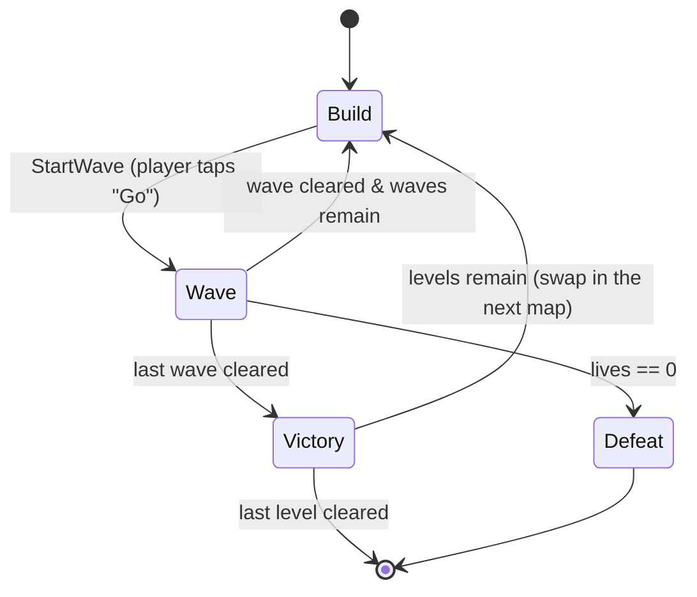

# ARCHITECTURE.md

**Project:** MobileDemo — a 2D mobile tower-defense demo
**Engine:** Unity 6.3 LTS · **Language:** C# · **Target:** Android/iOS, portrait, 60 FPS

---

## 1. Purpose & honest framing

This is a portfolio demo. Its job is to be a small, *finished*, genuinely playable
tower-defense round that demonstrates a handful of well-known patterns **in places
where they are actually the right tool** — not a gallery of patterns for their own sake.

The single most important thing a reviewer can learn from this repo is *judgment*:
where a pattern earned its place, and where a simpler option was chosen instead.
That reasoning lives in this document and in short inline comments at each decision
point, never in extra layers of code. If a pattern isn't pulling its weight, it isn't here.

### Scope, deliberately bounded
- **Three** maps played in sequence, **one** wave sequence each, **two** enemy types, **two**
  tower types.
- Build phase → wave phase → win/lose. That's the whole loop, repeated per map.
- **Lives carry over across all three maps** — one pool for the whole run, so losing on map 3
  restarts the run. That single decision is why `STARTING_LIVES` is a *run* constant and not
  per-map data (§7), and why `Defeat` is not per-map (§4).
- No meta-progression, no save system, no ads/IAP, no networking, no audio mixing.
  These are called out again in §12 so their absence reads as a decision, not a gap.

**Three maps is not a campaign system.** A map is a prefab that gets swapped, not a scene that
gets loaded — the whole feature is one component and three prefabs, with no level select, no
unlock state and nothing persisted. That distinction is what keeps it inside the bounded scope
above rather than reopening §12's meta-progression exclusion.

---

## 2. Design constraints (the "why" behind everything else)

| Constraint | Consequence in the architecture |
|---|---|
| **Mobile** | Allocation during a wave is the enemy → **object pooling is mandatory, not decorative**. Draw calls kept low via one sprite atlas. |
| **Touch input** | All interaction is tap-to-select / tap-to-place. Input is abstracted behind one interface so the demo can be driven by mouse in-editor. |
| **Portrait, single screen** | No camera controller, no scrolling. The whole board fits `REFERENCE_RESOLUTION`. |
| **60 FPS on mid-range phones** | Per-frame work is budgeted: enemies use cached transforms; towers scan on a **tick**, not every frame (see §9). |
| **Small & finished** | Every system has a hard "good enough for the demo" line. Abstraction stops there. |

Named constants (single source of truth — see `GameConfig` ScriptableObject, §7):

```
REFERENCE_RESOLUTION      = 1080 x 1920   (portrait)
TARGET_FRAME_RATE         = 60
STARTING_CURRENCY         = 100
STARTING_LIVES            = 20
TOWER_SCAN_INTERVAL_SEC   = 0.1           (see §9 Polling)
ENEMY_POOL_PREWARM        = 64
PROJECTILE_POOL_PREWARM   = 128
```

No magic numbers in gameplay code — everything above is read from config assets.

`GameConfig` now exists (§13's slice created it) and carries **three** of the seven:
`TARGET_FRAME_RATE`, `STARTING_LIVES`, `ENEMY_POOL_PREWARM`. The other four are deliberately not
on it:

- `STARTING_CURRENCY` — nothing earns or spends yet. A serialized knob nothing reads lies about
  being tunable. It arrives with `Economy`'s currency half, i.e. the first `ICommand` that spends.
- `PROJECTILE_POOL_PREWARM` — there is no `Projectile`, so there is nothing to size. The
  ctor-argument reasoning below still holds verbatim for this one entry.

`ENEMY_POOL_PREWARM` is a **run** constant, not a per-level one: the pool is built once at boot
and survives every level swap, so it must be sized for the *worst* of §1's three maps rather than
the current one. Three levels therefore strengthens this field's place on `GameConfig`. The
practical consequence for tuning is that `PeakActive` (§10) has to be read after a full run
across all three, not after map 1.

**The number above and the number in the asset have drifted apart, and the asset is the one that
runs.** `Data/GameConfig.asset` currently carries `enemyPoolPrewarm: 30`, not the 64 this section
names; §13's HUD run measured `PeakActive=9, InstanceCount=30, Prewarm=30`, so 30 is holding with
room to spare and nothing has grown. That does **not** settle which figure is right, because of
the paragraph directly above: 9 is map 1's peak, and the constant has to cover the worst of three
maps under a real `WaveRunner`, neither of which exists yet. Recorded as an open divergence rather
than resolved by editing one to match the other — the honest fix is to retune once a full run
across all three levels can be measured, and until then the two numbers disagreeing is a fact
about the project, not a typo.
- `REFERENCE_RESOLUTION` — configured on the scene's `CanvasScaler`, which is where Unity reads
  it. A copy on the asset would be a second source of truth that nothing consults.
- `TOWER_SCAN_INTERVAL_SEC` — no towers.

**`ENEMY_POOL_PREWARM` moving onto the asset did not change `ObjectPool<T>`.** `prewarm` is still
a **constructor argument**: `GameConfig` supplies the number to `Bootstrap`, which passes it to
`new ObjectPool<Enemy>(...)`. The pool has no idea the asset exists, and `ObjectPoolTests` still
constructs pools with a literal — which is what keeps it testable with no asset and no scene
(§14).

---

## 3. High-level layout

Three runtime assemblies, so dependency direction is enforced *by the compiler*, not by
discipline:

```
+-------------------------------------------------------------+
|  MobileDemo.UI          (HUD, build menu, win/lose panels)    |
|      depends on ->  Gameplay, Core                           |
+-------------------------------------------------------------+
|  MobileDemo.Gameplay    (towers, enemies, waves, economy,     |
|                         spawning, phases)                    |
|      depends on ->  Core                                     |
+-------------------------------------------------------------+
|  MobileDemo.Core        (EventBus, pooling, interfaces,       |
|                         ScriptableObject base types, config) |
|      depends on ->  (nothing project-specific)               |
+-------------------------------------------------------------+
```

Rule: **UI never reads gameplay state directly and Gameplay never references UI.**
They meet only through events (§8). If a `using UI;` ever appears in a Gameplay file,
the build breaks — which is the point.

The rule is now visible rather than asserted: the project's first UI file, `HudPresenter.cs`,
names only `MobileDemo.Core.Events`, `TMPro` and `UnityEngine`. And it is why the composition
root (`Bootstrap`, §5) sits *inside* Gameplay rather than in a fifth assembly above UI — it never
needs to name a UI type, because `HudPresenter` subscribes itself.

Assemblies are named `MobileDemo.<Layer>`, not bare `Core` / `Gameplay` / `UI`. A bare
`UI.asmdef` produces an assembly called literally `UI` — generic enough to collide with a
package, and it tells a reader nothing about where the code came from. The prefix is the
standard Unity `<Project>.<Module>` convention and costs nothing.

A fourth assembly, **`MobileDemo.Editor`**, sits outside this stack: it is editor-only, is
excluded from player builds, and may reference the three above while none of them can
reference it. See §11 for why that separation is a hard requirement rather than tidiness.

---

## 4. Core game loop & phases — **State pattern**

The round is a small state machine. This is the pattern I'd rank *highest* for a job
signal, above Factory, because it keeps the whole game readable at a glance.



**`Victory` is per level, not per run — and `Defeat` is the opposite.** Clearing the last wave of
map 1 or 2 swaps in the next level's prefab and returns to `Build`; only the last map's victory
ends the run. `Defeat` is terminal for the whole run, because §1's lives carry over: there is one
life pool across all three maps, so hitting zero on map 3 is not "retry map 3". The asymmetry is
the interesting part — it comes entirely from the carry-over decision, and flipping that one
answer would flip both transitions.

```csharp
public interface IGameState
{
    void Enter();
    void Tick(float dt);
    void Exit();
}
```

`GameStateMachine` owns the current `IGameState`, forwards `Tick`, and swaps states.
Each state is tiny and does one thing: `BuildState` enables the build UI and pauses
spawning; `WaveState` drives the active `WaveRunner`; `VictoryState`/`DefeatState`
freeze the board and raise a single event for the UI. `VictoryState` is also where the level swap
belongs, which is why `LevelRunner` (§5) waits on this machine rather than arriving first —
building it sooner would mean inventing a second, parallel notion of "round over".

Enemies get their *own* micro state machine (`Spawning → Moving → Dying`) — same
interface, different scope. Reusing the shape shows the pattern generalises.

**The enemy's machine shipped first**, ahead of `GameStateMachine`, because §13's slice has no
phases: a one-state round machine would demonstrate nothing and be rewritten once real phases
exist. Three things that fell out of building it, recorded because they are the parts a reader
cannot infer:

- **What justifies classes over an enum plus a `switch`** (which would be ~30 lines shorter):
  `EnemyMovingState` owns its own `waypointIndex` and re-zeroes it in `Enter()`, so the pooling
  reset for the path cursor *is* the pattern, rather than another line in `OnSpawn`.
- **State instances are constructed once, in `Awake`, never in `OnSpawn`.** `OnSpawn` is the
  pool's "sole initializer" and so is the tempting home — but a 64-enemy wave would then allocate
  192 objects mid-wave, the exact spike §2 calls pooling mandatory to prevent.
- **The cost:** three empty `Exit()` bodies. That is what sharing §4's interface buys, and `Exit`
  earns its keep in the round's machine, where `BuildState.Exit()` disables the build UI.

---

## 5. Systems overview

| System | Responsibility | Key patterns |
|---|---|---|
| `EventBus` | Typed one-to-many delivery for the §8 catalogue | **Observer** |
| `ObjectPool<T>` | Recycles pooled `Component`s — enemies and projectiles | **Object Pool** |
| `GameStateMachine` | Round phases | **State** |
| `WaveRunner` | Reads a `WaveDefinition`, schedules spawns over time | **Factory**, ScriptableObject |
| `EnemyFactory` | Turns an `EnemyDefinition` into a live, pooled enemy | **Factory + Object Pool** |
| `Enemy` | Path following, health, death | **State**, Observer (emits) |
| `Tower` | Target acquisition, firing | **Polling** (§9), Factory (spawns projectiles) |
| `Economy` | Currency & lives | **Observer** (emits changes) |
| `BuildController` | Place/upgrade/sell via undoable actions | **Command** |
| `InputService` | Touch → world intent | Strategy-ish (one interface, editor vs device) |
| `HudPresenter` | Listens, renders numbers | **Observer** (subscribes) |
| `Level` | Owns one map's path — and later its wave sequence. The unit that gets swapped | **none** — a prefab-root component, not an asset (see §7) |
| `LevelRunner` | Swaps in the next level's prefab on victory | planned — waits on `GameStateMachine` (§4) |
| `Bootstrap` | Composition root: builds pool, factory and economy from `GameConfig`, sets the frame rate, drives the tick | **none** — deliberately not a Service Locator or DI container (§15 declines both) |

**This table is a design, not an inventory.** What has code today: `EventBus`, `ObjectPool<T>`,
`EnemyFactory`, `Enemy`, `Level`, `Bootstrap`, `HudPresenter`, and `Economy` — the last of which
is **lives only** until something can spend (§8's `CurrencyChanged` therefore has no publisher
yet, which is fine: §8 is a contract). Still names only: `GameStateMachine`, `WaveRunner`,
`LevelRunner`, `Tower`, `BuildController`, `InputService`. `Bootstrap` is last in the table
because it is the only row that is *meant* to shrink — see §13.

`EventBus` and `ObjectPool<T>` head the table because they are Core infrastructure the rest lean
on, not gameplay systems in their own right — everything below them is a
`MobileDemo.Gameplay`/`MobileDemo.UI` concern. There is no `ProjectilePool` type: one generic pool
serves both clients as `ObjectPool<Enemy>` and `ObjectPool<Projectile>`, and a named subclass per
client would buy nothing.

---

## 6. Patterns — where, and *where not*

This is the table a reviewer should read first. The right-hand column is the senior part.

### Object Pool — `Core/Pooling/ObjectPool<T>`
- **Where:** enemies and projectiles. Enemies spawn in dozens per wave; a basic tower
  fires ~10×/sec. `Instantiate`/`Destroy` at that rate is the classic mobile GC-spike source.
- **Why it's justified:** it directly serves the mobile constraint. Prewarmed at construction from
  the §2 figures (`ENEMY_POOL_PREWARM`, `PROJECTILE_POOL_PREWARM`), passed as a constructor
  argument rather than read from an asset — see §2 for why that is not yet `GameConfig`'s job.
- **Where I did *not* pool:** towers themselves. A handful exist for the whole round and
  are placed by hand — pooling them would add lifecycle complexity for zero benefit.
- **Exhaustion grows the pool. This reverses an earlier decision.** §12 used to list a fixed
  budget as deliberately out of scope, on the reasoning that one known wave sequence needs no
  growth. That reasoning is still true about the *shipped* configuration and prewarm is still sized
  to hold it — but it decided the wrong question. The question is not "will a correctly tuned pool
  run dry" (it won't), it is "what should happen when someone tunes it wrong", and the honest
  answer is not a silently missing enemy. So an exhausted `Get()` creates one more instance and
  logs a warning: a mis-tuned prewarm costs one frame's `Instantiate` and one console line instead
  of a spawn that never appears. The cost of the reversal is that §10's allocation budget is now an
  invariant the numbers are *sized* to hold rather than one the code enforces, which is why §10
  says so in those words.
- **Growth is one instance per exhausted `Get`, never a doubling.** Doubling a 64-deep pool
  mid-wave would allocate 64 GameObjects in a single frame — a bigger hitch than the one pooling
  exists to avoid. The warning fires once per pool, because a burst can exhaust a pool many times
  in one frame and a flooded console is a console nobody reads; `InstanceCount > Prewarm` is the
  durable record, and `PeakActive` is the number to retune to.
- **Two callbacks (`IPoolable.OnSpawn`/`OnDespawn`), not `OnEnable`/`OnDisable`.** Those are
  spoken for: a pooled object is *disabled, not destroyed*, so `OnEnable`/`OnDisable` is the only
  correct home for EventBus subscription. Ordering is `SetActive(true)` → `OnSpawn()`, because a
  coroutine started in `OnSpawn` throws on an inactive GameObject and a tween on an inactive
  transform is meaningless; and `OnDespawn()` → `SetActive(false)` for the mirror reason. Prewarm
  does not call `OnDespawn`, so `OnSpawn` is the sole initializer.
- **`IPoolStats` — why a generic class needs a non-generic face.** `ObjectPool<Enemy>` and
  `ObjectPool<Projectile>` are unrelated closed types, so without a non-generic read surface
  nothing can hold a collection of pools. That is structural, not anticipation of the tool in §15;
  `PeakActive` already earns its place through §10.
- **Where I stopped:** no pool registry, no editor overlay, no `Clear`/`Dispose`, and no sweep for
  instances destroyed behind the pool's back. Each has a named trigger in
  [systems/object-pool.md](systems/object-pool.md) rather than speculative code here.

### Factory — `EnemyFactory`, projectile creation on `Tower`
- **Where:** `WaveRunner` asks `EnemyFactory` for "an enemy of this definition." The factory
  pulls from the pool, applies the `EnemyDefinition` data, and returns a configured instance.
- **Why it's justified:** it's the seam between *data* (which enemy) and *instance* (a live
  pooled object), and it's the one place that knows how to wire the two together.
- **Where I did *not* abstract:** no `AbstractFactory` hierarchy. One concrete factory is
  enough for two enemy types; an interface here would be architecture cosplay.

### Observer — `Core/Events/EventBus`
- **Where:** discrete, one-to-many facts: `EnemyKilled`, `EnemyLeaked`, `CurrencyChanged`,
  `LivesChanged`, `PhaseChanged`, `WaveCompleted`.
- **Why it's justified:** it's what keeps UI and Gameplay in separate assemblies (§3). The
  economy doesn't know the HUD exists; it just announces `CurrencyChanged`.
- **Where I did *not* use it:** tower→target and enemy→path following are *continuous*
  relationships, not discrete events, so they are plain references, not subscriptions.
  Firing an event every frame per enemy would be Observer used as a hammer.
- **Design choice — why a small static `EventBus` and not ScriptableObject event channels:**
  SO event channels are the trendy Unity answer and I know them, but they add an asset and an
  editor-wiring step per event for a demo where every subscriber is code. The static typed bus
  is fewer moving parts and trivially testable. Noted here so the omission is visibly a choice.
- **Shape:** `EventBus<TEvent>` is a *static generic* class, so closing it over an event type
  gives that event its own static field — a type-keyed dictionary resolved by the runtime once,
  rather than a `Dictionary<Type, List<Delegate>>` hashed on every publish. Subscribers are held
  in a multicast `Action<TEvent>`, which is immutable: a handler that unsubscribes itself mid-
  dispatch cannot corrupt the in-flight call, and getting that same guarantee from a `List` would
  cost a defensive copy per publish. Payloads are `readonly struct`s, enforced by
  `where TEvent : struct, IEvent` so no-boxing is the compiler's guarantee and not a convention.
  The real win is compile-time, though, not allocation: `Subscribe` and `Publish` agree on
  `TEvent` by construction, so a handler wired to the wrong event fails to compile instead of
  failing the day that event first fires.
- **The one non-obvious requirement — clearing statics between play sessions.** With *Enter Play
  Mode Options* set to skip domain reload, static subscribers survive into the next session and
  the second Play throws `MissingReferenceException` from code that reads as correct. A
  non-generic `EventBus.ClearAll()` runs at `SubsystemRegistration` to prevent that. It needs the
  indirection of a reset registry because a static generic class cannot be enumerated — there is
  no way to ask the runtime which closed forms exist, so each one registers itself on first use.
- **Dependency footprint:** `System`, `System.Collections.Generic`, and `UnityEngine` for the
  play-mode reset hook. No package, no asset, no container, no base class a subscriber must
  inherit. An earlier draft kept the engine touch behind `UNITY_5_3_OR_NEWER` so the files would
  also compile outside Unity; that guard is gone and the bus is Unity-only by choice, because the
  portability it bought was hypothetical. The property that actually pays daily is the one §14
  uses: the bus tests with no scene, no GameObject and no play mode.
- **Where a Factory would *not* help.** A factory is the seam between data and a configured
  instance — its job for enemies, above. Events have no asset, no pool and no lifecycle to bridge,
  and `Publish` needs `TEvent` at the call site regardless, so a factory could not remove the very
  type it would exist to hide. The instinct behind the question — *one thing that manufactures
  events, so a new event needs no new type* — is the ScriptableObject event-channel pattern, and
  it is declined two bullets up.
- **Considered and declined — one-line event declarations.** Each event costs a ~6-line
  `readonly struct`, so: can it be one line? Two routes exist and both lose. *C# 9 records* —
  `record struct` is exactly right but is C# 10, and Unity 6.3 pins `-langversion:9.0`; a `record`
  *class* is reachable with a hand-declared `IsExternalInit`, but it is a reference type, so every
  publish heap-allocates and it contradicts the `struct` constraint outright. *Phantom-tag
  generics* — `Changed<Currency>` and `Changed<Lives>` genuinely are distinct closed types with
  distinct statics, so this does trade six lines for one, but it only fits the four single-`int`
  events (`EnemyKilled` carries reward *and* position) and it makes §8 a worse catalogue to read,
  which is most of what §8 is for. Worth naming the trap next door: a `ValueTuple` payload,
  `EventBus<(int total)>`, would silently put `CurrencyChanged` and `LivesChanged` on the *same*
  bus. Distinct named types are what prevent that.

### Command — `Gameplay/Build/ICommand` + `BuildController`
- **Where:** build-phase actions only — `PlaceTowerCommand`, `UpgradeTowerCommand`,
  `SellTowerCommand`. `BuildController` pushes each onto an undo stack.
- **Why it's justified:** Command is the pattern that feels *forced* in a pure action game.
  A build phase gives it an honest home: undo/redo for free, and a clean, testable input layer
  (a command can be executed from a test with no touch input at all).
- **Where I stopped:** undo does **not** cover combat (you can't un-kill an enemy). Undo is
  scoped to the build phase, where it models a real player affordance ("misclicked, take it back")
  instead of inventing complexity to show off.
- **How it meets the bus — the one place the two patterns can disagree.** A command is not an
  event: it is an imperative with exactly one execution and a receiver the caller holds, where an
  event is a past-tense fact broadcast to nobody in particular. But commands *produce* events.
  `PlaceTowerCommand.Execute()` spends currency, so `Economy` raises `CurrencyChanged`; `Undo()`
  must therefore refund **and let that raise again**, or `HudPresenter` and `BuildController`'s
  afford check (§8) keep showing the pre-undo balance while `Economy` holds the real one. Undo
  restores state *and* re-announces it.

```csharp
public interface ICommand
{
    void Execute();
    void Undo();
}
```

### State — see §4.

### ScriptableObject-driven data — see §7. (Not GoF, but the thing pure-pattern demos miss.)

---

## 7. Data-driven config — ScriptableObjects

All tuning lives in assets, not code. This is both good Unity practice and the reason the
demo has *no magic numbers* in gameplay classes.

- `GameConfig` — the constants from §2 (currency, lives, frame rate, pool sizes).
- `EnemyDefinition` — sprite, hp, move speed, currency reward, damage-on-leak.
- `TowerDefinition` — sprite, cost, range, fire rate, projectile ref, upgrade tiers.
- `WaveDefinition` — an ordered list of `{ EnemyDefinition, count, spawnInterval }` groups.

Designers (or you, at 2am) can retune the whole game by editing assets in the Inspector —
no recompile. `EnemyFactory` and `WaveRunner` read these; they never hard-code values.

**Today:** `GameConfig` carries three of §2's seven constants (that list says which, and why the
rest are absent). `EnemyDefinition` carries all five fields above plus `spawnDelaySeconds`, the
placed-but-not-moving window `EnemySpawningState` owns. `TowerDefinition` and `WaveDefinition`
have no code. Two `EnemyDefinition` fields — `maxHealth` and `currencyReward` — are **authored but
unread** until towers exist: a deliberate call, so the asset is authored once and completely. The
line that is *not* crossed is `Enemy.currentHealth`, because a data knob a future system will read
is a knob, while a field on a live object with no writer reads as working code.

Both types carry `[CreateAssetMenu]`, and `Data/GameConfig.asset`, `Data/EnemyGreenSoldier.asset`
and `Data/EnemyGreySoldier.asset` are now authored. The two soldiers differ **only** as data —
they share one prefab — which is the §6 Factory claim made concrete: grey is slower, tougher and
worth more, and adding it cost an asset rather than a type.

### Why `STARTING_LIVES` is on `GameConfig` and not on a level

It reads like per-level data, and the next reader will assume it is. It isn't: §1's lives **carry
over across all three maps**, so there is one life pool for the whole run and "starting lives" is
a *run* constant — the same category as `TARGET_FRAME_RATE`. Had lives reset per map, this field
would belong on `Level` and `Economy` would be rebuilt on every swap. Recorded here because the
reasoning is the only thing that distinguishes the two cases, and the wrong guess is a plausible
"fix".

### Why per-level data lives on a prefab component, not a `LevelDefinition` asset

§7's rule is that tuning belongs in assets, so a `LevelDefinition` ScriptableObject is the
expected answer here and it was declined. A map's defining content is a `SpriteRenderer` and an
`EnemyPath` — waypoint `Transform`s, which can only exist on a GameObject. The prefab therefore
*is* the level whether or not an asset also describes it, and adding the asset would mean two
artifacts per level to keep in sync plus a real failure mode: a definition pointing at the wrong
prefab. So `Level` is a component on the prefab root, and the `WaveDefinition[]` it will carry is
a reference to assets rather than a reason to become one. The ScriptableObject case comes back if
level tuning ever needs to be compared side by side without opening three prefabs.

---

## 8. Event catalogue (Observer contract)

The full list of gameplay events. Keeping it short and enumerated *here* is deliberate — if
this list starts growing past ~10 entries, that's the signal the EventBus is becoming a dumping
ground and some of these should go back to direct references.

| Event | Raised by | Consumed by | Payload |
|---|---|---|---|
| `EnemyKilled` | `Enemy` | `Economy`, `WaveRunner` | reward, position |
| `EnemyLeaked` | `Enemy` | `Economy` (lives), `WaveRunner` | damage |
| `CurrencyChanged` | `Economy` | `HudPresenter`, `BuildController` (afford check) | new total |
| `LivesChanged` | `Economy` | `HudPresenter`, `GameStateMachine` (defeat check) | new total |
| `PhaseChanged` | `GameStateMachine` | `HudPresenter`, build UI | new phase enum |
| `WaveCompleted` | `WaveRunner` | `GameStateMachine` | wave index |

---

## 9. Polling vs. events — an explicit decision

Two continuous jobs deliberately use **polling on a tick**, not events:

- **Tower target acquisition.** Each tower re-scans for the nearest in-range enemy every
  `TOWER_SCAN_INTERVAL_SEC` (0.1s), not every frame and not via an "enemy moved" event.
  - *Why not every frame:* a 10 Hz scan is imperceptible for TD and cuts the work 6×.
  - *Why not event-driven:* "enemy entered range" would mean every enemy notifying every
    tower on every move — a many-to-many event storm that's strictly worse than a cheap poll.
  This is the honest case where **polling is the right answer** and events would be the naive one.
- **Enemy path following** advances along waypoints in its own `Tick`. No event per step.

Discrete, rare facts (a death, a phase change) use Observer. Continuous, per-frame-ish
relationships use polling. The dividing line — *event frequency vs. subscriber count* — is
stated so the choice looks reasoned.

### Who calls `Tick` — a third explicit decision

**Enemies are ticked by the composition root, not by their own `Update`.** `Bootstrap.Update`
walks a `List<Enemy>` and calls `enemy.Tick(dt)`; `Enemy` has no `Update` at all. Why:

- **This section's own vocabulary is `Tick`.** A driven `Tick(float dt)` makes the sentence above
  literally true, and it makes the enemy's micro machine and the round's machine driven
  *identically* — which is the point §4 makes about reusing the shape.
- **Testability, and there is no PlayMode assembly (§12).** `enemy.Tick(0.016f)` is callable from
  an EditMode test with a deterministic `dt`; `Update` is not callable at all. This is what buys
  `EnemyTests`, so it is the concrete reason rather than a theoretical one.
- **Pausing is free**, and §4's `BuildState` needs it: a driven tick pauses by not being called,
  where 64 `Update`s pause by 64 `enabled` writes or a `timeScale` hack that also freezes UI.
- **Order is deterministic.** Undefined `Update` order between pooled instances is real
  frame-to-frame variance; one loop is one order.

The interop saving (one native→managed crossing per frame instead of 64) is real but is *not* the
argument — at this scale it is not the dominant cost, and claiming otherwise would be a
measurement we did not take. **The honest cost** is that `Bootstrap` must own the live-enemy list
and ~10 lines of add/remove bookkeeping that `Update` would have given for free. The pool cannot
supply that list: it deliberately does not expose its active set, and asking it to would make it
a registry. Those are the same ten lines `WaveRunner` inherits.

---

## 10. Mobile-specific notes

- **Input:** `IInputService` exposes `TryGetTap(out Vector2 world)`. A `TouchInputService`
  on device, an editor implementation reading the mouse — so the demo is playable in-editor
  without a phone. Nothing else in the game knows which is running.
- **Rendering:** one sprite atlas → few draw calls. Sprites on a single sorting layer with
  explicit `orderInLayer`. No per-object materials.
- **Resolution:** Canvas Scaler set to *Scale With Screen Size* against `REFERENCE_RESOLUTION`,
  match = 0.5, so it survives from 18:9 to 20:9 without art breaking.
- **Allocation budget:** zero `Instantiate`/`Destroy` during a wave — an invariant the §2 prewarm
  figures are *sized* to hold, not one the code enforces. An exhausted `ObjectPool<T>.Get()` grows
  by one and logs a warning (§6), so a mis-tuned prewarm surfaces as one frame's allocation and one
  console line rather than a missing enemy. That makes **a clean console across a full wave** the
  thing that actually certifies this budget, and `PeakActive` after a run the number prewarm should
  be tuned to — which is what gives `IPoolStats` a job today, with the §15 overlay still unbuilt.
  `PeakActive` now has a real reader: `EnemyFactory.Stats`, logged once by `Bootstrap.OnDestroy`.
  Cache `WaitForSeconds`, avoid LINQ in per-tick paths, cache `Transform` references.
- **The sprite atlas does not exist yet, and that is a dated decision rather than an oversight.**
  With one enemy sprite and one background there is nothing measurable to batch, and a two-sprite
  atlas is the kind of decoration §1 disowns. **Named trigger: the second enemy type** — the first
  moment two enemy sprites share a frame and batching has something to merge. Until then the
  draw-call bullet above is design intent, not a measurement.

### Build & player settings

These are not incidental project settings. Each one backs a claim made elsewhere in this
document, which is why they are enumerated here and committed to version control instead of
being left to whoever opens the project next.

| Setting | Value | What it backs |
|---|---|---|
| Default orientation | **Portrait**, autorotation off | §2 "Portrait, single screen", and the Canvas Scaler note above |
| Scripting backend (Android) | **IL2CPP** | Required for the ARM64 build below; AOT also beats Mono on per-frame cost |
| Target architecture | **ARM64** | Google Play rejects 32-bit-only uploads |
| Minimum Android API | **26** (Android 8.0) | Covers the mid-range devices §2 targets |
| Incremental GC | **On** | Spreads collection across frames. It *complements* §6's pooling; it does not remove the reason for it |
| `Application.targetFrameRate` | **60** | §2's `TARGET_FRAME_RATE`. Unity exposes no project setting for this — it must be assigned in code at boot, read from `GameConfig` |

**Orientation is the one that had to be corrected.** Unity's 2D template ships with
autorotation enabled for all four orientations, which silently contradicts every layout
assumption in §2 and in the Canvas Scaler note above — left alone, the board would have
rotated into landscape on device. It is now portrait-only, deliberately; treat any future
change here as a change to §2.

**Current state:** everything above is set as listed. `Application.targetFrameRate` now has code
behind it — `Bootstrap.Awake` assigns it from `GameConfig.TargetFrameRate` — and §13's scene
wiring is done, so that assignment now actually runs.

**One caveat on that row, worth committing because it is silent.** `Application.targetFrameRate`
is *ignored* whenever `QualitySettings.vSyncCount != 0`. The project runs quality level 0, where
`vSyncCount` is 0, so it holds today — but Medium and above ship `vSyncCount: 1`, so changing
quality level voids the row with no error and no log. Not worth defensive code; worth knowing
before profiling a frame rate that will not budge.

**Colour space stays at Linear**, the URP default — a decision, not an oversight. Gamma is
marginally cheaper on mobile and this is a 2D game with no real lighting model, but the 2D
Renderer and any `Light2D` use are authored against Linear, and re-authoring art to chase a
small win is not a trade this demo needs. Revisit only if on-device profiling says otherwise.

---

## 11. Folder structure

Flat, by asset type, at the `Assets` root — with code grouped by *assembly* under `Scripts/`,
because an `.asmdef` boundary is a folder boundary:

```
Assets/
  Scripts/
    Core/           (MobileDemo.Core.asmdef)
      Events/       EventBus.cs, IEvent.cs, GameEvents.cs
      Pooling/      ObjectPool.cs, IPoolable.cs, IPoolStats.cs
      Config/       GameConfig.cs
      Interfaces/   ICommand.cs, IGameState.cs, IInputService.cs
    Gameplay/       (MobileDemo.Gameplay.asmdef)
      Bootstrap.cs                         (composition root — §5, §13)
      Phases/       GameStateMachine.cs, BuildState.cs, WaveState.cs, ...
      Enemies/      Enemy.cs, EnemyStates.cs, EnemyFactory.cs, EnemyDefinition.cs, EnemyPath.cs
      Levels/       Level.cs, LevelRunner.cs        (LevelRunner planned — §4)
      Towers/       Tower.cs, TowerDefinition.cs, Projectile.cs
      Waves/        WaveRunner.cs, WaveDefinition.cs
      Economy/      Economy.cs
      Build/        BuildController.cs, PlaceTowerCommand.cs, ...
      Input/        TouchInputService.cs, EditorInputService.cs
    UI/             (MobileDemo.UI.asmdef)
      HudPresenter.cs, BuildMenu.cs, EndScreen.cs
    Editor/         (MobileDemo.Editor.asmdef — Editor platform only)
      PathEditor.cs, PoolOverlay.cs        (both planned — §12)
  Tests/
    EditMode/       (MobileDemo.Tests.EditMode.asmdef — see §14)
  Data/             *.asset  (GameConfig, EnemyGreenSoldier, EnemyGreySoldier;
                             Tower/Wave definitions planned)
  Art/              sprites (atlas still deferred — §10)
    Sprites/Environment/   the three §1 maps: variant1..3
  Prefabs/          EnemySoldier.prefab, Level_01..03.prefab  (tower, projectile planned)
  Scenes/           Gameplay.unity
  Settings/         URP 2D pipeline assets — Unity's 2D template made these; left in place
  TextMesh Pro/     TMP Essential Resources — a one-time import, committed; see §15
```

Outside `Assets/`, the repo root holds one authored folder: **`Tools/`**, for scripts that act
on the project rather than shipping in it (`lint.ps1` — see §15). It sits outside `Assets/`
deliberately: anything under `Assets/` is an asset Unity imports, generates a `.meta` for and
considers for a build, and a lint script is none of those things.

### Why flat, and not an `Assets/_MobileDemo/` root

Most Unity style guides recommend putting everything you author inside a single
underscore-prefixed, project-named folder. That convention solves one problem well: Asset
Store packages dumping their own folder trees into the `Assets` root, plus the related job of
migrating content between projects.

This project does not have that problem. §15 excludes Asset Store content deliberately, and
PrimeTween — the one third-party dependency — installs through Package Manager into
`Packages/`, which never touches `Assets/` at all. Paying an extra nesting level on every path
to defend against an import that is ruled out by policy is cost without benefit, so the layout
stays flat. Noted here so the omission reads as "knew the convention and declined it," not
"hadn't heard of it."

**The trade-off flips if the premise does:** the first Asset Store package that lands in
`Assets/` is the signal to adopt the `_MobileDemo/` root and move these folders under it.

### Rules this layout does keep

- **`Editor/` is a reserved name, not a stylistic choice.** Unity excludes the contents of any
  folder called `Editor` from player builds. The §15 tooling (`PathEditor`, and the Pool Overlay
  that would read `IPoolStats` — both still unwritten, §12) references `UnityEditor`, so without
  this folder — and an assembly constrained to the Editor platform — the Android/iOS build fails
  to compile. The dependency is strictly one-way: editor code may reference runtime code, never
  the reverse. The assembly exists ahead of its first file precisely so that stays true by
  construction.
- **No `Resources/`.** It inflates build size unconditionally and offers no async loading.
  Every ScriptableObject is referenced directly per §7, so nothing here needs it.
- **Type folders stop at the top level.** No `Art/Textures/` or `Art/Materials/` nesting — the
  Project window's type filter already does that job, and such folders would only restate it.
- **PascalCase, no spaces, no Unicode** in folder and asset names. Unity's command-line and
  batch tooling breaks on all three.
- **Package references are per-assembly, not global.** `MobileDemo.Gameplay` references
  `Unity.InputSystem` (the §10 input services); `MobileDemo.UI` references `UnityEngine.UI` and
  `Unity.TextMeshPro` (§15). `MobileDemo.Core` references nothing but the engine — which is
  precisely what makes it the layer everything else can safely depend on.
- **`Interfaces/` is for the cross-cutting ones.** `ICommand`, `IGameState` and `IInputService`
  are contracts a whole layer implements and other layers name. An interface that exists to serve
  one type lives beside that type instead — which is why `IPoolable` and `IPoolStats` sit in
  `Pooling/` and not in `Interfaces/`. Grouping interfaces by the fact that they are interfaces
  would be filing by C# keyword rather than by responsibility.
- **`EnemyPath.cs` sits in `Enemies/` rather than earning a `Path/` folder.** Same rule as the
  bullet above, one level up: a folder holding one file that serves one system is filing by noun,
  not by responsibility. **Named trigger to move it:** the first *non-enemy* runtime consumer of
  the path — say a build-slot system asking how far a tile is from the road. `Scripts/Editor/
  PathEditor.cs` is deliberately **not** that trigger, because editor→runtime is the one-way
  dependency this section already permits.
- **`Gameplay/Levels/` holds one file today and still gets a folder**, which is not a
  contradiction of the bullet above. The test is not "how many files" but "does the folder name a
  responsibility that will hold more than one" — `Levels/` gains `LevelRunner.cs` with §4's
  machine, exactly as `Economy/` started with one file and will gain the currency half. `Path/`
  failed that test because the path is *part of* the enemy system, not a system beside it.
- **The three enemy states share `EnemyStates.cs`**, following `GameEvents.cs`'s precedent: small
  types that only ever change together read better as one catalogue. Deliberately asymmetric with
  `Phases/`, which *will* split `BuildState.cs` and `WaveState.cs` — those are several times the
  size and are the round's readable spine, so one-per-file earns its place there and not here.
- **`Economy.cs` lives in `Economy/` but its namespace is `MobileDemo.Gameplay`, and that is a
  compile error avoided rather than an inconsistency.** With the class in
  `MobileDemo.Gameplay.Economy`, any file inside `MobileDemo.Gameplay` — `Bootstrap.cs` — writing
  `Economy economy;` resolves `Economy` against its enclosing namespace's members *before*
  consulting `using` directives, finds the **namespace**, and fails `CS0118: 'Economy' is a
  namespace but is used like a type`. The folder keeps its name; only the namespace flattens.
  Said here and at the top of the file, or the next reader "fixes" it straight back into CS0118.
- **`Bootstrap.cs` sits at the Gameplay root, not in a subfolder**, matching `HudPresenter.cs` at
  the UI root. It is not a system in the `Enemies/`/`Phases/` sense; it is the seam that
  assembles them.
- **`Assets/TextMesh Pro/` does not trip the `_MobileDemo/` trigger below.** That trigger is
  *Asset Store* content landing in the `Assets` root; TMP Essential Resources is a first-party
  Unity package resource that Unity's own importer puts there and expects to find there. Said
  explicitly, or the rule reads as ignored the first time someone sees the folder.

**Status:** every `.asmdef` exists — `Core`, `Gameplay`, `UI`, `Editor`, `Tests/EditMode` — so the
§3 dependency graph has been enforced by the compiler from the first line of code rather than
retrofitted later, when untangling it would have meant moving files. Four of the five now hold
code; `Editor` is still an empty shell, waiting on `PathEditor` and the Pool Overlay (§12).

Leaf folders appear as their code does. **With code:** `Core/Events`, `Core/Pooling`,
`Core/Config`, `Core/Interfaces`, `Gameplay/Enemies`, `Gameplay/Economy`, `Gameplay/Levels`,
`Gameplay/` root (`Bootstrap.cs`), `UI/` root (`HudPresenter.cs`), `Tests/EditMode`. **Still only
names in this table:** `Gameplay/Phases`, `Gameplay/Towers`, `Gameplay/Waves`, `Gameplay/Build`,
`Gameplay/Input`, and `Editor/`.

Of the asset folders, `Art/`, `Scenes/`, `Data/`, `Prefabs/` and `TextMesh Pro/` all hold content:
sprites, the three config/definition assets, and `EnemySoldier.prefab` + `Level_01.prefab`. The
tree above is now the tree on disk — **`Scenes/Gameplay.unity` is the real name rather than the
target one**, renamed in place (F2's effect, via `AssetDatabase.RenameAsset`) so the guid survived
and `EditorBuildSettings.asset` needed only its path rewritten.

**Why the enemy prefab is `EnemySoldier.prefab` and not `Enemy.prefab`.** Prefab identity here is
per *body shape*, not per "enemy": the green and grey soldiers share a silhouette, so they share a
prefab and differ only as `EnemyDefinition` data, while the planned tanks need their own prefab
and cannot. A file called `Enemy.prefab` would have to mean "the soldier one" the moment the tank
lands, so it is named for what it actually is. The consequence is recorded in
[systems/enemy-factory.md](systems/enemy-factory.md): a second prefab means a second pool, so the
tank slice changes `EnemyFactory` rather than only adding assets.
Anything still empty when the demo ships should be deleted rather than committed as decoration.
**`Art/UI/` has now gone**, on exactly that rule: the HUD is TMP text over the map, so no UI sprite
was ever going to land there, and the folder was holding a place for a decision already made
elsewhere. Note that git does not track empty directories but *does* track their `.meta` files, so
a fresh clone can get orphan `.meta`s that Unity deletes on first open — worth a cleanup pass, and
called out here so the next reader knows that diff is expected rather than damage.

---

## 12. Deliberately out of scope

Listed so their absence is legibly a decision:
save/meta-progression, more than two enemy/tower types, audio, IAP/ads,
analytics, localisation, networking.

Still out of scope, and specific to §6's pooling: a pool registry or editor overlay for live counts
(`IPoolStats` exists for it; the tool does not), pool `Clear`/`Dispose` and cross-scene pool
lifetime, pooling anything other than enemies and projectiles, and a PlayMode test assembly.

**Two entries have been removed from this list rather than kept.**

*Object-pool auto-growth beyond prewarm* was listed here as out of scope, with the reasoning that
a fixed budget is fine for one known wave sequence. Growth is now implemented, so the entry cannot
stand; the reversal and what it cost are recorded at the decision point in §6's Object Pool entry,
not deleted.

***Multiple maps* was the second, and this one is a scope reversal rather than an implementation
one.** It was listed on the reasoning that one map is enough to demonstrate a tower-defense round,
which is still true — but it answered the wrong question. The cost of a second map is not a
level-management system; it is a prefab swap, because a map *is* a `SpriteRenderer` plus an
`EnemyPath` and both already live on a GameObject. Three maps therefore cost one `Level` component
and three prefabs (§5, §11), and the art for all three was already in the repo. What the reversal
does buy back is a real demand on the phase machine — `Victory` stops being terminal (§4) — and
that is the part worth reading as the price rather than the feature. Still excluded, and worth
saying because it is the line this reversal does *not* cross: no level select, no unlock state,
nothing persisted between runs. That is §12's save/meta-progression entry, which stands.

---

## 13. First vertical slice — **done; seen end to end**

Every type the slice needs exists, compiles and is tested: `GameConfig`, `IGameState`, `Economy`,
`EnemyDefinition`, `EnemyPath`, `Enemy` + its three states, `EnemyFactory`, `Level`, `Bootstrap`,
`HudPresenter`, and 28 new EditMode tests (§14).

**The spawn/pool/path/leak spine has now been authored and run.** What is done:

1. ✅ `Data/GameConfig.asset`, `Data/EnemyGreenSoldier.asset` and `Data/EnemyGreySoldier.asset`.
   Grey is a second *definition*, not a second prefab — see §7.
2. ✅ `Prefabs/EnemySoldier.prefab` — `SpriteRenderer` (order 10, above the map's 0) + `Enemy`, no
   collider, **root left active** (see [systems/object-pool.md](systems/object-pool.md) for why
   that is not cosmetic). Named for the body shape, not for "enemy" — reasoning in §11.
3. ✅ **`Prefabs/Level_01.prefab`** — root carries `Level`, with the map `SpriteRenderer`
   (`variant1_riverside_switchback`, order 0) and an `EnemyPath` GameObject plus ten waypoint
   children, `Level.Path` assigned inside the prefab, one instance in the scene. Authoring the
   level as a prefab *now* is what stops maps 2 and 3 requiring a restructure later.
4. ✅ Scene wiring: `PoolRoot` (scale exactly 1, at the scene root — **not** a child of the level,
   because pooled enemies must outlive a level swap) and `Bootstrap`'s six references.

The HUD half is now authored too, which is what closes the slice:

5. ✅ TMP Essential Resources imported — `Assets/TextMesh Pro/` (~3.9 MB), committed. Without it
   the HUD label renders nothing, silently (§15).
6. ✅ The HUD Canvas, whose Canvas Scaler carries §2's `REFERENCE_RESOLUTION` at match 0.5, with
   `HudPresenter.livesLabel` assigned. `EnemyLeaked` → `Economy` → `LivesChanged` now has
   somewhere to land, so step 4 of the four below is proven rather than asserted.
7. ✅ `Scenes/SampleScene.unity` → `Scenes/Gameplay.unity`, renamed in place so the guid survived
   (`8c9cfa26…` is unchanged) and `EditorBuildSettings.asset` needed only its path rewritten.

**These three were scripted, not clicked**, through a throwaway editor class driven by
`Unity.exe -executeMethod`. That is worth one line because of what it bought and what it cost: the
authoring is reproducible and the Canvas Scaler numbers came from §2 rather than from a memory of
§2, but the script was deleted once it had run, because a one-shot that authors a scene is
scaffolding and §11's folder table describes what ships. The **`EventSystem` was deliberately not
authored**: nothing is tappable yet, and one serving nothing is the decoration §1 disowns — it
arrives with the build phase.

`Level_02` and `Level_03` are deliberately **not** authored yet: one prefab proves the shape, and
the other two arrive with the swap itself, which waits on §4's machine.

**The slice is certified by running it, not by the tests.** What has been seen, on
`SampleScene.unity` at `spawnIntervalSeconds = 2`:

- Enemies spawn, walk the switchback and leak at the end; all eight on-screen sit on the road art.
- **The pool recycles.** Across ~40 spawns over 81 s, `PoolRoot`'s child count held at exactly 64
  and the active count plateaued at 8 — the number the path length predicts (≈23.7 units at speed
  1.5 ≈ 16 s alive ÷ a 2 s interval). A pool that was not recycling would have shown active
  climbing with the spawn count.
- `Pool 'EnemySoldier': PeakActive=9, InstanceCount=64, Prewarm=64` on exit —
  `InstanceCount == Prewarm` is the durable record that it never grew, and **no growth warning
  was logged**.
- Three consecutive play sessions, clean each time: no `MissingReferenceException`, so
  `EventBus.ClearAll()` is doing its job with domain reload off
  (`m_EnterPlayModeOptions: 1` is set).
- 70 EditMode tests green.

One caveat worth recording rather than hiding: Unity does not tick while unfocused, so the run
needed `Application.runInBackground = true`. That is a *harness* fact about driving the editor
from outside, not a property of the game — **and it does not stay a harness fact by itself.**
Assigning it from editor code writes `runInBackground: 1` into `ProjectSettings.asset`, where it
becomes a shipped **player** setting: a mobile build that keeps simulating in the background,
which is a battery bug and contradicts the sentence before this one. It has been reverted to `0`,
and anyone driving the editor from outside again should expect to revert it again.

**And what has now been seen with the HUD attached**, on `Gameplay.unity` at the same
`spawnIntervalSeconds = 2`, over a 32 s scripted play session:

- **The label counts down: `Lives 14`**, from a starting 20 — six leaks, which is the whole of
  §8's `EnemyLeaked` → `Economy` → `LivesChanged` → `HudPresenter` chain working end to end. It
  is also the first time `Economy` has had a subscriber that a human can see.
- **The label is genuinely rendered, not merely correct in memory.** A screenshot of the Game view
  shows "Lives 14" drawn top-left over the map, and the component reports
  `font = LiberationSans SDF`. Both halves matter: §15's TMP failure mode is a label that holds the
  right string and draws *nothing*, so a `.text` read alone would not have caught it.
- `Pool 'EnemySoldier': PeakActive=9, InstanceCount=30, Prewarm=30` on exit. `PeakActive` reproduced
  the earlier run's 9 exactly, `InstanceCount == Prewarm` again says it never grew, and no growth
  warning was logged. The prewarm figure differs from the run above because the asset was retuned
  between them — see §2, which records that divergence rather than papering over it.
- Clean console: no `MissingReferenceException` across repeated sessions, so `EventBus.ClearAll()`
  is still doing its job with domain reload off.
- 70 EditMode tests green, run headless via `-runTests`.

**Two things this run cost, recorded because they are the parts a reader cannot infer.** A
CLI-launched editor restores whatever session scene it likes, so the verifier has to open the
scene under test explicitly — the first attempt happily played an empty backup scene and reported
no HUD. And `ScreenCapture` photographs the *Game view*, which such an editor may not have open;
rendering `Camera.main` into a `RenderTexture` is **not** the workaround, because a Screen Space
– Overlay canvas does not render through a camera at all and the photograph would miss the one
thing it exists to show.

With that seen, the slice is closed and the next one is **the first tower** (introducing §9's
polling and projectile pooling), then the build phase (Command), then the wave sequence and
phases.

The four steps, kept rather than deleted, because the order is the argument:

1. One `EnemyDefinition`, one hard-coded path (waypoints in the scene).
2. A pooled spawner (`ObjectPool<Enemy>` + `EnemyFactory`) *gets* one enemy — `Release` is the
   opposite direction, the return to the pool.
3. The enemy follows the path, reaches the end, and raises `EnemyLeaked`.
4. A single `HudPresenter` label subscribed to the bus decrements a lives counter.

That slice exercises Pool + Factory + Observer + enemy State with **no towers, no waves,
no build UI, no commands**. When it runs clean, we add the first tower (introducing polling
and projectile pooling), then the build phase (Command), then the wave sequence and phases.
One verified slice at a time.

### What the slice deliberately did *not* do

Each of these was reachable and was left out, because building it would have meant a type with no
caller or a field with no writer:

- **No `GameStateMachine`, `BuildState`, `WaveState` or `PhaseChanged` publisher** — no phases
  exist, and a one-state machine proves nothing. `Bootstrap.Update` is the placeholder, with
  successors named in [systems/bootstrap.md](systems/bootstrap.md).
- **No `WaveRunner` / `WaveDefinition`** — `Bootstrap`'s spawn timer is the honest stand-in.
- **No `IInputService`** and no `TouchInputService`/`EditorInputService`: nothing is tappable, so
  `MobileDemo.Gameplay`'s `Unity.InputSystem` reference is correctly present and unused.
- **No enemy health, `TakeDamage` or `EnemyKilled`** — nothing can damage or reward. See §7 for
  where that line was drawn on the data asset versus the live object.
- **No currency on `Economy`** and no `Projectile`, `Tower`, collider, or sprite atlas (§10).
- **No `StateMachine<T>` helper in Core.** `Enemy` needs four lines (`Exit` → assign → `Enter`);
  extracting a shared one before §4's machine exists would be designing for a caller that does
  not yet exist, and the two swap implementations cannot be shown identical until both are here.

**Two judgement calls worth flagging as such**, rather than presenting as obvious: the third
enemy state (`Spawning`) has a real but thin job today — a ~0.15 s placed-but-not-moving window
whose eventual owners are a spawn pop and a not-yet-targetable rule; and `Enemy.Initialize()` is
idempotent purely so EditMode tests can drive it (see §14), which is a test-shaped concession in
production code and is recorded as one.

---

## 14. Testing (lightweight, but present)

EditMode tests where they're cheap and meaningful — exactly the seams the patterns created:
`EventBus` (deliver/unsubscribe/isolation per type, `ClearAll`), `ObjectPool` (get/release/reuse,
no leak, plus growth on exhaustion, a rejected double release, and the `SetActive`↔`OnSpawn` order
§6's reasoning depends on), each `ICommand` (execute then undo restores state), `Economy`
(spend/earn/insufficient-funds), `GameStateMachine` (legal transitions only). These pass without a
scene, because Command and the EventBus decoupled the logic from Unity objects — which is the
practical payoff of the architecture, not just theory.

The `EventBus` tests also pin two behaviours the implementation's §6 reasoning depends on and that
a future refactor could silently break: that a handler unsubscribing mid-publish still lets the
rest of that dispatch through (the multicast snapshot), and that subscribing the same handler
twice calls it twice (no hidden de-duplication). Both are asserted deliberately, so changing them
has to be a decision rather than an accident.

The `ObjectPool` tests are where EditMode's limits show, so the boundary is stated rather than
discovered. They build their prefab from a runtime `GameObject` under a throwaway root and tear it
down with `DestroyImmediate` — in EditMode, `Destroy` defers to a frame that never arrives, so
every pooled instance would leak into the next test. What that leaves unverified, by choice:
`Awake`/`OnEnable` ordering and a coroutine started from `OnSpawn` are Play-Mode behaviour, and
there is no PlayMode assembly (§12). The tests assert the pool's *own* call order instead —
observable from inside `OnSpawn`/`OnDespawn` and fully deterministic — which is the half §6
actually depends on.

§13's slice added three fixtures. `EconomyTests` is the clean case this section describes — a
plain class whose only collaborator is a static bus, so 11 tests run with no scene at all.
`EnemyFactoryTests` reuses `ObjectPoolTests`' runtime-built-prefab technique. `EnemyTests` drives
the micro machine and path following through `Enemy.Tick(dt)` with an explicit `dt`, which is the
concrete payoff of §9's driven-tick decision: `Update` would not be callable from a test at all.

**A second EditMode limit, stated rather than discovered: `Awake` is not sent outside play mode.**
So a test's `AddComponent<Enemy>()` never initializes. `Enemy.Initialize()` is therefore
idempotent and called from `Configure` as well as `Awake` — **one guard clause in production
code, bought for this coverage**, and worth naming as a test-shaped concession rather than
dressing up as defensive programming. It has a second benefit that would justify it anyway: it
makes the code indifferent to whether `Object.Instantiate` sends `Awake` at edit time, which is
version-dependent and not worth depending on either way. Note also that a
`ScriptableObject.CreateInstance` fixture needs `DestroyImmediate` in teardown for the same reason
the pool's instances do — an unparented SO otherwise leaks for the whole editor session.

**Not tested, and why:** `Bootstrap` (its job is wiring an asset, a prefab, two scene components
and a Canvas — a test would have to build all four and would then be testing Unity's
serialization; its `targetFrameRate`, spawn cadence, release loop and `Awake`/`OnEnable`/`Start`
ordering are all Play-Mode behaviour, and there is no PlayMode assembly per §12); `HudPresenter`
(excluded by assembly reference, by design — see the paragraph below, which is now load-bearing
rather than incidental); and `EnemyPath` (~15 lines of bake and indexing, where a test would need
reflection or `SerializedObject` to reach a `[SerializeField] Transform[]` — a seam bought for
trivial code, when avoiding exactly that seam for the code that *matters* is why `Enemy.Configure`
takes `IReadOnlyList<Vector2>`; its one realistic failure gets a `Debug.LogError` instead).

These live in `Assets/Tests/EditMode` under `MobileDemo.Tests.EditMode`. It references
`MobileDemo.Core` and `MobileDemo.Gameplay` — deliberately *not* `MobileDemo.UI`, since none of
the five targets above is a UI class — plus `UnityEngine.TestRunner` / `UnityEditor.TestRunner`
and NUnit. It is restricted to the Editor platform and gated behind a `UNITY_INCLUDE_TESTS`
define constraint, so no test code can reach a player build.

`Assets/Tests/` sits at the root rather than inside `Scripts/` because that is where Unity's
Test Runner creates test assembly folders by default, and it mirrors Unity's own package
layout, where `Tests` is a sibling of `Runtime` and `Editor` rather than nested inside them.

---

## 15. Dependencies & third-party packages

Dependency policy for a portfolio demo is the inverse of a shipping game: every plugin
is a liability as much as a help, because a reviewer can't tell what was built from what
was bought. So the list is short, and the **excluded** list below is as much a signal as
the included one — it shows the same judgment as §6's "where I did *not* use it."

### First-party (Unity packages) — included
| Package | Why it's here | Ties to |
|---|---|---|
| **Input System** | Touch handling, sat behind `IInputService` (device vs editor impl) | §10 |
| **2D Sprite + Sprite Atlas** | The atlas is what *backs* the draw-call budget — not optional flavor | §10 |
| **TextMeshPro** | Crisp scalable UI text; its absence would look odd. Needed a **one-time `Window > TextMeshPro > Import TMP Essential Resources`** — **now done and committed**: 3.9 MB under `Assets/TextMesh Pro/`. Without it a `TextMeshProUGUI` has no font asset and no shaders, and renders *nothing*, with no error | §5 UI |
| **Test Framework (UTF)** | Runs the EditMode tests; without it §14 is just a claim | §14 |

**TextMeshPro is not a separate package here, and the table above should not be read as saying it
is.** In Unity 6 TMP ships *inside* `com.unity.ugui` (2.5.0 in `Packages/manifest.json`) — there is
no `com.unity.textmeshpro` entry to add, and the Essential Resources package that has to be
imported lives in the editor install under
`.../BuiltInPackages/com.unity.ugui/Package Resources/`. Worth stating, because the obvious
"fix" for a missing TMP is to add a package that this project correctly does not list.

*(2D Tilemap only if the map is grid-authored; otherwise it's dead weight.)*

### First-party built-in — a stated pooling decision
Unity ships `ObjectPool<T>` in `UnityEngine.Pool`. This project rolls its own instead, for
three reasons, only two of which are demo-specific. To **demonstrate the pattern** rather than
hide it behind a call. To expose `IPoolStats`/`PeakActive`, which the built-in doesn't surface —
`PeakActive` pays for itself before any tooling exists, as §10's allocation budget is certified by
it, and the Pool Overlay that would also read it is still §12 work. And the reason that holds
regardless of either: `UnityEngine.Pool.ObjectPool<T>` is a **plain-object** pool with `Action`
hooks — it knows nothing about prefab instantiation, parenting or GameObject activation, so
wrapping it would still leave us writing the create/activate/parent code, which is most of what
our class *is*. `UnityEngine.Pool` remains the correct production default for pooling plain
objects; rolling our own for pooled `Component`s is a deliberate choice, recorded so it reads as
"knew and chose," not "didn't know."

### Third-party — exactly one
- **PrimeTween** — for game feel (placement pop, hit-flash, UI slides). Polish is
  disproportionately what makes a demo read as *finished*. Chosen over the more popular
  **DOTween** specifically because PrimeTween is **allocation-free**, which is consistent
  with §10's allocation budget; DOTween allocates on each tween start, and tweens run
  *continuously* during a wave — squarely the per-frame path §10 does police — so it would
  quietly contradict that budget. Free, installs via Package Manager. DOTween remains the fair
  alternative if its richer sequencing is ever needed.

### Deliberately excluded
| Not used | Why |
|---|---|
| **Odin Inspector** | Would replace the hand-written custom editors (`PathEditor`) — that tooling *is* the flex here |
| **DI frameworks** (VContainer / Zenject) | Over-abstraction at this scale; reads as cargo-culting, not competence |
| **Ads / IAP / analytics** (Unity Gaming Services) | Out of scope per §12; dilutes a focused demo into a half-built product |
| **Asset-store TD kits, behaviour-tree assets** | They do exactly the work the demo exists to demonstrate |
| **Cinemachine** | No camera movement on a static portrait board — pure noise |

### Process (not a package, but assumed)
Git + a Unity `.gitignore`. Version control is a baseline requirement in the roles this demo
targets, and a clean commit history is itself portfolio evidence. Unity's own Version Control
is free, but Git is the expected standard.

### Lint — `.editorconfig` + `dotnet format`

The project lints itself through a root **`.editorconfig`**, run from **`Tools/lint.ps1`**
(read-only by default, `-Fix` to apply). It needs no package: `.editorconfig` is what Rider,
Visual Studio and VS Code already read, and `dotnet format` ships with the .NET SDK. The
script drives two passes over the `.csproj` files Unity generates — `whitespace` (syntax tree
only, so it works even when the code does not compile) and `style` (the `IDE####` rules, which
need a real compilation and therefore Unity's generated references).

The severity policy is the part worth defending: **rules that catch something wrong are
`warning`; rules that are taste are `suggestion`; nothing is `error`.** A demo whose build
stops on a stray blank line is a demo nobody playtests. `Tools/lint.ps1` still exits non-zero
on any warning, so there is a hard gate exactly where a hard gate belongs — a deliberate
check — and not in the edit-compile-play loop.

**It runs at three moments, deliberately, because no one of them is sufficient.** Live, as
squiggles: the C# extension is Roslyn-based and reads `.editorconfig` itself, so violations
surface as you type — but only in *open* files. On save: `.vscode/settings.json` turns on
`editor.formatOnSave` for `[csharp]`, which fixes the formatting rules and (via
`dotnet.formatting.organizeImportsOnFormat`) the using directives, so the mechanical half of
the lint can never fail. On demand: `Tools/lint.ps1` covers every file in every assembly and
is the only one of the three that can fail a check, which is why it is the one that matters.
The `[csharp]` block pins `editor.defaultFormatter` explicitly rather than relying on the
default, because a global default formatter set for another language would otherwise be handed
our `.cs` files on save.

The gap that leaves: naming, `this.` qualification, braces and `readonly` are code actions
rather than formatting, and the C# extension has no fix-all-on-save for them. They stay
visible as warnings and are applied by `Tools/lint.ps1 -Fix`. Note also that VS Code's core
editor does not read `.editorconfig` without the EditorConfig extension, which is not
installed here — so the `[*]` section is advisory for anything that is not C#.

Two consequences worth recording, because both were arrived at by being burned:

- **Line endings are pinned to LF in two places.** With `end_of_line` unset, `dotnet format`
  falls back to `Environment.NewLine` and writes CRLF into whichever line it fixes, leaving an
  otherwise-LF file with mixed endings — which is how the first run of this lint left
  `GameEvents.cs`. `.editorconfig` pins `end_of_line = lf` and `.gitattributes` pins
  `*.cs text eol=lf`, so checkout is deterministic regardless of a machine's `core.autocrlf`
  and the lint cannot pass here while failing on another clone.
- **The rules codify the conventions already in `Core/Events`, rather than importing a
  house style.** Explicit types over `var`, no `this.`, no `private` keyword where private is
  the default, block-scoped namespaces (also forced by Unity generating the project at
  LangVersion 9), and the naming split the `EventBus` already uses: PascalCase for readonly
  statics, camelCase with no underscore prefix for mutable private fields — underscores only
  degrade the label Unity's Inspector derives from a field name.

**What this lint deliberately does not cover: Unity-specific mistakes.** `GetComponent` in
`Update`, an empty `Update`, `?.` on a `UnityEngine.Object` (where the engine's overloaded `==`
sees a destroyed object as null but the runtime's reference check does not) — those are
`Microsoft.Unity.Analyzers`' `UNT####` rules, and catching them means committing a DLL under
`Assets/` with a `RoslynAnalyzer` label. That is a dependency, so it answers to the policy at
the top of this section and is currently declined: the analyzer is the right call the moment
there is enough `MonoBehaviour` code for those rules to have something to say, and there is
almost none yet. The two `.editorconfig` rules most likely to bite in Unity —
`dotnet_style_null_propagation` and `dotnet_style_coalesce_expression` — are held at
`suggestion` for precisely this reason, with the trap written out at the point of the setting.
Escalating them to `warning` without the analyzer present would be pressuring the reader
toward the bug.

**§13's slice found two more of exactly that shape, and this time the lint was already
failing.** The project's first `[SerializeField]` fields made `IDE0044` ("make field readonly")
and `IDE0032` ("use auto property") fire fifteen-odd times at `warning`, so `Tools/lint.ps1`
exited non-zero on code that is correct. Both "fixes" are Unity bugs: the serializer cannot write
to a `readonly` field, and collapsing a serialized field plus its getter into an auto property
moves the serialized name to the compiler's `<Prop>k__BackingField`, changing both the Inspector
label and the stored data. Both are now `suggestion`, with the reasoning at the point of the
setting — the same resolution `.editorconfig` had already reached for `IDE0051`/`IDE0052`, which
that file's own comment explains as Roslyn being unable to see that "a `[SerializeField]` field is
assigned by the engine". Where no serialization is involved, the auto-property fix was simply
taken (`Economy.Lives`, `Enemy.Definition`).

That makes **four** rules now held down for the same reason, which sharpens the trigger stated
above rather than changing the answer: `Microsoft.Unity.Analyzers` suppresses `IDE0044` on
serialized fields, and this slice is the first one with enough `MonoBehaviour` code for those
`UNT####` rules to have anything to say. The dependency is still declined — it means committing a
DLL under `Assets/` with a `RoslynAnalyzer` label, which answers to the policy at the top of this
section — but the case for it is now concrete rather than anticipated, and this is where to
revisit it.
